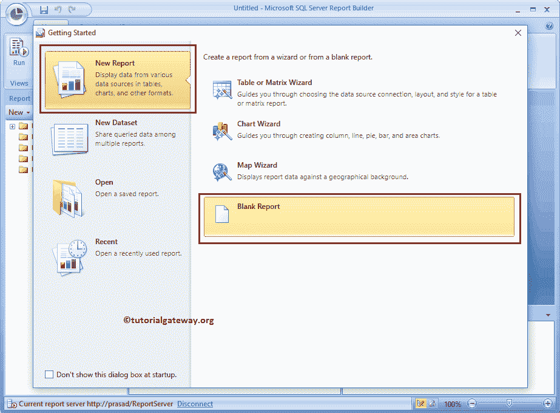

# 在 SSRS 报表生成器中创建新报表

> 原文：<https://www.tutorialgateway.org/create-new-report-in-ssrs-report-builder/>

在本文中，我们将向您展示如何在不使用向导的情况下在 SSRS 报表生成器中创建新报表。或者我们可以说，使用 SSRS 报表生成器创建新表或矩阵报表所涉及的步骤。

对于这个 SSRS 报表生成器表报表，我们将使用我们在早期报表中创建的共享数据源和共享数据集。

要在 SSRS 报表生成器中创建新报表，我们必须打开报表生成器。为此，请打开您的报表管理器，点击报表生成器按钮，如下图所示

## 在 SSRS 报表生成器中创建新报表

点击 [SSRS](https://www.tutorialgateway.org/ssrs/) 报表生成器按钮后， [SQL Server](https://www.tutorialgateway.org/sql/) 报表生成器将打开一个起始页

在这个例子中，我们想在 SSRS 创建一个新的报告而不使用报告构建向导，所以请选择新建报告选项卡，然后选择空白报告选项，如下图所示

选择空白报告选项后，SSRS 报告生成器将显示空白报告。我们在上一篇文章中已经解释了窗格，所以请参考[创建新报告](https://www.tutorialgateway.org/create-a-new-report-in-ssrs/)文章。

要创建数据源，右键单击报告数据窗格中的数据源文件夹，并从上下文菜单

中选择添加数据源选项

单击该选项后，SSRS 报表生成器将打开“数据源属性”窗口来配置数据源。在本例中，我们选择了之前创建的共享数据源。

请参考报表管理器中的[创建共享数据源，了解创建数据源的步骤。](https://www.tutorialgateway.org/data-source-in-ssrs-report-manager/)

要为此报表创建数据集，请右键单击报表数据中的数据集文件夹，并从上下文菜单中选择添加数据集选项。它会打开一个新窗口，在该窗口中，您可以选择“新建数据集”选项

它将打开一个名为“数据集属性”的新窗口。在这里，您可以选择第一个选项来选择我们之前创建的共享数据集，或者通过选择第二个选项，我们也可以创建一个新数据集。

对于这个 SSRS 报表生成器演示，我们选择了第一个选项。我建议您参考【报表生成器】中的[创建新数据集一文，了解创建共享数据集所涉及的步骤。](https://www.tutorialgateway.org/create-a-new-dataset-using-ssrs-report-builder-wizard/)

让我检查数据集返回的字段。

在 SSRS 报表生成器中，请选择“插入”选项卡，将表插入到报表设计器中。

请单击表按钮下方的向下箭头，并选择“插入表”选项将表添加到报告区域。

将表拖放到数据区域。

接下来，将列添加到表中。我们已经在[新建表报表](https://www.tutorialgateway.org/ssrs-table-report/)中解释了将列添加到表字段的步骤，请参考相同的内容。

下面的截图将向您展示我们添加到表报告中的列。

让我格式化表报告，以改变整体外观。建议大家参考[格式表报告](https://www.tutorialgateway.org/format-table-report-in-ssrs/)了解可用格式选项列表。

请检查格式化的最终表报告。请调整表中所有列的宽度和高度。

让我在不使用 SSRS 报表生成器向导的情况下将报表名称更改为表报表，然后单击

运行按钮

单击“运行”按钮后，将生成以下报告。从下面的截图中，您可以看到报告显示了带有给定字段的格式化表报告。

让我单击“保存”按钮，在报表服务器上保存报表。

单击保存选项后，将打开一个名为另存为报告的新窗口。在这里，您可以选择本地文件系统或报表服务器。让我选择 SSRS 报表服务器

让我打开我的 SSRS 报表服务器来显示新创建的表报表。在这里，如果您想查看报告预览或运行报告，那么您不必访问报告生成器或 BIDS。

只需点击表报告将运行报告。让我选择之前保存的报告，点击

现在您可以在报表服务器

中看到我们在 SSRS 报表生成器中创建的表报表