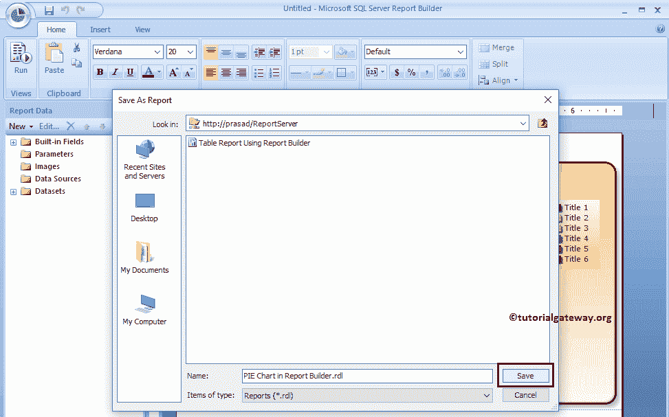

# 在 SSRS 表格报告生成器向导中创建饼图

> 原文：<https://www.tutorialgateway.org/create-pie-chart-in-ssrs-report-builder-wizard/>

在本文中，我们将向您展示如何在 SSRS 表格报告生成器向导中创建饼图。或者我们可以说，使用 SSRS 表格报告生成器创建饼图的步骤。

要创建饼图或任何报表，我们必须打开报表生成器。为此，请打开您的报表管理器，点击报表生成器按钮，如下图所示

点击 [SSRS](https://www.tutorialgateway.org/ssrs/) 报表生成器按钮后， [SQL Server](https://www.tutorialgateway.org/sql/) 报表生成器将打开一个起始页。

## 在 SSRS 表格报告生成器向导中创建饼图

在本例中，我们希望在 SSRS 表格报告生成器向导中创建一个饼图。因此，请选择“新建报告”选项卡，然后选择“图表向导”选项。条形图、柱形图也是如此。

选择图表向导选项后，将打开一个名为“新建图表”的新窗口。如果报表服务器中有任何现有数据集或共享数据集，则使用第一个选项；否则，使用第二个选项。

目前，我们选择第一个选项。我建议您参考【报表生成器】中的[创建新数据集一文，了解创建共享数据集所涉及的步骤。](https://www.tutorialgateway.org/create-a-new-dataset-using-ssrs-report-builder-wizard/)

接下来，请选择要创建的图表。这里我们选择饼图。

接下来，我们有三个部分:

*   可用字段:数据集中所有可用列的列表。
*   类别:您希望如何对饼图进行分类。例如，国家、地区、颜色、产品组
*   值:要在饼图中显示的所有度量列名。它决定了馅饼切片的大小。

我们将标题添加到类别中，将销售金额列添加到值中。这意味着我们的饼图将按员工职称显示销售金额。

请从现有模板中选择布局。

现在，您可以看到自动生成的报告。

让我将标题添加到饼图中，并展开饼图，使其看起来整洁干净。

删除报告区域周围的多余空间，点击【运行】按钮

单击“运行”按钮后，将生成以下报告。

右键单击饼图，并从上下文菜单中选择显示数据标签选项，以显示值

让我通过单击保存按钮

将报告部署到报告管理器

单击“保存”按钮后，将打开一个名为“另存为报告”的新窗口。在这里，您可以选择本地文件系统或报表服务器。让我选择报表服务器

让我打开报表服务器来显示新创建的表报表。在这里，如果您想查看报告预览或运行报告，那么您不必访问报告生成器或 BIDS。只需点击报告就会运行报告。让我选择之前保存的报告，点击

现在你可以在报表服务器

里面看到报表了

注:请参考[格式化饼图](https://www.tutorialgateway.org/formatting-pie-chart-in-ssrs/)一文，了解格式化标签、图例和托盘所涉及的步骤。