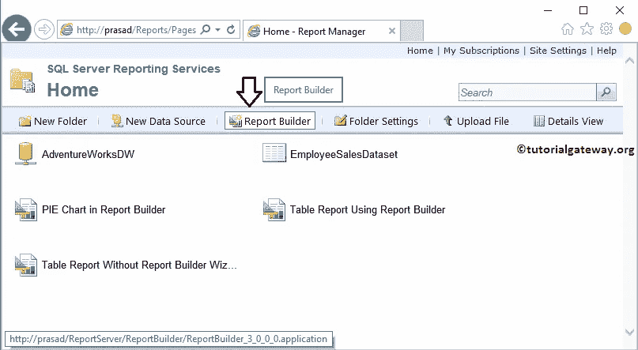

# 在 SSRS 表格报告生成器中创建条形图

> 原文：<https://www.tutorialgateway.org/create-bar-chart-in-ssrs-report-builder/>

在本文中，我们将向您展示如何在不使用向导的情况下在 SSRS 表格报告生成器中创建条形图。或者说出创建条形图或任何使用 SSRS 表格报告生成器的图表的步骤。

为此，我们将使用我们在早期报告中创建的共享数据源和嵌入式数据集。

要创建条形图或任何图表，我们必须打开报告生成器。为此，请打开您的报告管理器，点击报告生成器按钮，如下图所示



## 在 SSRS 表格报告生成器中创建条形图

点击 [SSRS](https://www.tutorialgateway.org/ssrs/) 报告生成器按钮后， [SQL Server](https://www.tutorialgateway.org/sql/) 报告生成器将打开一个起始页。

在本例中，我们希望在不使用报告生成器向导的情况下在 SSRS 创建条形图。所以，请选择新建报告选项卡，然后选择空白报告选项


选择空白报告选项后，报告生成器将显示空白报告。我们已经在上一篇文章中解释了设计器窗格。所以请参考[新建报告](https://www.tutorialgateway.org/create-a-new-report-in-ssrs/)一文来理解。


要创建数据源，请右键单击报告数据窗格中的数据源文件夹。接下来，从上下文菜单


中选择添加数据源选项

通过单击该选项，它将打开“数据源属性”窗口来配置数据源。

在本例中，我们选择了之前创建的共享数据源。请参考【报告管理器】中的[创建共享数据源，了解共享数据源的创建。](https://www.tutorialgateway.org/data-source-in-ssrs-report-manager/)

[](https://www.tutorialgateway.org/data-source-in-ssrs-report-manager/)

要为此报告创建数据集，请右键单击报告数据中的数据集文件夹。然后从上下文菜单中选择添加数据集选项。


它将打开一个名为“数据集属性”的新窗口。在这里，选择第一个选项来选择我们之前创建的共享数据集。或者通过选择第二个选项，我们也可以创建一个新的数据集。

目前，我们正在选择第二个选项。我建议您参考【报告生成器】中的[创建新数据集一文，了解创建共享数据集所涉及的步骤。](https://www.tutorialgateway.org/create-a-new-dataset-using-ssrs-report-builder-wizard/)

[](https://www.tutorialgateway.org/create-a-new-dataset-using-ssrs-report-builder-wizard/)

[我们在数据集中使用的 SQL](https://www.tutorialgateway.org/sql/) 查询是:

```
-- Create Bar Chart in SSRS Report Builder
SELECT Cat.[EnglishProductCategoryName] AS ProductCategory, 
                SubCat.[EnglishProductSubcategoryName] AS ProductSubCategory, 
                Prod.EnglishProductName AS ProductName, 
                Prod.Color, 
                Fact.OrderQuantity, 
                Fact.TotalProductCost, 
                Fact.SalesAmount, 
                Fact.TaxAmt, 
                Fact.[Freight]
FROM FactInternetSales AS Fact
          INNER JOIN DimProduct AS Prod  
                 ON Fact.ProductKey = Prod.ProductKey
          INNER JOIN DimProductSubcategory AS SubCat
                 ON Prod.ProductSubcategoryKey = SubCat.ProductSubcategoryKey 
          INNER JOIN DimProductCategory AS Cat 
                  ON SubCat.ProductCategoryKey = Cat.ProductCategoryKey
```

让我检查数据集返回的字段。


在报告生成器中，请选择“插入”选项卡，将图表插入到报告设计器中。


请点击图表按钮下方的向下箭头。接下来，从菜单中选择插入图表选项，将表添加到报告区域。


将图表拖放到数据区域。从下面的截图可以看到，默认显示的是


条形图

当您将图表从“插入”选项卡拖放到设计空间时，将打开一个名为“选择图表类型”的新窗口，从可用图表中选择所需的图表。在本例中，我们选择了一个三维柱形图。


单击“确定”按钮后，三维柱形图将显示在带有虚拟数据的设计区域中。


点击 SSRS 柱形图周围的空白处将打开图表数据窗口


在本例中，我们将为产品的销售金额和产品总成本除以产品颜色创建一个柱形图。因此，将“销售额”和“产品总成本”列从数据集中拖放到类别组中的图表数据值和颜色中。

让我使用报告生成器将报告名称更改为条形图，然后单击运行按钮


单击“运行”按钮后，将生成条形图。


让我将图表更改为常规柱形图，并设置图表式以获得更好的外观。建议大家参考[创建柱形图](https://www.tutorialgateway.org/column-chart-in-ssrs/)、[格式化柱形图](https://www.tutorialgateway.org/formatting-column-chart-in-ssrs/)了解更改图表类型、给图表添加数据标签的步骤。

接下来，请单击保存按钮将报告保存到报告服务器中。


单击保存选项后，将打开一个名为另存为报告的新窗口。在这里，您可以选择本地文件系统或报告服务器。让我选择报告服务器


让我打开报告服务器来显示新创建的条形图报告。在这里，如果您想要运行报告，或者查看报告预览，那么您不必访问报告生成器或 BIDS。只需点击条形图将运行报告。让我选择之前保存的报告，点击


现在，您可以在报告服务器


中看到条形图