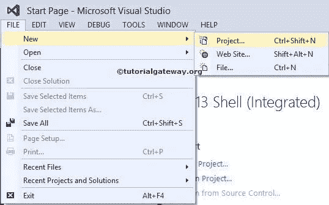
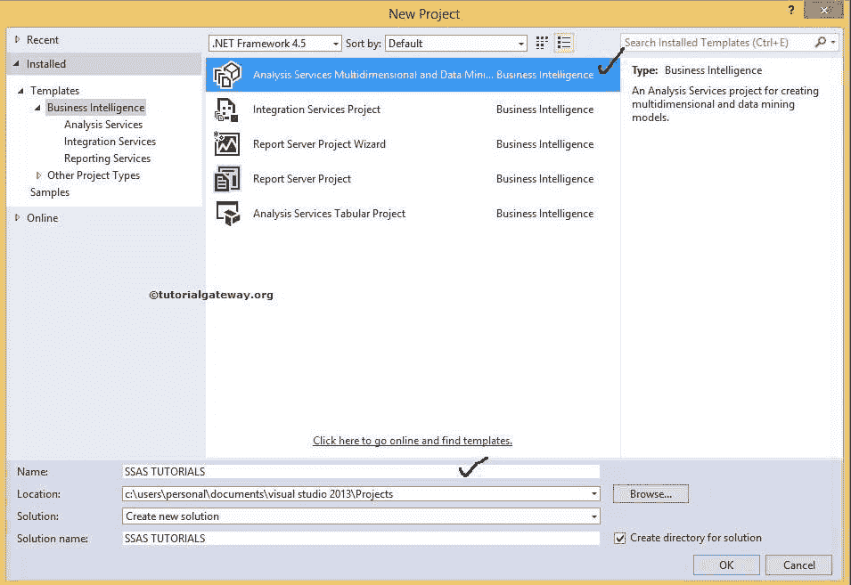
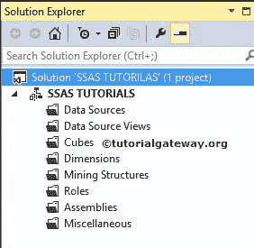

# 在 SSAS 创建新项目

> 原文：<https://www.tutorialgateway.org/create-new-project-in-ssas/>

在本文中，我们将通过示例向您展示如何在 SSAS 创建一个新项目。要在 SQL Server Analysis Services (SSAS)中创建新项目，请双击 BIDS 应用以打开商业智能开发工作室。

要在 SSAS 创建新项目，请点击文件菜单，然后选择项目选项，如下图所示。

单击项目选项后，将打开新建项目窗口来选择分析服务项目。请从可用的商业智能模板

中选择分析服务多维度和数据挖掘项目模板

请提供项目名称，并根据您的要求更改位置。我们仅更改了解决方案名称和名称，但您可以尝试。单击“确定”完成创建新的分析服务项目。

## 在 SSAS 创建新项目后看到的文件夹

我们在 [SSAS](https://www.tutorialgateway.org/ssas/) 创建了一个新项目之后，如果你观察解决方案资源管理器，我们有以下文件夹。

*   数据源视图:类似数据集。请参考 [SSAS 数据源视图](https://www.tutorialgateway.org/ssas-data-source-view/)文章，了解如何在 SQL Server Analysis Services 中创建新数据集。
*   多维数据集:帮助创建多维数据集，包括度量值和度量组。请参考[在 SSAS 创建 OLAP 立方体](https://www.tutorialgateway.org/create-olap-cube-in-ssas/)文章了解，如何在 SQL Server 分析服务中创建新立方体
*   维度:帮助添加数据库级维度，这些维度适用于所有多维数据集。要访问这些维度，每个多维数据集都必须添加到自己的维度文件夹(项目级)。请参考[在 SSAS 创建维度](https://www.tutorialgateway.org/create-dimension-in-ssas/)一文，了解如何在 SQL Server 分析服务中创建新维度
*   挖掘结构:出于数据挖掘的目的
*   角色:为多维数据集提供安全性，如分配新角色等。
*   程序集:如果我们需要任何外部程序集来工作，则将它们添加到此文件夹中
*   杂项:如果多维数据集需要任何图像或文档，则将它们全部添加到此文件夹中