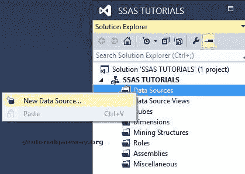

# SSAS 数据源

> 原文：<https://www.tutorialgateway.org/ssas-data-source/>

SQL Server Analysis Services (DS)中的数据源是到数据库或数据仓库的连接，我们从其中导入(加载)所需的数据。每个分析服务项目必须至少有一个数据源才能工作。如果我们有必须使用多个数据库的情况，那么我们使用多个 SSAS 数据源。一般来说，大多数情况下，我们可能使用 1 或 2 个数据源。

SSAS 的数据源包含连接信息。它是提供程序、服务器名称、数据库名称和模拟信息的组合。

SSAS 支持两者。Net 和 OLE 数据库提供程序。以下是 SSAS 支持的一些主要数据源:SQL Server、MS Access、Oracle、Teradata、IBM DB2 和其他具有适当 OLE DB 提供程序的关系数据库。

在 SSAS 创建数据源

创建新多维项目(分析服务项目)后，解决方案资源管理器如下图所示

要创建数据源，右键单击解决方案资源管理器中的数据源文件夹，并从上下文菜单

中选择新建数据源选项

它将打开带有欢迎页面的数据源向导。如果您不想再次看到此欢迎页面，请选中下面的“不再显示此页面”选项。

点击下一步

如果您观察以上内容，则 [SSAS](https://www.tutorialgateway.org/ssas/) 数据连接窗格为空，因为我们以前没有连接管理器。如果我们在此之前创建了任何连接管理器，而不是一次又一次地创建它们，我们可以在这里选择它们。

点击上面截图中的新按钮将打开另一个连接管理器窗口。使用它选择提供程序、服务器名称和数据库名称。

从上面的截图中，您可以观察到我们使用本地主机 windows 帐户作为服务器名称，使用[AdventureWorksDW2014]作为数据库名称。

注意:在这里，我们使用的是本地数据库。所以我们使用 windows 凭据。但是，在实时情况下，您必须选择 SQL Server 身份验证，并提供由数据库管理员或您的团队领导提供的凭据。

单击下面提供的“测试连接”按钮，检查连接是否成功。

点击确定

按下一步按钮配置模拟设置

### SSAS 数据源中可用的模拟选项

模拟允许 SSAS 承担客户端应用的身份/安全上下文，即执行服务器端数据操作，如数据访问、处理等。作为模拟的一部分，以下模拟选项在 SSAS 可用:

*   使用特定的 Windows 用户名和密码:此选项允许您指定 Windows 帐户凭据。SSAS 将使用这些凭证来执行源数据访问、处理等操作。通常，每个组织都会提供这些细节。
*   使用服务帐户:SSAS 使用服务帐户凭据，在此凭据下，分析服务服务配置/运行源数据访问、处理等。开始-搜索栏-服务 MSSQL 服务器。一般来说，它将在本地系统下运行。因此，服务帐户将把本地系统作为服务帐户，如果服务器在另一个位置，这将不起作用。
*   使用当前用户的凭据:SSAS 使用当前用户的凭据来执行 DMX 查询、访问多维数据集等操作。此选项不适用于执行服务器端操作，如数据访问、处理。因为现有用户凭据仅用于访问他的计算机。但是要访问位于服务器上的数据库，我们需要数据库管理员提供单独的凭据。
*   继承:该选项允许使用父对象的模拟选项。对于任何数据源，父对象都是数据库。因此，它将使用与数据库用户相同的模拟选项。如果设置此选项，默认情况下，SSAS 将使用服务帐户进行处理等操作，以及查询本地多维数据集、查询数据挖掘模型等操作。，它将使用当前用户的凭据

点击完成按钮，查看 SSAS 解决方案资源管理器中新创建的数据源

