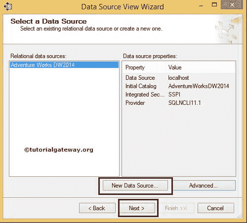

# SSAS 数据源视图

> 原文：<https://www.tutorialgateway.org/ssas-data-source-view/>

SSAS 的数据源视图是设计多维数据集所需的一组数据库表或视图(我们可以称之为数据集)。分析服务只能访问数据源视图内的表或视图，数据源视图外的任何内容都不可访问。SSAS 数据源视图的一些基本属性包括:

*   一个数据源视图只能从一个数据源中提取数据。
*   分析服务允许我们从单个数据源创建多个数据源视图。
*   分析服务允许我们从多个数据源创建数据源视图。
*   在数据源视图中所做的任何更改(如更改表名、删除一些不需要的列)都不会反映基础数据库。

例如，如果数据仓库包含 100 个表，而我们只需要 20 个表来设计多维数据集，那么添加 100 个表是没有意义的。相反，数据源视图提供了添加这 20 个表的空间。

提示:在 [SSAS](https://www.tutorialgateway.org/ssas/) 一个数据源视图只能从一个数据源拉取数据。

### 在 SSAS 创建数据源视图

要创建数据源视图，请右键单击解决方案资源管理器中的数据源视图文件夹，并从上下文菜单中选择新建数据源视图选项

注意:在数据源视图中所做的任何更改(如更改表名、删除一些不需要的列)都不会反映基础数据库。

它打开带有欢迎页面的数据源视图向导。如果您不想再次看到此欢迎页面，请选中下面的“不再显示此页面”选项。

点击下一步

如果您已经创建了一个数据源，那么它将显示如上，或者您必须单击“新建数据源”按钮来创建一个数据源。请参考 [SSAS 数据源](https://www.tutorialgateway.org/ssas-data-source/)文章了解如何创建数据源。对于这个例子，让我选择现有的一个。

要在 DSV 添加数据，我们必须从可用对象到包含对象中选择所需的表

要添加，请在可用对象中选择所需的表，然后单击>按钮。它将这些表添加到包含的对象中。

要从包含的对象中删除不需要的表，请选择该表，然后单击下面图形用户界面表单中的

<< and >>按钮用于添加或删除包含对象中的所有表格。

还有一个按钮叫做“添加相关表”。如果我们在“包含的对象”中选择一个表。并希望使用主键和外键关系添加与该表相关的所有表。这个按钮对你有用。

这里我选择了一些随机表格

点击下一步

单击完成，在 SSAS 解决方案资源管理器

中查看新创建的数据源视图

双击新创建的 SSAS 数据源视图显示选中的表、视图和关系，如下图所示。

