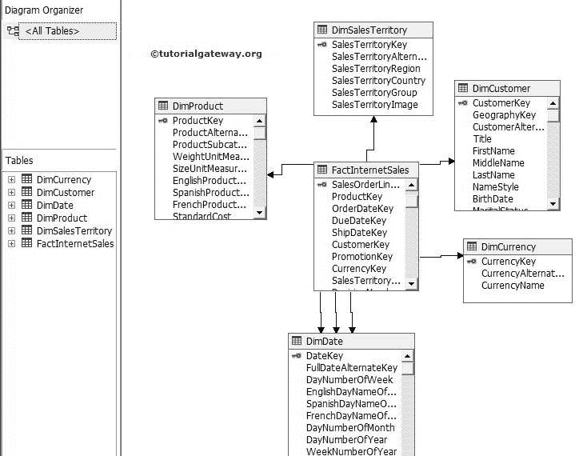
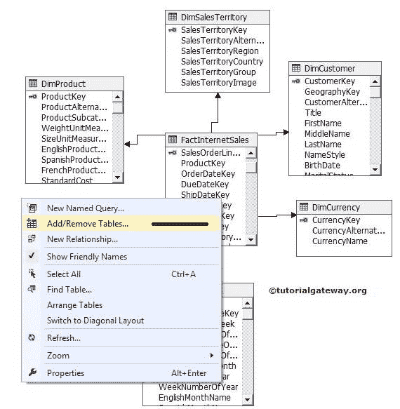
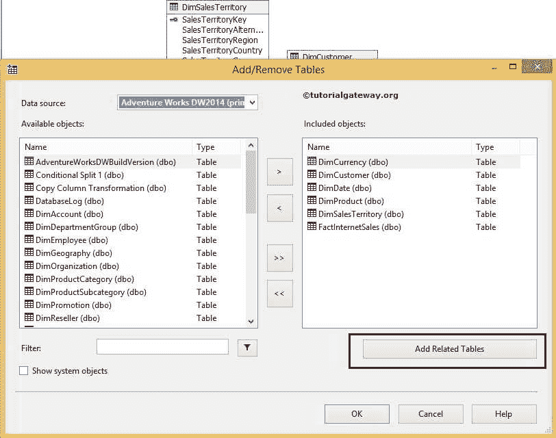
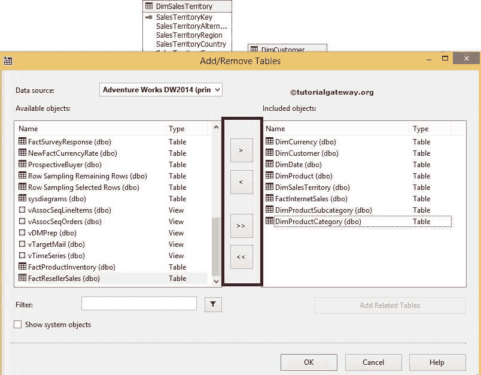
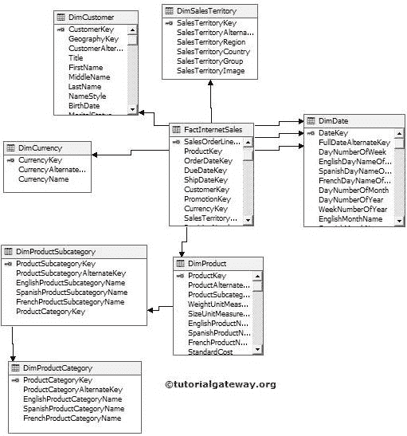

# 在 SSAS 的数据源视图中添加或删除表

> 原文：<https://www.tutorialgateway.org/add-or-remove-tables-from-data-source-view-in-ssas/>

在本章中，我们将向您展示如何在 SSAS 的数据源视图中添加或删除表。

如果您正在处理一个新项目，那么您必须根据公司要求创建您的数据源视图。实时地，我们主要在现有的项目上工作，因此，有人已经设计了数据源视图。

当我们使用预先设计的数据源视图时，我们需要一些额外的表来满足我们的要求。或者，如果有一些不需要的表要从数据源视图中删除，那么“添加或删除表”选项将有助于实现相同的效果。此选项不仅可以在 SSAS 数据源视图中添加或删除表，还可以添加或删除视图。请参考 [SSAS 数据源视图](https://www.tutorialgateway.org/ssas-data-source-view/)创建新的数据源视图。

## 在 SSAS 的数据源视图中添加或删除表示例

我们有一个简单的数据源视图，其中包含 1 个[事实互联网销售]和 5 个维度表，如模糊客户、模糊产品、模糊销售区域、模糊货币和模糊日期。

例如，我们可以检查产品子类别和产品类别的销售额和税额。但是，数据源视图中没有这些表，因此没有可用的数据。在这些情况下，右键单击数据源视图中的空间，然后从上下文菜单中选择“添加或删除表”选项。

它将打开添加或删除表格窗口，如下图

要添加，请在可用对象中选择所需的表，然后单击>按钮。它会将这些表添加到包含的对象中

要从包含的对象中删除不需要的表，请选择该表，然后单击下面图形用户界面表单中的

<< and >>按钮用于添加或删除包含对象中的所有表格。

还有一个按钮叫做“添加相关表”。如果我们在“包含的对象”中选择了一个表，并且想要添加所有相关的表，那么这个按钮就可以帮到你。

从上面的截图中，您可以看到我们向包含的对象添加了 Dim 产品子类别、Dim 产品类别表。

单击确定，查看[数据源视图](https://www.tutorialgateway.org/ssas-data-source-view/ "SSAS Data Source View")从添加或删除表格选项中检查新添加的表格。

