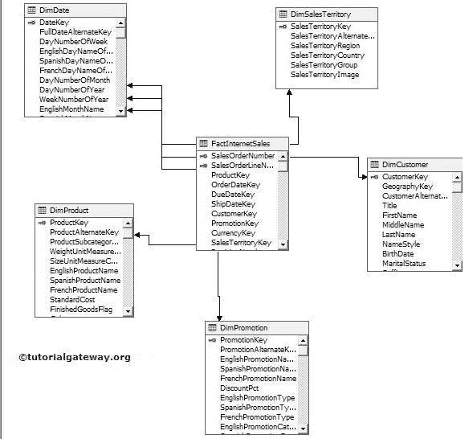
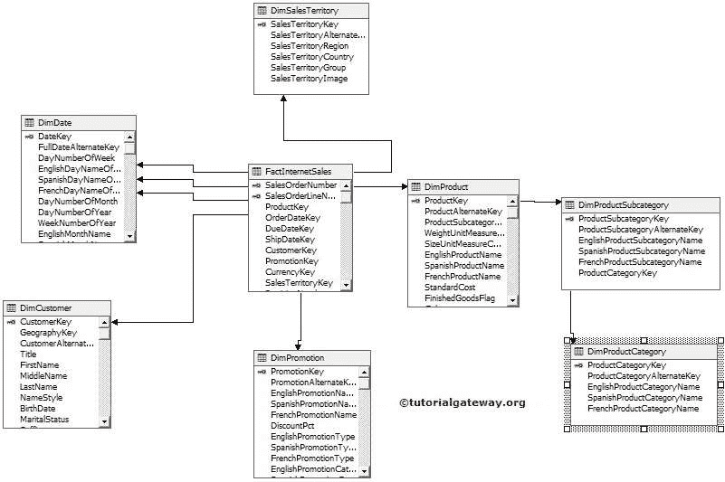

# SSAS 的星型模式和雪花模式

> 原文：<https://www.tutorialgateway.org/star-schema-and-snowflake-schema-in-ssas/>

在本文中，我们将向您展示 SSAS 的星型模式和雪花模式之间的基本区别

*   星型架构:数据源视图(DSV)中的每个维度都与事实或度量表直接链接或相关。
*   雪花架构:数据源视图(DSV)中的某些维度直接链接到事实数据表。有些维度与事实表间接相关(借助于中间维度)。例如在【冒险作品 DW 2014】中，【Dim 产品子类】借助【Dim 产品】与【事实互联网销售】间接相关。

## 星形模式与雪花模式

下表将显示 SSAS 的星型模式与雪花模式或星型模式与雪花模式之间的差异。

| 星型模式 | 雪花模式 |
| 由 DE 规范化维度表包围的位于中心的事实表 | 由规范化维度表包围的位于中心的事实表 |
| 在星型模式中，所有维度都将与事实表直接链接 | 在雪花模式中，一些维度直接链接到事实表，一些维度间接链接到事实表(借助于中间维度) |
| 这个设计很容易理解 | 这很难理解 |
| 提高查询性能，因为我们可以用更少的连接提取数据 | 我们必须连接更多的表来提取数据，以便更多的连接 |
| 我们主要在小型数据库中看到星型模式。或者我们说小公司。 | 大多数大公司或任何大数据库都将永远属于雪花模式。 |
| 通过对数据库进行规范化，我们可以将雪花模式转换为星型模式。 | 通过规范化数据库意味着使用主键和外键进一步划分表的数据，我们可以快速地将星型模式转换为雪花模式。 |

星型结构:包含星型模式(规范化数据)和雪花模式(规范化数据)的混合结构。

### SSAS 的星型模式示例

从下图中我们可以看到【Dim 生产】、【Dim 客户】、【Dim 产品】、【Dim 日期】、【Dim 销售区域】表直接附在【事实互联网销售】上。所以，这是 SSAS

恒星模式的完美例子

### SSAS 的雪花模式示例

从下面 [SSAS](https://www.tutorialgateway.org/ssas/) 图可以看到【Dim 币】、【Dim 客户】、【Dim 日期】、【Dim 产品】表直接附在【事实互联网销售】上。但是【点心产品子品类】和【点心产品品类】是间接关联的。

