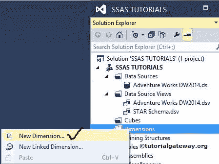
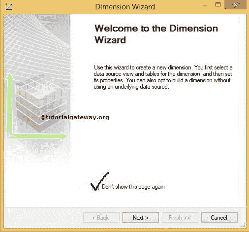
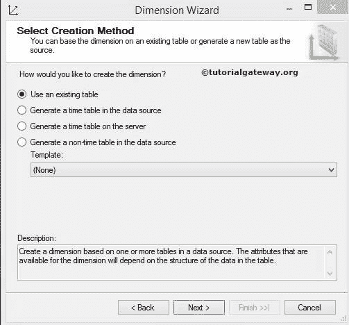
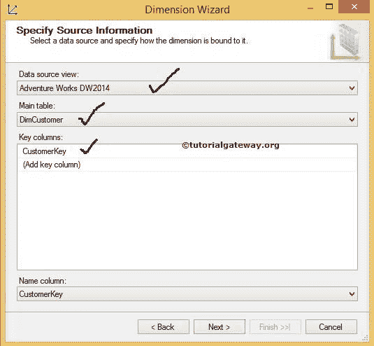
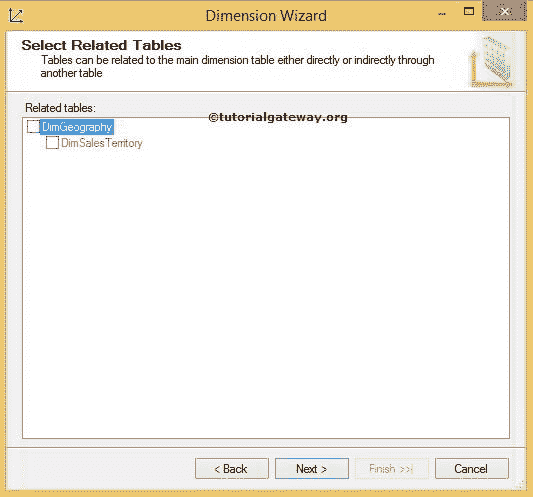
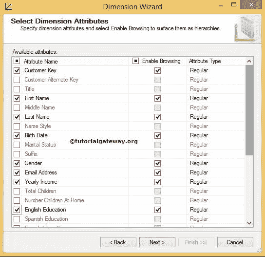
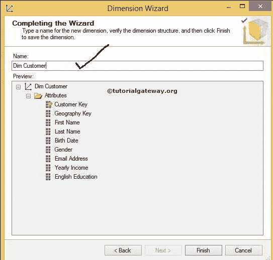
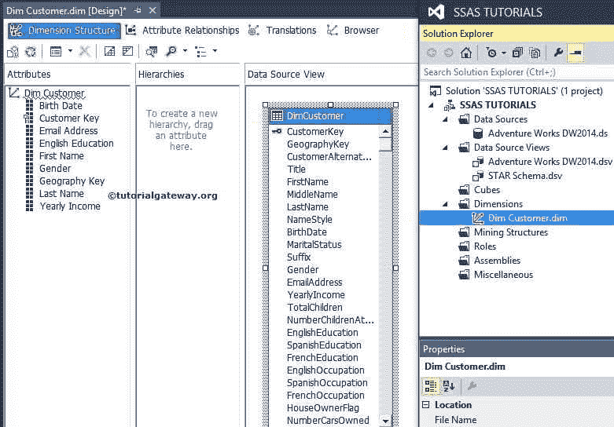

# 在 SSAS 创建维度

> 原文：<https://www.tutorialgateway.org/create-dimension-in-ssas/>

SSAS 维度是基于数据源视图中维度表的一组属性(只有列)。所有这些属性都显示为属性层次结构，分析服务也为我们提供了创建用户定义层次结构的选项。

在 SSAS，维度有两种类型，如数据库维度和多维数据集维度。请参考 SSAS 文章中[数据库维度和多维数据集维度的区别，了解 SQL Server Analysis Services 中数据库维度和多维数据集维度的区别。](https://www.tutorialgateway.org/difference-between-database-dimension-and-cube-dimension/)

## 在 SSAS 创建维度示例

在解决方案资源管理器中，右键单击维度文件夹，并从上下文菜单中选择新建维度以创建新维度。

通过单击新建，维选项将打开维向导。

SSAS 维度向导的第一页是欢迎页面。如果你不想再看到这个页面，那么不要再显示这个页面选项如下图截图所示点击下一步

下一页是“选择创建方法”，该页提供了在 SSAS 创建维度的四个选项。

*   使用现有表:它将使用数据源视图中的现有表。
*   在数据源中生成时间表:该选项将生成时间表并将其保存在数据源中。
*   在服务器上生成时间表:此选项生成时间表，并将该表直接保存在服务器中。
*   在数据源中生成非时间表:此选项将生成常规表并将其保存在数据源中。它有一个模板来选择您是否要创建客户、员工、部门、地理位置等。

通常，我们只使用第一个选项(使用现有表)，因为它将使用数据源视图中所需的表。但是，如果我们不知道如何创建一个特定的表，那么就使用这里提供的模板来设计它。

单击“下一步”按钮将打开“指定源信息”页面，以配置数据源视图、表和键列。

对于本例，选择我们之前在 [SSAS 数据源视图](https://www.tutorialgateway.org/ssas-data-source-view/)文章中创建的数据源视图。我们打算从 DimCustomer 表中创建一个维度。因此，从主表下拉列表中选择相同的表。每个维度表都需要有一个键属性，CustomerKey 是这个表的主键列。

单击下一步按钮将进入 SSAS 维度向导选择相关表页面。在这里，它将显示相关表(使用外键关系与直接客户连接的表)。目前，我们正在选择它们。

单击下一步按钮将打开选择维度属性页面。在这一页，我们有三个部分要理解。

*   可用属性:它显示数据源视图中显示的“直接客户”表的所有可用列(属性)。我们可以选择所有的列，或者我们可以选择所需的列。选择所需的列总是明智的。
*   启用浏览:如果选中此选项，则该列可在多维数据集中浏览。如果取消选中此选项，客户端应用在浏览维度时将看不到它。有时我们可能需要 id 列作为参考，但不需要对数据进行切片，然后您可以取消对它们的浏览。
*   属性类型:SQL Server 分析服务在创建维度时提供了许多属性类型。选择合适的类型，如果不知道选择哪种属性类型，则选择常规类型。例如，对于“日历年”列，选择日历年属性类型。

目前，我们从 Dim Customer 中选择了几个列，并且我们还没有将属性类型从常规更改为适当的属性类型。

注意:选择特定的属性类型而不是常规类型总是一种好的做法。特别是对于时间和账户维度，我们必须指定属性类型。因为它在使用 MDX 时会有所帮助。

现在下一步是给这个维度起一个特定的或者任何合适的名字。在本例中，我们将其命名为“暗淡客户”。

单击“完成”按钮，完成在 SSAS 创建尺寸。

从下面的截图可以观察到，

*   在解决方案资源管理器中，我们在“维度”文件夹下有“客户维度”。
*   属性窗格仅包含选定的属性(列)。这些是我们在使用维度向导创建维度时选择的。
*   “层次结构”窗格为空，因为我们尚未创建任何用户定义的层次结构。
*   数据源视图将显示 Dim 客户表中的所有可用列。

我们在 SSAS 成功地创造了我们的第一维度