# 在 SSAS 创建 OLAP 魔方

> 原文：<https://www.tutorialgateway.org/create-olap-cube-in-ssas/>

在本文中，我们将向您展示如何使用多维数据集向导在 SQL Server Analysis Services (SSAS)中创建 OLAP 多维数据集。

SSAS·OLAP 立方是度量(派生的、计算的度量)和维度、计算、透视、动作、分区、关键性能指标(KPI)和翻译的组合。

## 在 SQL Server 分析服务中创建 OLAP 多维数据集

在解决方案资源管理器中，右键单击多维数据集文件夹将打开上下文菜单。选择新建多维数据集选项，如下图所示。

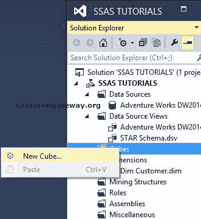

它将打开带有欢迎页面的 SSAS OLAP 立方体向导。如果您不想再次看到此欢迎页面，请选中下面的“不再显示此页面”选项。

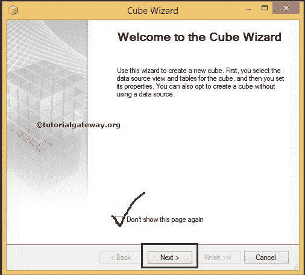

单击下一步按钮

选择创建方法

在多维数据集向导中，此页面将提供 3 个选项供您选择

*   使用现有表:如果选择此选项，多维数据集将使用数据源视图中的现有表。
*   创建空多维数据集:此选项将创建一个没有度量值和空维度的空多维数据集。在完成立方体创建后，我们必须一个接一个地添加它们。
*   在数据源中生成表:直接在数据源中生成表。

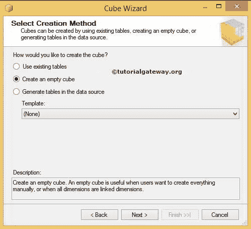

选择选项(创建一个空的立方体)总是更好，这是我在经验中所做的，我希望这是任何开发人员的最佳方法。点击下一步按钮

选择数据源视图

此页面用于选择空多维数据集的数据源视图。在这里，如果我们已经创建了数据源，我们可以选择数据源，否则我们可以选择无，稍后，我们可以创建并使用它。同样，这是开发人员的选择，但是在开始时创建数据源和数据源视图总是一种好的做法。

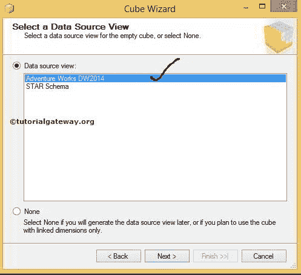

这里我们选择了我们在上一篇文章中创建的数据源视图。请参考 [SSAS 数据源视图](https://www.tutorialgateway.org/ssas-data-source-view/)文章，了解如何在 SSIS 创建数据源视图

单击“下一步”按钮，根据您的要求重命名多维数据集。

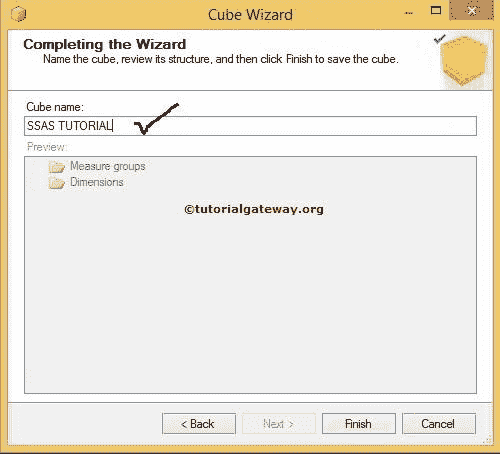

单击“完成”按钮完成多维数据集的创建。

让我们看看我们的解决方案资源管理器，检查新创建的多维数据集。

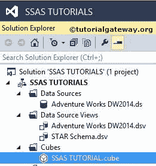

### 使用现有表创建多维数据集

在这里，我们选择了现有表格选项，向您展示这是如何工作的。

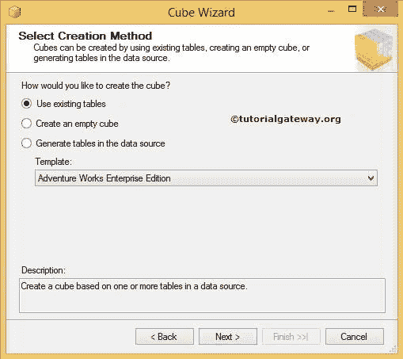

点击下一步按钮

选择度量值组表

选择已经创建的(现有的)数据源视图。这里我们也选择了冒险作品 DW2014，这是我们在上一篇文章中创建的。

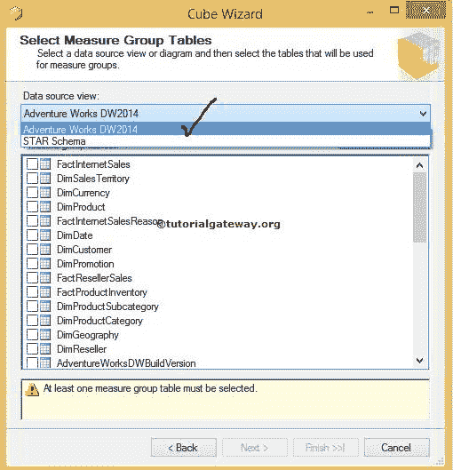

现在从数据源视图的可用表列表中选择度量表(度量组或事实表)。

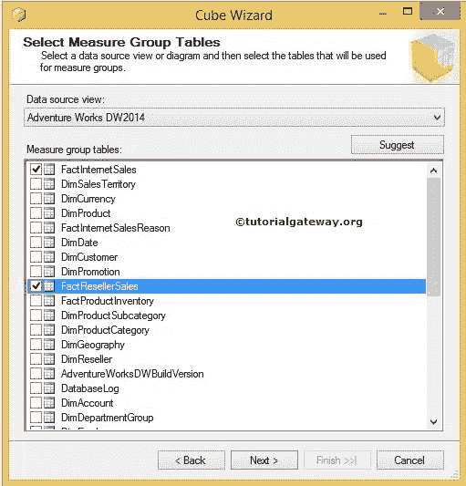

单击下一步按钮。

多维数据集向导将带您进入下一页，从度量值组中选择各个度量值。

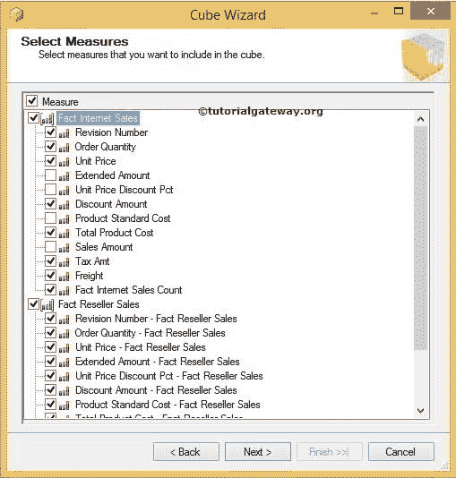

在这里，我们选择了一些随机措施，并点击下一步按钮。

为 SSAS OLAP 多维数据集选择现有维度

此页面允许我们从可用维度列表

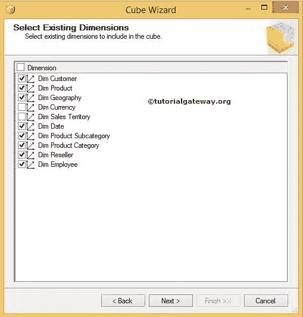

中选择创建立方体所需的维度

单击“下一步”按钮，并根据组织的要求提供多维数据集名称。

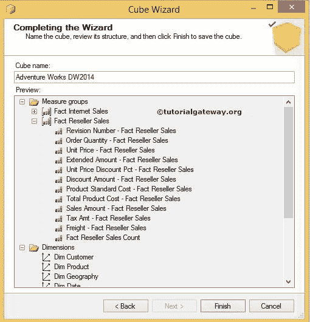

点击完成按钮，查看我们是否成功创建了 SSAS OLAP 立方体

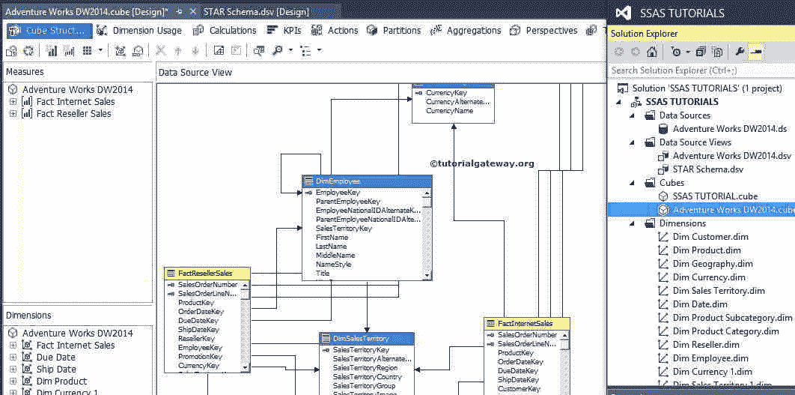