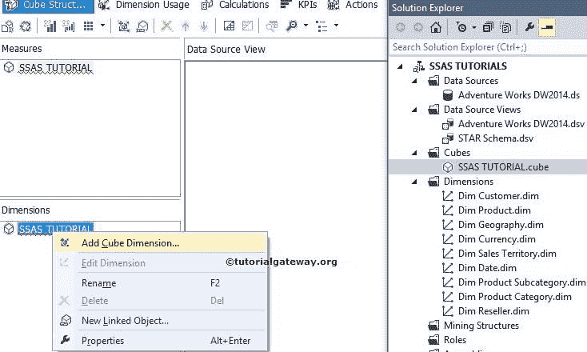
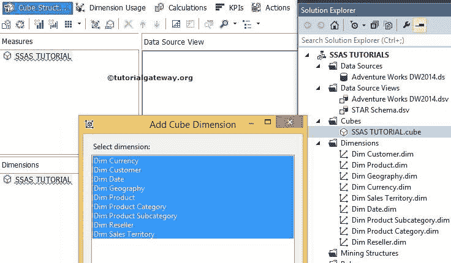
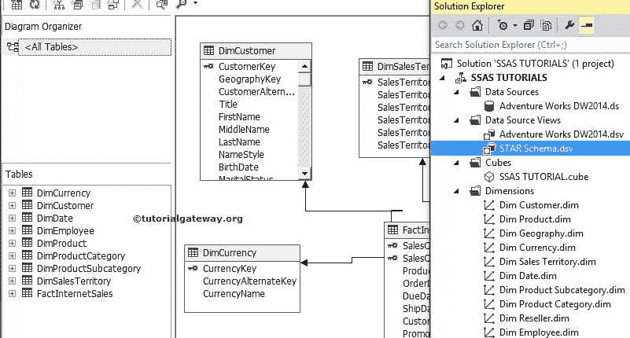

# 在 SSAS 创建立方体维度

> 原文：<https://www.tutorialgateway.org/create-cube-dimension-in-ssas/>

SSAS 的立方体维度是多维数据集中数据库维度的一个实例。立方体维度可以在特定的多维数据集中访问，我们不能在另一个多维数据集中访问一个立方体维度。

## 在 SSAS 创建立方体维度

在这个 SSAS 示例中，我们将向您展示如何在 SQL Server 分析服务中创建立方体维度。请参考 SSAS[创建维度](https://www.tutorialgateway.org/create-dimension-in-ssas/)一文，了解如何在 [SQL Server 分析服务](https://www.tutorialgateway.org/ssas/)中创建数据库维度。

步骤 1:在维度窗格中，右键单击多维数据集名称将打开上下文菜单来选择选项。由于我们正在添加立方体维度，点击添加立方体维度选项

单击添加立方体维度选项将打开添加立方体维度窗口。它将向我们显示数据源视图中所有可用的维度表。

在此窗口中，我们必须根据您的组织要求选择所需的维度。

从上面的截图中，您可以看到我们已经选择了数据源视图中的所有表。单击“确定”关闭窗口。

从上面的 SSRS 图像中，您可以了解到维度窗格中的所有维度都称为立方体维度。解决方案资源管理器中的所有维度称为数据库维度。