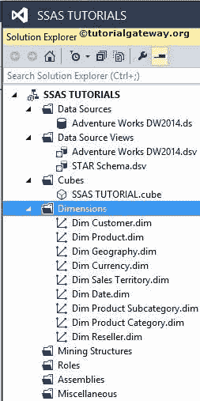

# SSAS 数据库维度与多维数据集维度的差异

> 原文：<https://www.tutorialgateway.org/difference-between-database-dimension-and-cube-dimension/>

在 SQL Server 分析服务中，有两种类型的维度

*   数据库维度
*   立方结构维度

## SSAS 的数据库维度

使用解决方案资源管理器的维度向导创建的所有维度都被视为数据库维度。换句话说，数据库级别的维度称为数据库维度。

数据库维度独立于多维数据集，因此单个数据库维度可以在多个多维数据集中使用。请参考[在 SSAS 创建维度](https://www.tutorialgateway.org/create-dimension-in-ssas/)文章了解，如何在

SQL Server Analysis Services 中创建数据库维度

从上图看，所有维度如 Dim 客户、Dim 产品等。，位于“维度”文件夹下，是数据库维度。

## SSAS 的立方体维度

多维数据集维度是多维数据集中数据库维度的实例。多维数据集维度可在该特定多维数据集内访问，我们不能在另一个多维数据集中访问该多维数据集维度。请参考[在 SSAS 创建多维数据集维度](https://www.tutorialgateway.org/create-cube-dimension-in-ssas/)一文，了解如何在 SQL Server Analysis Services 中创建多维数据集维度。

从上面的截图中，维度窗格中的所有维度称为多维数据集维度，解决方案资源管理器中的维度称为数据库维度。

### SSAS 数据库维度与多维数据集维度的差异

*   数据库维度只有名称和标识属性，而多维数据集维度有更多的功能。
*   数据库维度创建一次，我们可以在多个多维数据集中使用它们。
*   多维数据集维度只是数据库维度的一个参考点。我们无法访问多维数据集之外的多维数据集维度
*   多维数据集维度可以创建多个维度(我们称之为角色扮演维度)。