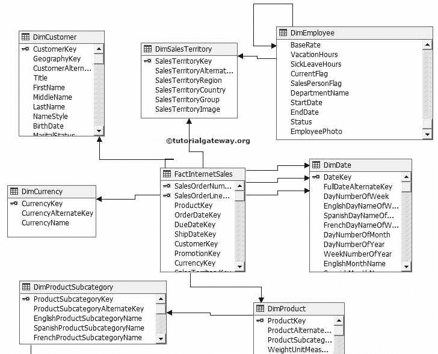
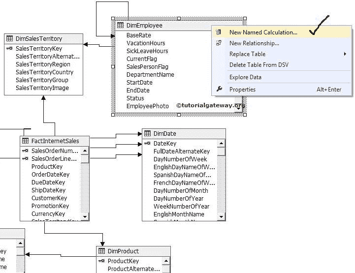
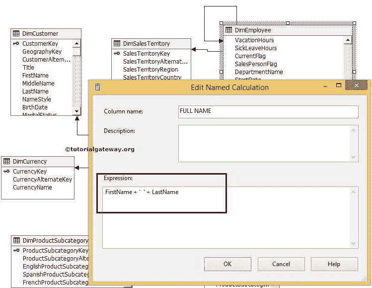
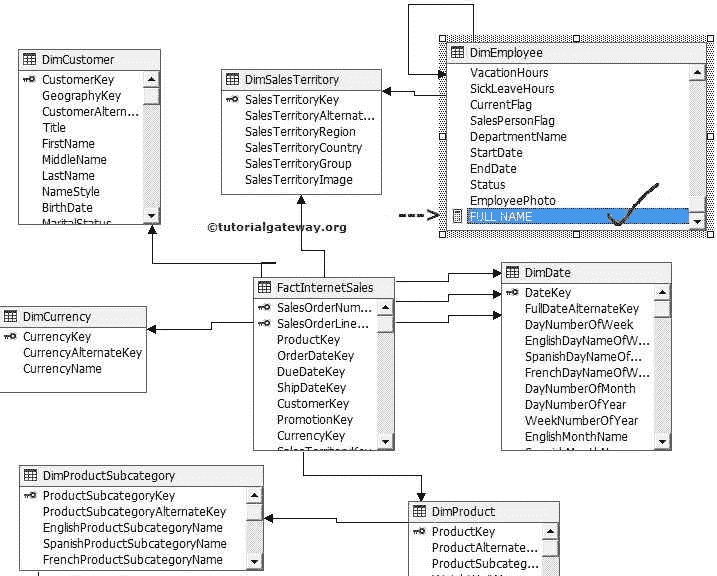

# SSAS 命名计算

> 原文：<https://www.tutorialgateway.org/ssas-named-calculations/>

在 SQL Server Analysis Services 或 SSAS 中，命名计算只是创建一个新列，并将其添加到数据源视图中的表或视图中。命名计算是基于表达式或某些静态值或现有列的组合创建的。以下是 SSAS 命名计算的基本特征

*   命名计算允许您向 SSAS 数据源视图中的表或视图添加额外的列。
*   使用命名计算创建的所有列仅属于数据源视图，它们独立于基础数据源(服务器)。
*   我们可以通过组合基础数据源视图中的一个或多个列来创建计算列。例如，通过组合名和姓来查找全名
*   我们可以创建命名计算来保存任何静态值
*   我们可以使用 SQL 表达式创建 SSAS 命名计算。例如计算利润、税收、产品浪费等
*   所有命名计算将在处理期间计算。这可能会减慢处理时间。

### 在 SSAS 创建命名计算

单击解决方案资源管理器中的数据源视图文件夹，然后单击创建的数据源视图。请参考 [SSAS 数据源视图](https://www.tutorialgateway.org/ssas-data-source-view/)文章了解，如何在 SSAS 创建数据源视图。

下面截图会给大家展示

数据源视图

右键单击数据源视图中的维度表将打开包含多个选项的上下文菜单。

从上下文菜单

中选择新命名计算选项

当您单击新建命名计算选项时，将打开编辑命名计算窗口表单(如下所示)，在 SSAS 创建命名计算。

*   列名是要向最终用户显示的名称
*   描述是描述这个命名计算将做什么。它是可选的，但在实时中至关重要。
*   表达式是用来编写 SQL 表达式或任何静态值的地方。

在这个 SSAS 命名计算示例中，我们通过组合维度表中的名字和姓氏列来创建全名。

表达式:名字+ ' ' +姓氏

单击确定按钮完成在 SSAS 创建命名计算，并检查数据源视图。您可以在 Dim 员工表中看到计算列(由命名计算创建)。您也可以在列名前观察到一个小 tiff。

