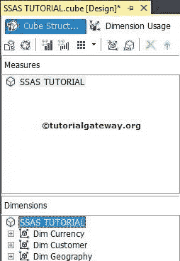
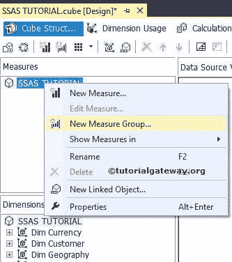
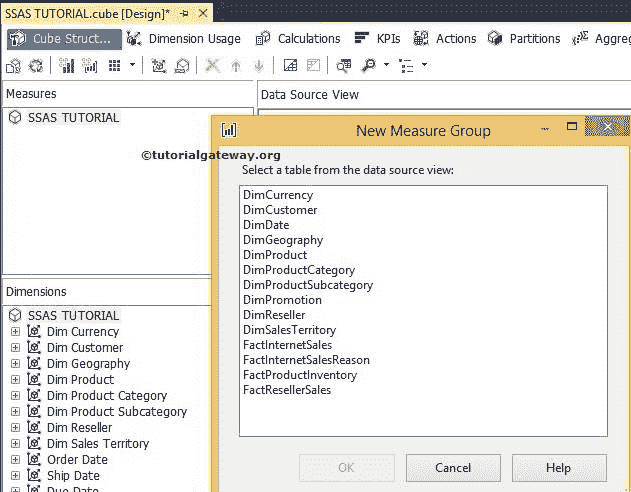
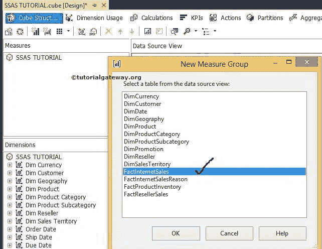
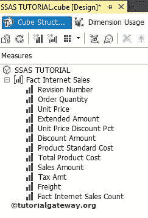

# 创建 SSAS 度量值组

> 原文：<https://www.tutorialgateway.org/creating-ssas-measure-groups/>

SSAS 的度量是单个数值(表示表中的单个列)。相反，度量值组是度量值的集合。或者我们可以说表中所有列的分组。例如，互联网销售表[销售额]和[税额]是单独的度量，所有列的组被视为 SSAS 度量组。

## 创建 SSAS 度量值组示例

使用向导创建空的 [OLAP 立方体](https://www.tutorialgateway.org/create-olap-cube-in-ssas/)后，我们必须创建度量或度量组。在开始创建新度量值组之前，让我们在多维数据集编辑器

中查看我们的度量值窗格

要在 SSAS 创建新的度量值组，在度量值窗格中，右键单击多维数据集名称将打开用于创建度量值的上下文菜单。

从上面的上下文菜单中，我们有两个选项，如“新度量”和“新度量组”。在此 [SSAS](https://www.tutorialgateway.org/ssas/) 示例中，我们正在创建一个度量值组，因此请选择“新建度量值组”选项。

注意:当我们选择“新建度量值组”选项时，默认情况下将选择表中的所有列。大多数情况下，我们不需要事实表中的所有列，所以坦率地说，这是一个糟糕的选择。

选择“新建度量值组”选项后，“新建度量值组”窗口将打开，并在[数据源视图](https://www.tutorialgateway.org/ssas-data-source-view/)中显示可用的表。

这里我们从列表中选择 FactInternetSales 表。

单击“确定”完成 SSAS 度量值组(事实互联网销售)的配置。让我们看看新创建的度量值组的度量值窗格。

看了上面的截图，就能明白为什么这是错误的选择。如果我们不想要任何像修订成员这样的措施，那么我们必须明确删除它。