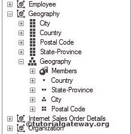
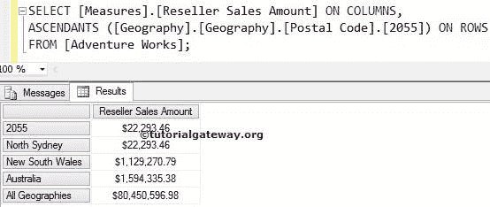
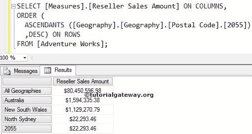
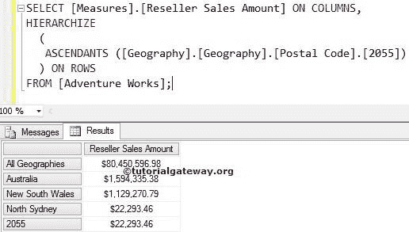

# MDX 优势函数

> 原文：<https://www.tutorialgateway.org/mdx-ascendants-function/>

MDX 上升函数将在所有级别返回指定成员的关联父成员，直到它达到级别 0。或者，我们可以说，上升函数将返回指定成员的所有上升。例如，你知道客户的名字。如果您想找到该特定客户的邮政编码、城市、州和国家，那么您可以使用这个上升功能。

## MDX 优势函数语法

多维表达式中 MDX 上升函数的基本语法如下所示:

```
ASCENDANTS (Member_Expression)
```

成员表达式:返回有效成员的任何多维表达式。

在本文中，我们将通过示例向您展示如何编写上升函数查询。为此，我们将使用下图所示的层次结构



## MDX 优势函数示例

在这个 [MDX](https://www.tutorialgateway.org/mdx/) 示例中，我们将找到邮政编码 2055 的城市、州和国家

```
SELECT 
 [Measures].[Reseller Sales Amount] ON COLUMNS,
  ASCENDANTS ([Geography].[Geography].[Postal Code].[2055]) ON ROWS
FROM [Adventure Works];
```



## 有序函数和上升函数

在本例中，我们将使用 MDX Order 函数以降序对上升函数编写的成员进行重新排序。

```
SELECT [Measures].[Reseller Sales Amount] ON COLUMNS,
ORDER (
   ASCENDANTS ([Geography].[Geography].[Postal Code].[2055])
  ,DESC) ON ROWS
FROM [Adventure Works];
```



## 使用等级和优势

本示例使用 Hierarchize 函数将上升函数编写的成员从上到下重新排序。

```
SELECT [Measures].[Reseller Sales Amount] ON COLUMNS,
HIERARCHIZE 
  (
    ASCENDANTS ([Geography].[Geography].[Postal Code].[2055])
  ) ON ROWS
FROM [Adventure Works];
```



注:分层函数是一个非常有用的函数，用来对上升者写的成员进行排序，而不是排序函数。