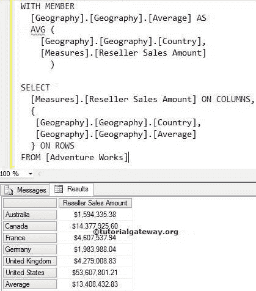

# MDX `AVG`函数

> 原文：<https://www.tutorialgateway.org/mdx-avg-function/>

MDX `AVG`函数用于计算指定集合中非空成员的平均值。类似于 [SQL `AVG`函数](https://www.tutorialgateway.org/sql-avg-function/)。在计算平均值时，MDX 平均函数将忽略空值

## `AVG`函数语法

多维表达式中 `AVG`函数的基本语法如下所示:

```
AVG ( Set_Expression, Numeric_Expression)
```

*   集合表达式:返回有效集合的任何多维表达式。
*   数值表达式:任何返回数值的多维表达式。一般来说，我们在这里使用所需的测量值。

如何用 `AVG`函数结合实例计算平均值？。为此，我们将使用下面显示的数据。


以下截图显示了地理


内的国家

## MDX `AVG`函数示例 1

以下查询将返回国家/地区中所有国家/地区的经销商销售额，并使用 MDX `AVG`函数计算其销售额的平均值。

```
WITH MEMBER 
  [Geography].[Geography].[Average] AS
   AVG (
        [Geography].[Geography].[Country],
	[Measures].[Reseller Sales Amount]
       ) 

SELECT 
  [Measures].[Reseller Sales Amount] ON COLUMNS,
  {
   [Geography].[Geography].[Country], 
   [Geography].[Geography].[Average]
  } ON ROWS
FROM [Adventure Works]
```



在 [MDX](https://www.tutorialgateway.org/mdx/) 语句下面将创建计算成员【地理】。[地理]。[平均]

```
WITH MEMBER 
  [Geography].[Geography].[Average] 
```

在下一行中，我们使用 `AVG`函数来计算[度量]的平均值。[地理位置]中国家/地区的[经销商销售额]。[地理]。[国家]

```
AVG (
     [Geography].[Geography].[Country],
     [Measures].[Reseller Sales Amount]
    )
```

在`next`语句中，我们在列中选择了经销商销售额，然后在行中选择了国家/地区集和计算成员

```
SELECT 
  [Measures].[Reseller Sales Amount] ON COLUMNS,
  {
   [Geography].[Geography].[Country], 
   [Geography].[Geography].[Average]
  } ON ROWS

```

## MDX `AVG`函数示例 2

以下查询将返回日期维度中所有日历年的互联网销售额。并使用 MDX `AVG`函数计算他们销售金额的平均值。

```
WITH MEMBER [Date].[Calendar].[Average] AS
  AVG (
       [Date].[Calendar].[Calendar Year],
       [Measures].[Internet Sales Amount]
      ) 

SELECT [Measures].[Internet Sales Amount] ON COLUMNS, 
  NON EMPTY {
             [Date].[Calendar].[Calendar Year], 
             [Date].[Calendar].[Average] 
            } ON ROWS
FROM [Adventure Works]
```


以下语句将创建计算成员[日期]。[日历]。[平均]

```
WITH MEMBER 
  [Date].[Calendar].[Average]  
```

在下一行中，我们使用 `AVG`函数来计算[度量]的平均值。[日期]中存在的日历年的[互联网销售额]。[日历]。[日历年]

```
AVG (
       [Date].[Calendar].[Calendar Year],
       [Measures].[Internet Sales Amount]
      ) 
```

在`next`语句中，我们选择了列上的互联网销售额，然后选择了日历年集和计算成员([日期]。[日历]。[平均值])。我们还使用了非空函数来避免空值。

```
SELECT [Measures].[Internet Sales Amount] ON COLUMNS, 
  NON EMPTY {
             [Date].[Calendar].[Calendar Year], 
             [Date].[Calendar].[Average] 
            } ON ROWS
FROM [Adventure Works]
```

## MDX `AVG`函数示例 3

在这个例子中，我们将向您展示当我们有空值时会发生什么。为此，我们使用上述不带非空函数的 MDX 查询。

```
WITH MEMBER [Date].[Calendar].[Average] AS
  AVG (
       [Date].[Calendar].[Calendar Year],
       [Measures].[Internet Sales Amount]
      ) 

SELECT [Measures].[Internet Sales Amount] ON COLUMNS, 
       {
        [Date].[Calendar].[Calendar Year], 
        [Date].[Calendar].[Average] 
       } ON ROWS
FROM [Adventure Works]
```


如果你观察结果，我们得到相同的平均值，例如，2 和 3。这是因为 `AVG`函数不考虑具有空值的成员。这意味着 `AVG`函数正在计算 2010 年至 2014 年的平均值。