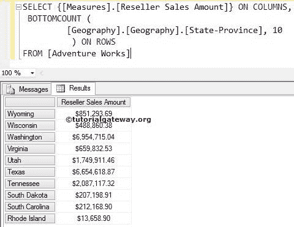
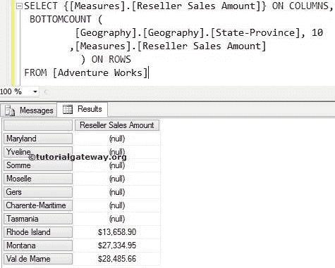
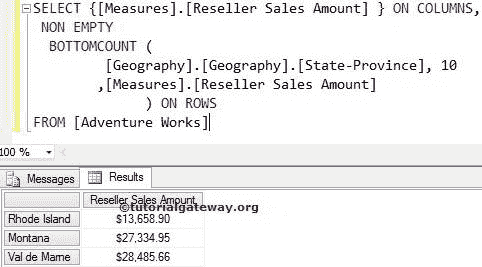

# MDX `BOTTOMCOUNT`函数

> 原文：<https://www.tutorialgateway.org/mdx-bottomcount-function/>

MDX BottomCount 函数将以升序对给定的数据进行排序，然后从排序的数据中选择所需数量的记录。例如，如果你想找到表现最差的 10 种产品。或者您想查找销售额最低的 10 个地区或计算最低工资。我们可以将这个 MDX BottomCount 函数用于度量。

## MDX `BOTTOMCOUNT`函数语法

多维表达式中 MDX 底部计数的基本语法如下所示:

```
BOTTOMCOUNT (Set_Expression, Count, Numeric_Expression)
```

*   Set_Expression:要检查的任何多维表达式或属性。
*   计数:您想要检索多少条记录？。
*   数值表达式:任何多维表达式或度量。这是一个可选的参数。如果我们使用这个参数，MDX BOTTOMCOUNT 将使用这个 Numeric_Expression 以升序对数据进行排序。然后，挑选你要的记录数量；否则，BOTTOMCOUNT 将选择所需数量的记录，而不进行排序。

如何用示例编写 MDX BottomCount 函数，从经销商销售金额少于他人的地理维度(存在于 Adventure Works 多维数据集中)中提取倒数 10 个州？。为此，我们将使用下面显示的数据。


## 带两个参数的 MDX 底部计数

在这个例子中，我们将向您展示，当我们错过 MDX BottomCount 函数中的第三个参数时会发生什么。下面的查询将按照上面出现的顺序返回来自上述来源的最后 10 条记录。

提示:请使用 [MDX TOPCOUNT 功能](https://www.tutorialgateway.org/mdx-topcount-function/)获取前 10 名表现状态。

```
SELECT {[Measures].[Reseller Sales Amount]} ON COLUMNS,
 BOTTOMCOUNT (
	    [Geography].[Geography].[State-Province] 
           ,10 
      	  ) ON ROWS
FROM [Adventure Works]
```

在上面的 MDX 查询中，我们选择了列上的[经销商销售额]度量和行上的地理维度中的[州/省]属性。接下来，底部计数功能将选择底部 10 条记录，而不管它们的测量值如何。



从上面的截图中，您可以观察到他们不是经销商销售金额低于其他州的前 10 名州。这里 BottomCount 函数只是按照插入的顺序选择了最后 10 条记录。

## MDX `BOTTOMCOUNT`函数示例

当我们在 MDX BottomCount 函数中添加第三个参数时会发生什么？。以下查询将使用[度量]按升序对记录进行排序。[经销商销售额]然后返回排序数据中的前十条记录。简而言之，我们将获得全球表现最差的 10 个州。

```
SELECT {[Measures].[Reseller Sales Amount]} ON COLUMNS,
 BOTTOMCOUNT (
	    [Geography].[Geography].[State-Province] 
           ,10 
	   ,[Measures].[Reseller Sales Amount]
	  ) ON ROWS
FROM [Adventure Works]
```



## 非空以及 MDX `BOTTOMCOUNT`函数

在本例中，我们将使用 [Non Empty](https://www.tutorialgateway.org/mdx-non-empty/) 关键字来移除 BottomCount 函数返回的 NULL 值。

```
SELECT {[Measures].[Reseller Sales Amount] } ON COLUMNS,
 NON EMPTY
  BOTTOMCOUNT (
	      [Geography].[Geography].[State-Province], 10
	     ,[Measures].[Reseller Sales Amount] 
	      ) ON ROWS
FROM [Adventure Works]
```



虽然我们要求底部的 10 条记录，但是上面的查询显示了 3 条记录，因为剩下的 7 条记录是 NULLS。我们在上面的查询中使用的 MDX `NON EMPTY`关键字删除了这 7 条记录。

注意:请在 BOTTOMCOUNT 函数中使用适当的度量作为第三个参数。否则，你最终会得到错误的结果。