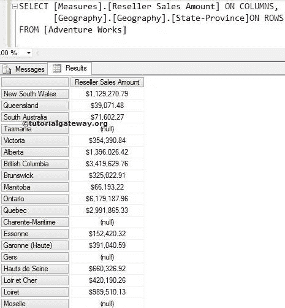
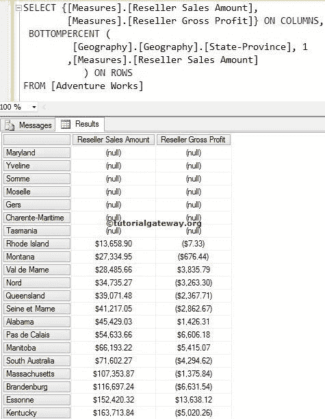

# `BOTTOMPERCEN`函数

> 原文：<https://www.tutorialgateway.org/mdx-bottompercent-function/>

MDX `BOTTOMPERCEN`函数将按升序对给定的数据进行排序。然后，MDX bottompercent 从已排序的数据中选择所需数量的记录，这些记录的总数大于或等于指定的百分比。

## `BOTTOMPERCEN`函数语法

多维表达式中 MDX 底部百分比的基本语法如下所示:

```
BOTTOMPERCENT (Set_Expression, Percentage, Numeric_Expression)
```

*   Set_Expression:要检查的任何多维表达式或属性。
*   百分比:请提供要检索的百分比。
*   数值表达式:任何多维表达式或度量。MDX BottomPercent 函数将使用这个 Numeric_Expression 按升序对数据进行排序，然后选择与百分比匹配所需的记录数。

如何编写 MDX BottomPercent 函数来从地理维度(位于冒险工作多维数据集中)中提取在经销商销售额中处于总销售额的底部 1%的州？。为此，我们将使用下面显示的数据。



## MDX `BOTTOMPERCEN`函数示例

以下查询返回地理维度中贡献经销商销售总额后 1%的所有州。

提示:请使用 [MDX `TOPPERCENT`函数](https://www.tutorialgateway.org/mdx-toppercent-function/)查找 Top 百分比。

```
SELECT {[Measures].[Reseller Sales Amount]} ON COLUMNS,
 BOTTOMPERCENT (
	    [Geography].[Geography].[State-Province], 1
            ,[Measures].[Reseller Sales Amount]
	    ) ON ROWS
FROM [Adventure Works]
```

在上面的 [MDX](https://www.tutorialgateway.org/mdx/) 查询中，我们选择了列上的【经销商销售额】度量和行上的地理维度中的【州省】列。接下来，MDX BottomPercent 函数将使用度量值按升序对数据进行排序。[经销商销售金额]。然后，它找到总销售额中销售额的百分比。


如果您观察上面的底部百分比截图，它们不是“总计”记录的底部 1%行。如果您合计上述屏幕截图中的经销商销售金额，它将大于或等于经销商销售总额的 1%。简而言之，上述各州是销售额占总销售额 1%的最差州。

## MDX `BOTTOMPERCEN`函数示例 2

在本例中，我们将使用两个度量标准([度量标准]。[经销商销售金额][衡量标准]。[经销商毛利])。

```
SELECT {[Measures].[Reseller Sales Amount], 
        [Measures].[Reseller Gross Profit]} ON COLUMNS,
 BOTTOMPERCENT (
             [Geography].[Geography].[State-Province], 1
            ,[Measures].[Reseller Sales Amount]
	   ) ON ROWS
FROM [Adventure Works]
```



如果您观察上面的截图，我们会发现[经销商毛利]的结果并不均衡。这是因为数据是根据[经销商销售额]排序的

注意:请在 BOTTOMPERCENT 函数中使用适当的度量作为第三个参数。否则，你最终会得到错误的结果。

## 非空以及 MDX `BOTTOMPERCEN`函数

在本例中，我们将使用 [Non Empty](https://www.tutorialgateway.org/mdx-non-empty/) 关键字来移除 BOTTOMPERCENT 函数返回的 NULL 值。

```
SELECT {[Measures].[Reseller Sales Amount] } ON COLUMNS,
 NON EMPTY
  BOTTOMPERCENT (
	      [Geography].[Geography].[State-Province], 1
	     ,[Measures].[Reseller Sales Amount] 
	      ) ON ROWS
FROM [Adventure Works]
```


虽然我们要求底部的 1%记录，但是上面的查询显示的记录很少，因为剩余的记录都是 NULLS。我们在上面的查询中使用的 MDX `NON EMPTY`关键字删除了那些空记录。