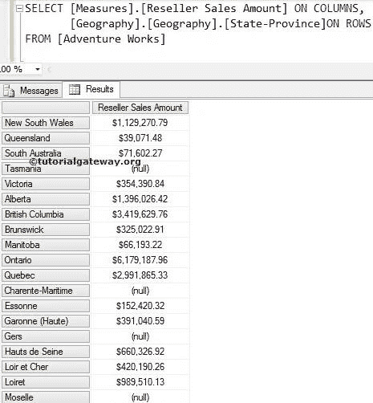
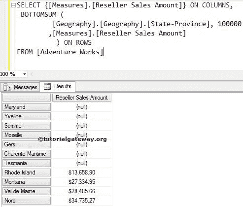
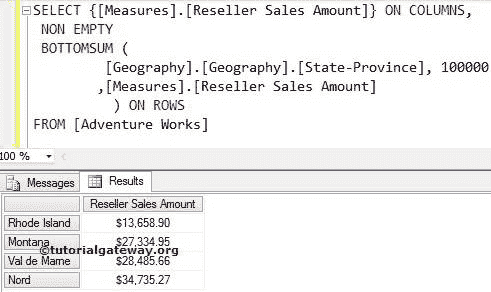

# MDX `BOTTOMSUM`函数

> 原文：<https://www.tutorialgateway.org/mdx-bottomsum-function/>

MDX BottomSum 函数将以升序对给定的数据进行排序。然后，MDX bottomsum 从排序后的数据中选择所需数量的记录，这些记录的总数至少等于指定的值。

## MDX `BOTTOMSUM`函数语法

多维表达式中 BottomSum 的基本语法是

```
BOTTOMSUM (Set_Expression, Value, Numeric_Expression)
```

*   Set_Expression:要检查的任何多维表达式或属性。
*   值:请提供值。MDX BOTTOMSUM 函数将检索总计至少等于该值的记录。
*   数值表达式:任何多维表达式或度量。BottomSum 函数将使用此数值表达式按升序对数据进行排序。接下来，它选择与该值匹配所需的记录数。

如何编写 MDX BottomSum 函数，从 Adventure Works 多维数据集中的 Geography 维度中提取总计至少等于用户给定值的底层状态？。为此，我们将使用下面显示的数据。



## MDX `BOTTOMSUM`函数示例

以下 MDX 底部总和查询将返回地理维度中的底部状态，这些状态贡献了总经销商销售额的 100000。

提示:请使用 [TOPSUM 函数](https://www.tutorialgateway.org/mdx-topsum-function/)计算前 N 条记录之和

```
SELECT {[Measures].[Reseller Sales Amount]} ON COLUMNS,
 BOTTOMSUM (
	 [Geography].[Geography].[State-Province]
        ,100000
	,[Measures].[Reseller Sales Amount]
	) ON ROWS
FROM [Adventure Works]
```

在上面的 MDX 查询中，我们选择了列上的[经销商销售额]度量和行上的地理维度中的[州/省]列。接下来，BottomSum 函数将使用 Measures 以升序对数据进行排序。[经销商销售金额]。然后，将每个州的销售金额相加，直到达到 100000。



如果您观察上面的截图，如果您将上面显示的状态的销售额相加，它们大约等于 104214.78。这比我们要求的更重要。

## 在 MDX 底部总和中使用非空

在本例中，我们将使用 Non Empty 关键字来移除 BottomSum 函数返回的空值。

```
SELECT {[Measures].[Reseller Sales Amount]} ON COLUMNS,
 NON EMPTY
  BOTTOMSUM (
	  [Geography].[Geography].[State-Province]
         ,100000
	 ,[Measures].[Reseller Sales Amount]
	 ) ON ROWS
FROM [Adventure Works]
```



如果观察上面的截图，我们在上面的查询中使用的 MDX [Non Empty](https://www.tutorialgateway.org/mdx-non-empty/) 关键字删除了那些 Null 记录。现在，它看起来又好又容易:)

注意:请在 BOTTOMSUM 函数中使用适当的度量作为第三个参数。否则，你最终会得到错误的结果。