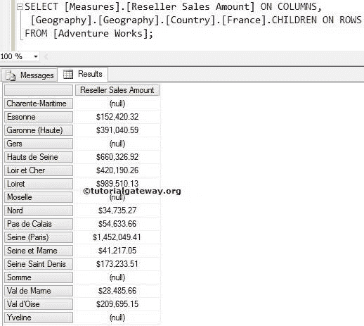
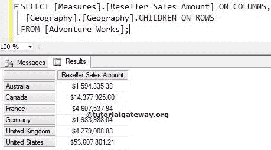

# MDX 子函数

> 原文：<https://www.tutorialgateway.org/mdx-children-function/>

如何用例子写出 Children 函数？。MDX 子函数将返回属于指定成员的关联子成员。

例如，如果你是亚马逊开发者，如果你的一个客户正在 Amazon.com 寻找 iPod。作为开发人员，您必须在页面底部显示所有苹果产品。以便用户可以浏览其他产品，有时他可能会购买？在这些情况下，您可以通过编写类似[产品]的内容来使用 MDX Children 函数。[苹果]。家长，孩子

## MDX 子函数语法

多维表达式中子函数的基本语法如下所示:

```
Member_Expression.CHILDREN
```

成员表达式:返回有效成员的任何多维表达式。

### MDX 子函数示例

在本例中，我们将找到法国所有州的[经销商销售额]。

```
SELECT 
  [Measures].[Reseller Sales Amount] ON COLUMNS,
  [Geography].[Geography].[Country].[France].CHILDREN ON ROWS
FROM [Adventure Works];
```



从上面的 [MDX](https://www.tutorialgateway.org/mdx/) 截图可以观察到，它显示的是法国目前所有的州。

### 儿童功能示例 2

在本例中，我们将找到地理属性中所有国家/地区的[经销商销售额]。

```
SELECT 
  [Measures].[Reseller Sales Amount] ON COLUMNS,
  [Geography].[Geography].CHILDREN ON ROWS
FROM [Adventure Works];
```

