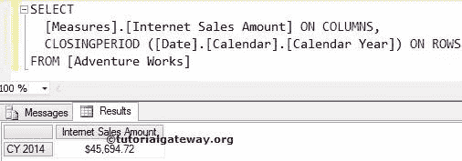
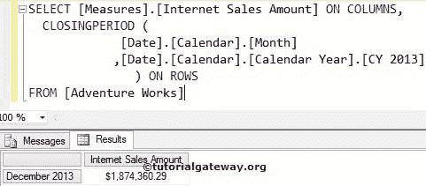
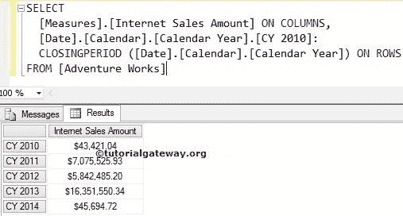
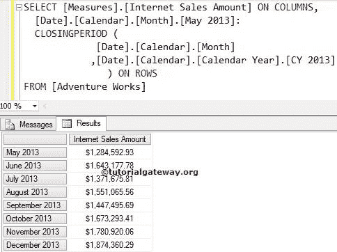

# `CLOSINGPERIOD`函数

> 原文：<https://www.tutorialgateway.org/mdx-closingperiod-function/>

MDX `CLOSINGPERIOD`函数将返回属于指定成员或指定级别的最后一个同级成员。

## `CLOSINGPERIOD`函数语法

多维表达式中 ClosingPeriod 的基本语法如下所示:

```
CLOSINGPERIOD (Level_Expression, Member_Expression)
```

*   成员表达式:返回有效成员的任何多维表达式。
*   Level_Expression:请指定要导航的级别。

对于 MDX 示例中的 ClosingPeriod 函数，我们将使用下面的显示数据。以下截图显示了日期维度


内的日历年列表

## MDX `CLOSINGPERIOD`函数示例

在本例中，我们将使用 MDX ClosingPeriod 函数查找日历年中的最后一年。

```
SELECT 
  [Measures].[Internet Sales Amount] ON COLUMNS,
  CLOSINGPERIOD ([Date].[Calendar].[Calendar Year]) ON ROWS
FROM [Adventure Works]
```



在上面的 MDX 查询中，我们在列中使用了[互联网销售额]

```
[Measures].[Internet Sales Amount] ON COLUMNS
```

下面一行代码将从日期维度返回日历年中的最后一个同级成员，即 2014 年。

```
CLOSINGPERIOD ([Date].[Calendar].[Calendar Year])
```

## MDX `CLOSINGPERIOD`函数示例 2

在本例中，我们将使用 ClosingPeriod 函数查找 2013 日历年中的最后一个月，并计算该月的互联网销售额。

```
SELECT 
  [Measures].[Internet Sales Amount] ON COLUMNS,
  CLOSINGPERIOD (
             [Date].[Calendar].[Month] 
            ,[Date].[Calendar].[Calendar Year].[CY 2013]
		) ON ROWS
FROM [Adventure Works]

```



## 使用 MDX 关闭周期的范围示例 1

在本例中，我们向您展示了如何使用 ClosingPeriod 函数来查找范围。以下 [MDX](https://www.tutorialgateway.org/mdx/) 查询将返回 2010 至 2014 日历年的互联网销售金额

```
SELECT 
  [Measures].[Internet Sales Amount] ON COLUMNS,
  [Date].[Calendar].[Calendar Year].[CY 2010]:
  CLOSINGPERIOD ([Date].[Calendar].[Calendar Year]) ON ROWS
FROM [Adventure Works]
```



在上面的 MDX 查询中，我们在列中使用了[互联网销售额]

```
[Measures].[Internet Sales Amount] ON COLUMNS
```

下面一行代码将从日期维度返回日历年中的最后一个同级成员，即 2014 年。

```
CLOSINGPERIOD ([Date].[Calendar].[Calendar Year])
```

这意味着我们在 2010 年和 2014 年之间使用了范围运算符。因此，输出将显示日期维度中所有日历年的互联网销售额。

```
[Date].[Calendar].[Calendar Year].[CY 2010] -- 2010

CLOSINGPERIOD ([Date].[Calendar].[Calendar Year]): -- 2014
```

## 使用 MDX 关闭周期的范围示例 2

在这个例子中，我们展示了如何使用 ClosingPeriod 函数找到范围。以下查询将返回 2013 日历年 5 月至 12 月的互联网销售额

```
SELECT 
  [Measures].[Internet Sales Amount] ON COLUMNS,
  [Date].[Calendar].[Month].[May 2013]: 
  CLOSINGPERIOD (
             [Date].[Calendar].[Month] 
            ,[Date].[Calendar].[Calendar Year].[CY 2013]
		) ON ROWS
FROM [Adventure Works]
```

