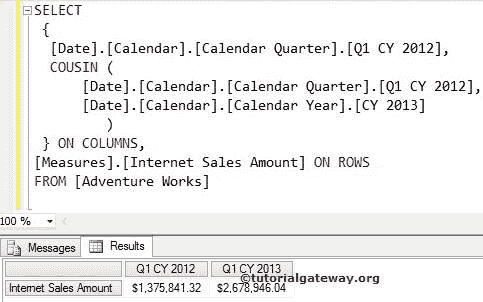
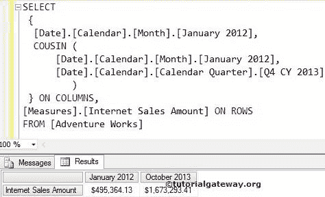
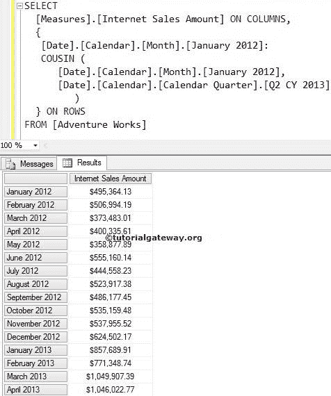

# MDX `COUSIN`函数

> 原文：<https://www.tutorialgateway.org/mdx-cousin-function/>

在 MDX 中，表哥函数将在第二个参数中指定的祖先下编写相同级别的成员。例如，如果您知道 2014 日历年第一季度的价值。你想找到 2015 日历年最后一个季度的销售额。然后就可以使用这个 MDX 表哥函数了。

## MDX `COUSIN`函数语法

MDX 库的基本语法是:

```
COUSIN( Member_Expression, Ancestor_Member_Expression )
```

*   成员表达式:返回有效成员的任何多维表达式。它会找到成员级别。例如，成员是一个季度的第一个月、学期还是年等等。
*   祖先成员表达式:返回有效祖先成员的任何多维表达式。MDX `COUSIN`函数将在这个祖先成员中找到第一个参数的表亲。

在本文中，我们将通过示例向您展示如何在 MDX 查询中编写 Cousin 函数。为此，我们将使用下面显示的数据


## MDX `COUSIN`函数示例

在本例中，我们将使用表弟函数来查找 2013 日历年中 Q1 CY 2012 的表弟

```
SELECT 
 {
  [Date].[Calendar].[Calendar Quarter].[Q1 CY 2012],
  COUSIN (
      [Date].[Calendar].[Calendar Quarter].[Q1 CY 2012],
      [Date].[Calendar].[Calendar Year].[CY 2013]
	 )
  } ON COLUMNS,
[Measures].[Internet Sales Amount] ON ROWS
FROM [Adventure Works]
```



在上面的 [MDX](https://www.tutorialgateway.org/mdx/) 查询中，我们使用了行上的【互联网销售额】

```
[Measures].[Internet Sales Amount] ON ROWS
```

SELECT 后的第一行代码将检查 Q1 CY 2012，并写入 Q1 CY 2012 的互联网销售金额。众所周知，Q1 CY 2012 是 2012 日历年的第一季度。

```
[Date].[Calendar].[Calendar Quarter].[Q1 CY 2012],
```

MDX 表亲代码的下一行将检查 2013 日历年的第一季度(因为 Q1 CY 2012 是 2012 日历年的第一季度)，然后写入 Q1 CY 2013 的互联网销售额

```
COUSIN (
      [Date].[Calendar].[Calendar Quarter].[Q1 CY 2012],
      [Date].[Calendar].[Calendar Year].[CY 2013]
	)
```

## MDX `COUSIN`函数示例 2

在本例中，我们将使用表哥函数在 2013 日历年第四季度中查找 2012 年 1 月的表哥

```
SELECT 
 {
  [Date].[Calendar].[Month].[January 2012],
  COUSIN (
      [Date].[Calendar].[Month].[January 2012],
      [Date].[Calendar].[Calendar Quarter].[Q4 CY 2013]
         )
  } ON COLUMNS,
  [Measures].[Internet Sales Amount] ON ROWS
FROM [Adventure Works] 
```



在上面的 MDX 查询中，我们在行上使用了[互联网销售额]

```
[Measures].[Internet Sales Amount] ON ROWS
```

SELECT 后的第一行 MDX Cousin 代码将检查 2012 年 1 月月份，并写入 2012 年 1 月的互联网销售金额。众所周知，在 2012 日历年中，1 月是 Q1 2012 年的第一个月。

```
[Date].[Calendar].[Month].[January 2012],
```

下面一行代码将检查 2013 年第四季度(即 10 月)的第一个月，然后写出 2013 年 10 月的互联网销售额

```
COUSIN (
        [Date].[Calendar].[Month].[January 2012],
        [Date].[Calendar].[Calendar Quarter].[Q4 CY 2013]
        )
```

注意:如果我们将上面代码行中的日历季度替换为日历第二学期，MDX Query 将编写第二学期的第一个月

## 使用 MDX `COUSIN`函数查找范围

在本例中，我们将使用 MDX 表哥函数计算一个点到另一个点之间的范围。

```
SELECT 
  [Measures].[Internet Sales Amount] ON COLUMNS,
  { 
   [Date].[Calendar].[Month].[January 2012]:
   COUSIN (
      [Date].[Calendar].[Month].[January 2012],
      [Date].[Calendar].[Calendar Quarter].[Q2 CY 2013]
	  )
  } ON ROWS
FROM [Adventure Works] 
```



SELECT 后的第一行代码将检查 2012 年 1 月月份，并写入 2012 年 1 月的互联网销售额。众所周知，在 2012 日历年中，1 月是 Q1 2012 年的第一个月。

```
[Date].[Calendar].[Month].[January 2012],
```

MDX 表亲代码的下一行将检查 2013 年 Q2 日历季度的第一个月(即 4 月)

```
 COUSIN (
      [Date].[Calendar].[Month].[January 2012],
      [Date].[Calendar].[Calendar Quarter].[Q2 CY 2013]
	 )
```

现在，上述语句之间的范围运算符(:)将写入 2012 年 1 月至 2013 年 4 月的所有日历月。