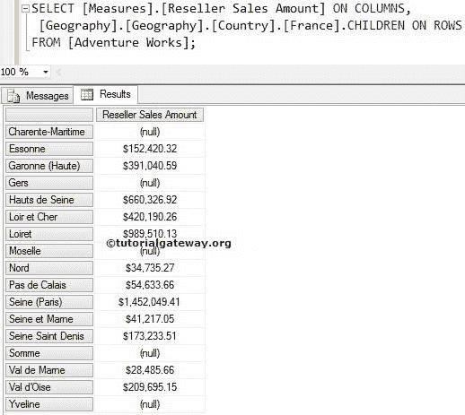

# MDX `FIRSTCHILD`函数

> 原文：<https://www.tutorialgateway.org/mdx-firstchild-function/>

MDX FirstChild 函数将返回属于指定成员的第一个子成员。例如，如果您知道一个客户的名字，并且您想找到第一个客户的销售额，那么您可以使用这个 MDX FirstChild 函数。

## MDX `FIRSTCHILD`函数语法

多维表达式中 MDX FirstChild 的基本语法如下所示:

```
Member_Expression.FIRSTCHILD
```

成员表达式:返回有效成员的任何多维表达式。

对于 MDX 查询中的这个 FirstChild 函数，我们将使用下面的显示数据。以下截图显示了地理


内的国家

下面的截图显示了法国



内部的【州-省】

## MDX `FIRSTCHILD`函数示例

在这个例子中，我们将找到法国国家的第一批孩子。它意味着法国的第一个州。

提示:我们可以使用 [MDX LastChild 函数](https://www.tutorialgateway.org/mdx-lastchild-function/)来查找最后一个子成员。

```
SELECT 
  [Measures].[Reseller Sales Amount] ON COLUMNS,
  [Geography].[Geography].[Country].[France].FIRSTCHILD ON ROWS
FROM [Adventure Works];
```


在上面的 [MDX](https://www.tutorialgateway.org/mdx/) 查询中，我们在列中使用了【经销商销售额】

```
[Measures].[Reseller Sales Amount] ON COLUMNS
```

下面一行代码将从法国的所有州-省中写出法国的第一个子成员。

```
[Geography].[Geography].[Country].[France].FIRSTCHILD
```

## MDX 第一个子函数示例 2

众所周知，巴黎是法国的一个州，我们打算找到法国的第一个州，然后我们可以使用这个 FirstChild 函数。在本例中，我们将找到州/省列表中的第一个孩子，并计算其经销商销售额。

```
SELECT 
 [Measures].[Reseller Sales Amount] ON COLUMNS,
 [Geography].[Geography].[State-Province].[Seine (Paris)].PARENT.FIRSTCHILD ON ROWS
FROM [Adventure Works];
```


在上面的 MDX 查询中，我们在列中使用了[经销商销售额]

```
[Measures].[Reseller Sales Amount] ON COLUMNS
```

从下面的代码行，

```
[Geography].[Geography].[State-Province].[Seine (Paris)].PARENT.FIRSTCHILD
```

MDX 将首先实现 Parent 函数来查找一个[塞纳(巴黎)]的父成员，它就是法国。详见 [MDX 父功能](https://www.tutorialgateway.org/mdx-parent-function/)

接下来，它将实现 FirstChild 函数来查找法国国家的第一个子成员，即 Charente-Maritime。对于夏朗德海洋州，根本没有销售。因此，它显示空结果。

## `FIRSTCHILD`函数替代

在这个例子中，我们使用 MDX FirstChild 函数替代来达到同样的结果。请参考 [MDX `FIRSTSIBLING`函数](https://www.tutorialgateway.org/mdx-firstsibling-function/)了解`FIRSTSIBLING`函数。

```
SELECT 
 [Measures].[Reseller Sales Amount] ON COLUMNS,
 [Geography].[Geography].[State-Province].[Seine (Paris)].FIRSTSIBLING ON ROWS
FROM [Adventure Works];
```

