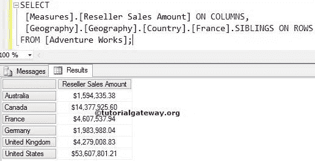

# MDX `FIRSTSIBLING`函数

> 原文：<https://www.tutorialgateway.org/mdx-firstsibling-function/>

函数将返回属于指定成员的父成员的第一个子成员。例如，如果您知道一个客户的名字，并且想要找到第一个客户的销售额，那么您可以使用这个 MDX 第一个兄弟函数。

## MDX `FIRSTSIBLING`函数语法

多维表达式中第一个兄弟函数的基本语法如下所示:

```
Member_Expression.FIRSTSIBLING
```

成员表达式:返回有效成员的任何多维表达式。

对于 MDX 查询中的第一个兄弟函数，我们将使用下面的 show data。以下截图显示了地理



内的国家

下面的截图显示了法国


内部的【州-省】

## MDX `FIRSTSIBLING`函数示例

在本例中，我们将在国家列表中找到第一个孩子。

```
SELECT 
  [Measures].[Reseller Sales Amount] ON COLUMNS,
  [Geography].[Geography].[Country].[France].FIRSTSIBLING ON ROWS
FROM [Adventure Works];
```


在上面的 [MDX](https://www.tutorialgateway.org/mdx/) 查询中，我们在列中使用了【经销商销售额】

```
[Measures].[Reseller Sales Amount] ON COLUMNS
```

下面一行代码将检查法国父代(它是所有成员)，然后找到该国家的第一个子代成员。

```
[Geography].[Geography].[Country].[France].FIRSTSIBLING
```

## MDX `FIRSTSIBLING`函数示例 2

如果我们知道卢瓦尔特是法国的一个州。我们打算在法国找到第一个州。然后，我们可以使用这个 MDX `FIRSTSIBLING`函数。在本例中，我们将找到州/省列表中的第一个孩子，并计算其经销商销售额。

```
SELECT 
 [Measures].[Reseller Sales Amount] ON COLUMNS,
 [Geography].[Geography].[State-Province].[Loiret].FIRSTSIBLING ON ROWS
FROM [Adventure Works];
```


在上面的 MDX 查询中，我们在列中使用了[经销商销售额]

```
[Measures].[Reseller Sales Amount] ON COLUMNS
```

下面的第一个兄弟代码行将检查 Loiret 父代(即法国)，然后找到法国国家的第一个子代成员。

```
[Geography].[Geography].[Country].[France].FIRSTSIBLING
```

对于夏朗德海洋州，根本没有销售。因此，它显示空结果。

## MDX `FIRSTSIBLING`函数替代

在这个例子中，我们将使用 FirstSibling 函数来达到同样的结果。请参考 [MDX 父功能](https://www.tutorialgateway.org/mdx-parent-function/)了解父功能，参考 [MDX 第一子功能](https://www.tutorialgateway.org/mdx-firstchild-function/)了解第一子功能。

```
SELECT 
 [Measures].[Reseller Sales Amount] ON COLUMNS,
 [Geography].[Geography].[State-Province].[Loiret].PARENT.FIRSTCHILD ON ROWS
FROM [Adventure Works];
```

