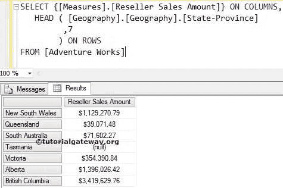
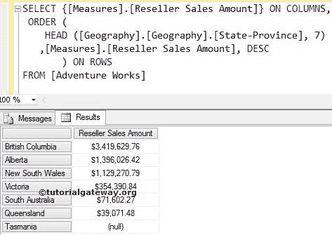
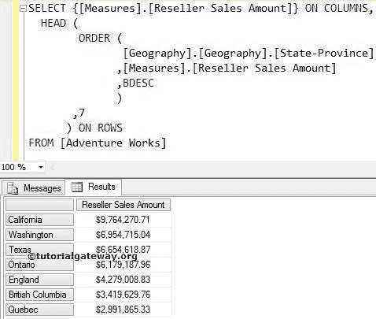

# MDX `Head`函数

> 原文：<https://www.tutorialgateway.org/mdx-head-function/>

MDX `Head`函数用于从源数据中选择所需数量的记录。例如，如果你想找到表现最好的 10 个产品。或者你想找到销售额最高的前 10 个地区，或者计算最高工资。我们可以将 MDX `Head`函数与 Order 函数一起使用。

## MDX HEAD 和 SQL TOP 子句的相似之处

MDX `Head`函数类似于 SQL TOP 子句。

*   像 [TOP 子句](https://www.tutorialgateway.org/sql-top-clause/)一样，MDX `Head`函数按照最初存储的顺序提取所需数量的记录。
*   要提取前 10 个性能记录，我们必须使用 SQL 中的 [Order By 子句](https://www.tutorialgateway.org/sql-order-by-clause/)。
*   要提取前 10 个表现良好的记录，我们必须使用带有适当度量或数值的 MDX 订单函数。

### 头函数语法

MDX 头函数只允许两个参数。多维表达式中 `Head`函数的基本语法如下所示:

```
HEAD (Set_Expression, Count)
```

*   Set_Expression:要检查的任何多维表达式或属性。
*   计数:要检索的记录数。

如何用示例编写 MDX `Head`函数从经销商销售额大于他人的地理维度(存在于 Adventure Works 多维数据集中)中提取前 7 个州？。为此，我们将使用下面显示的数据。


## MDX `Head`函数示例

在这个例子中，我们将向您展示如何编写 `Head`函数。下面的查询将按照上面出现的顺序返回来自上述来源的前七条记录。

```
SELECT {[Measures].[Reseller Sales Amount]} ON COLUMNS,
 HEAD (
	 [Geography].[Geography].[State-Province] 
        ,7 
       ) ON ROWS
FROM [Adventure Works]
```

在上面的 [MDX](https://www.tutorialgateway.org/mdx/) 查询中，我们选择了列上的[经销商销售额]度量和行上的地理维度中的[州省]属性。接下来，`Head`函数将选择前 7 条记录，而不考虑它们的测量值。



没有人会接受上述结果，成为全球表现最好的 7 个州。它们只是前七张唱片。

## 使用顺序函数和 MDX 头函数

在这个例子中，我们将向您展示，当我们添加 MDX 订单函数时会发生什么。

```
SELECT {[Measures].[Reseller Sales Amount]} ON COLUMNS,
 ORDER (
    HEAD ([Geography].[Geography].[State-Province], 7)--Already Picked Data 
   ,[Measures].[Reseller Sales Amount], DESC
       ) ON ROWS
FROM [Adventure Works]
```



首先，`Head`函数将使用下面的语句选择源数据中出现的前 7 条记录

```
 HEAD ([Geography].[Geography].[State-Province], 7)
```

接下来，MDX `Head`函数之外的 Order 函数将使用经销商销售额对已经挑选的数据进行降序排序。

```
 ORDER (
    HEAD ([Geography].[Geography].[State-Province], 7) 
   ,[Measures].[Reseller Sales Amount], DESC
       ) ON ROWS
```

这意味着我们按照降序从源数据中获得前 7 条记录

让我们更改上面的代码:

```
SELECT {[Measures].[Reseller Sales Amount]} ON COLUMNS,
  HEAD (
    ORDER (
          [Geography].[Geography].[State-Province]
         ,[Measures].[Reseller Sales Amount]
         ,BDESC
           )
     ,7 
      ) ON ROWS
FROM [Adventure Works]
```



首先，Order 函数将使用经销商销售额按降序对州/省数据进行排序。在对数据进行排序时，我们使用 BDESC 来打破层次结构。

```
ORDER (
        [Geography].[Geography].[State-Province]
       ,[Measures].[Reseller Sales Amount]
       ,BDESC
      )
```

接下来，MDX `Head`函数将从已经排序的数据中挑选前 7 条记录。

```
HEAD (
    ORDER (
          [Geography].[Geography].[State-Province]
         ,[Measures].[Reseller Sales Amount]
         ,BDESC
           )
     ,7 
      ) ON ROWS
```

现在，我们得到了我们的前 7 个表现状态。

注意:请在 ORDER 函数中使用适当的度量作为第二个参数。否则，你会得到错误的结果。