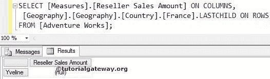

# MDX 最后一个子函数

> 原文：<https://www.tutorialgateway.org/mdx-lastchild-function/>

函数将返回属于指定成员的最后一个子成员。例如，如果您知道一个客户的名字，并且您想找到最后一个客户的销售额，那么您可以使用这个 MDX LastChild 函数。

## MDX 最后一个子函数语法

多维表达式中 LastChild 的基本语法如下所示:

```
Member_Expression.LASTCHILD
```

成员表达式:返回有效成员的任何多维表达式。

对于 MDX 查询中的 LastChild 函数，我们将使用下面的显示数据。以下截图显示了地理


内的国家

以下截图显示了法国


内部的【州-省】

## MDX 最后一个子函数示例

在这个例子中，我们将找到在法国的最后一个孩子。它意味着法国的最后一个州。

提示:我们可以使用 [MDX FirstChild 函数](https://www.tutorialgateway.org/mdx-firstchild-function/)来查找第一个子成员。

```
SELECT 
  [Measures].[Reseller Sales Amount] ON COLUMNS,
  [Geography].[Geography].[Country].[France].LASTCHILD ON ROWS
FROM [Adventure Works];
```



在上面的 [MDX](https://www.tutorialgateway.org/mdx/) 查询中，我们在列中使用了【经销商销售额】

```
[Measures].[Reseller Sales Amount] ON COLUMNS
```

下面一行代码将从法国的所有州-省中编写法国的 MDX Lastchild 成员。

```
[Geography].[Geography].[Country].[France].LASTCHILD
```

对于伊夫林州来说，根本没有销售。因此，它显示空结果。

## MDX LastChild 函数示例 2

在本例中，我们将查找“国家/地区”列表中的最后一个孩子，并计算该孩子的经销商销售额。

```
SELECT 
  [Measures].[Reseller Sales Amount] ON COLUMNS,
  [Geography].[Geography].[Country].[France].PARENT.LASTCHILD ON ROWS
FROM [Adventure Works];
```


在上面的 MDX 查询中，我们在列中使用了[经销商销售额]

```
[Measures].[Reseller Sales Amount] ON COLUMNS
```

从下面的代码行，

```
[Geography].[Geography].[Country].[France].PARENT.LASTCHILD
```

MDX 将首先实现 Parent 函数来查找法国的父成员，即所有成员。详见 [MDX 父功能](https://www.tutorialgateway.org/mdx-parent-function/)

接下来，它将实现 LastChild 函数来查找国家列表中的最后一个子成员谁是美国。

## MDX 最后一个子函数替代

在本例中，我们将使用 LastChild 函数替代来获得相同的结果。请参考 [MDX LastSibling 函数](https://www.tutorialgateway.org/mdx-lastsibling-function/)了解 LastSibling 函数。

```
SELECT 
  [Measures].[Reseller Sales Amount] ON COLUMNS,
  [Geography].[Geography].[Country].[France].LASTSIBLING ON ROWS
FROM [Adventure Works];
```

