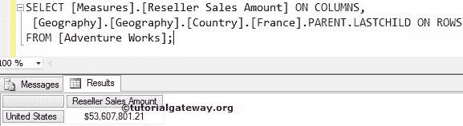

# MDX `LASTSIBLING`函数

> 原文：<https://www.tutorialgateway.org/mdx-lastsibling-function/>

函数将返回属于指定成员的父成员的最后一个子成员。例如，如果您知道一个客户名称，并且想要查找最后一个客户的销售额，那么您可以使用这个 MDX 最后一个同级函数。

## MDX 最后一个同级函数语法

多维表达式中 MDX 最后一个兄弟的基本语法如下所示:

```
Member_Expression.LASTSIBLING
```

成员表达式:返回有效成员的任何多维表达式。

对于 MDX 查询中的`LASTSIBLING`函数，我们将使用下面的显示数据下面的截图显示了地理


中的国家

以下截图显示了法国


内部的【州-省】

## MDX `LASTSIBLING`函数示例

如果我们知道 Loiret 是法国的一个州，并且我们打算找到法国的最后一个州，那么我们可以使用这个 LastSibling 函数。在本例中，我们将查找州/省列表中的最后一个孩子，并计算该孩子的经销商销售额。

提示:可以使用 [MDX 第一个`SIBLINGS`函数](https://www.tutorialgateway.org/mdx-firstsibling-function/)查找第一个兄弟。

```
SELECT 
 [Measures].[Reseller Sales Amount] ON COLUMNS,
 [Geography].[Geography].[State-Province].[Loiret].LASTSIBLING ON ROWS
FROM [Adventure Works];
```


## MDX `LASTSIBLING`函数示例

在本例中，我们将找到“国家”列表中的最后一个孩子。

```
SELECT 
  [Measures].[Reseller Sales Amount] ON COLUMNS,
  [Geography].[Geography].[Country].[France].LASTSIBLING ON ROWS
FROM [Adventure Works];
```


在上面的 [MDX](https://www.tutorialgateway.org/mdx/) 查询中，我们在列中使用了【经销商销售额】

```
[Measures].[Reseller Sales Amount] ON COLUMNS
```

下面一行代码将检查法国父代(它是所有成员)，然后找到该国家的最后一个子代成员。

```
[Geography].[Geography].[Country].[France].LASTSIBLING
```

## `LASTSIBLING`函数替代

在本例中，我们将使用 MDX LastSibling 函数替代来获得相同的结果。请参考 [MDX 父功能](https://www.tutorialgateway.org/mdx-parent-function/)了解父功能，参考 [MDX LastChild 功能](https://www.tutorialgateway.org/mdx-lastchild-function/)了解 LastChild 功能。

```
SELECT 
 [Measures].[Reseller Sales Amount] ON COLUMNS,
 [Geography].[Geography].[Country].[France].PARENT.LASTCHILD ON ROWS
FROM [Adventure Works];
```

