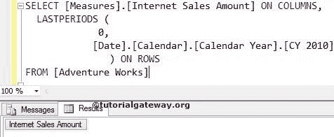
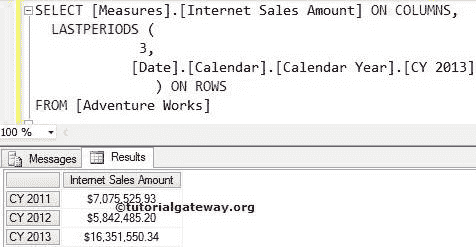
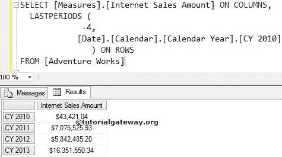

# MDX 最后周期函数

> 原文：<https://www.tutorialgateway.org/mdx-lastperiods-function/>

MDX LastPeriods 函数用于在相同级别的成员之间导航。它返回到指定位置的成员集，包括给定的数字本身。例如，如果你想列出从一个位置到一个特定成员的成员，那么我们可以使用这个 MDX LastPeriods 函数。

提示:如果知道目标成员的索引位置，可以使用这个 MDX LastPeriod 函数。

## 函数语法

多维表达式中最后一个周期的基本语法如下所示:

```
LASTPERIODS (Member_Position, Member_Expression)
```

成员表达式:返回有效成员的任何多维表达式。

成员 _ 位置:请指定要导航的成员的位置。

*   如果我们使用零作为成员位置，MDX 最后一个周期函数将返回空集合。
*   如果我们使用负值，LastPeriods 函数将向前移动到指定的值，并返回该位置的成员集，包括 Member_Expression。
*   如果我们使用正值，LastPeriods 函数将向后移动到一个指定的值，并返回到该位置的成员集，包括 Member_Expression。

MDX 最后周期函数用于在相同的成员级别之间导航。例如，如果我们将城市成员称为成员表达式，LastPeriods 函数将在剩余的城市之间导航。它不会升级(州-省)或降级(邮政编码)。

如何用例子编写 MDX LastPeriods 函数向前和向后导航？。为此，我们将使用下面显示的数据。


## 带零的最长周期函数

在这个例子中，我们将向您展示，当我们对最后一个周期函数使用零值时会发生什么。以下 [MDX](https://www.tutorialgateway.org/mdx/) 查询将返回空集合

```
SELECT 
  [Measures].[Internet Sales Amount] ON COLUMNS,
  LASTPERIODS (
               0, 
              [Date].[Calendar].[Calendar Year].[CY 2013] 
	       ) ON ROWS
FROM [Adventure Works]
```



## 具有正值的 MDX 最后周期函数

当我们在 LastPeriods 函数中使用正整数值时会发生什么？。以下查询将返回 2013、2012 和 2011 日历年的互联网销售额，因为具有正值(3)的 LastPeriods 函数将向后移动 2 年+2013 年。这是因为 LastPeriods 函数包含了 2013 本身。

```
SELECT 
  [Measures].[Internet Sales Amount] ON COLUMNS,
  LASTPERIODS (
               3, 
              [Date].[Calendar].[Calendar Year].[CY 2013] 
	       ) ON ROWS
FROM [Adventure Works]
```



## 具有负值的最长周期函数

在这个例子中，我们向你展示，当我们为最后一个周期函数使用负整数值时会发生什么。以下查询将返回 2010、2011、2012 和 2013 日历年的互联网销售额，因为具有负值(-4)的 LastPeriods 函数将向前移动 3 年+2010 年。这是因为最后一个周期函数包含了 2010 年本身。

```
SELECT 
  [Measures].[Internet Sales Amount] ON COLUMNS,
  LASTPERIODS (
              -4, 
             [Date].[Calendar].[Calendar Year].[CY 2010] 
	      ) ON ROWS
FROM [Adventure Works]
```

