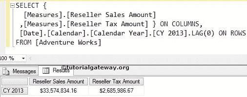
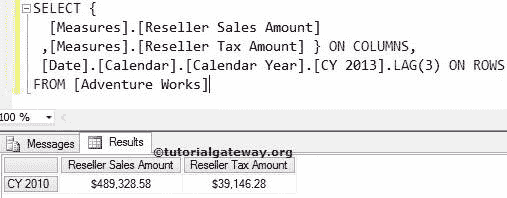
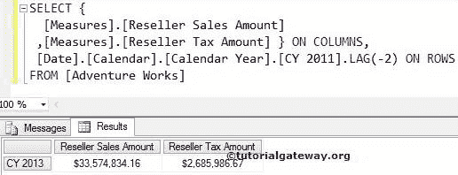
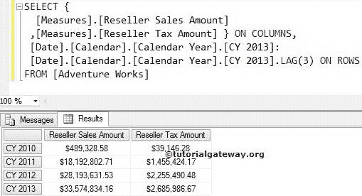

# MDX 滞后函数

> 原文：<https://www.tutorialgateway.org/mdx-lag-function/>

MDX Lag 函数用于在相同级别的成员之间导航，并返回指定位置的成员。例如，如果你想导航到一个特定的成员，那么我们可以使用这个 MDX Lag 函数。

## MDX 滞后函数语法

多维表达式中滞后函数的基本语法如下所示:

```
Member_Expression.LAG (Member_Position)
```

成员表达式:返回有效成员的任何多维表达式。

成员 _ 位置:请指定要导航的成员的位置。

*   如果我们使用零作为成员位置，那么 MDX 滞后函数将编写与我们在滞后函数之前提到的相同的成员表达式。
*   如果我们使用负值作为成员位置，那么滞后函数将向前移动到一个指定的值，并返回该位置的成员表达式。
*   如果我们使用正值作为成员位置，滞后函数将向后移动到指定的值，并返回该位置的成员表达式。

用于在相同成员级别之间导航的 MDX 滞后函数。例如，如果我们将城市成员称为成员表达式，滞后函数将在剩余的城市之间导航。它不会升级(州-省)或降级(邮政编码)。

如何编写一个 MDX Lag 函数，通过例子来实现向前和向后导航？。为此，我们将使用下面显示的数据。


## 零滞后函数

在这个例子中，我们将向您展示，当我们对滞后函数使用零值时会发生什么。以下查询将返回 2013 日历年本身的经销商销售额和税额。

提示:在 MDX 中，正值的[超前函数](https://www.tutorialgateway.org/mdx-lead-function/)等于负值的滞后。

```
SELECT {
  [Measures].[Reseller Sales Amount]
 ,[Measures].[Reseller Tax Amount] } ON COLUMNS,
  [Date].[Calendar].[Calendar Year].[CY 2013].LAG(0) ON ROWS
FROM [Adventure Works]
```



## 具有正值的 MDX 滞后函数

这个例子展示了当我们在滞后函数中使用正整数值时会发生什么。以下查询将返回 2010 日历年的经销商销售额和税额，因为正值(3)的滞后函数将从给定年份(2013–3 = 2010)向后移动 3 年

```
SELECT {
  [Measures].[Reseller Sales Amount]
 ,[Measures].[Reseller Tax Amount] } ON COLUMNS,
  [Date].[Calendar].[Calendar Year].[CY 2013].LAG(3) ON ROWS
FROM [Adventure Works]
```



## 具有负值的 MDX 滞后函数

在这个例子中，我们向您展示了，当我们为滞后函数使用负整数值时会发生什么。以下 [MDX](https://www.tutorialgateway.org/mdx/) 查询返回 2013 日历年的经销商销售额和税额。因为具有负值(-2)的滞后函数将从给定年份向前移动 2 年(2011 + 2 = 2013)

```
SELECT {
  [Measures].[Reseller Sales Amount]
 ,[Measures].[Reseller Tax Amount] } ON COLUMNS,
  [Date].[Calendar].[Calendar Year].[CY 2011].LAG(-2) ON ROWS
FROM [Adventure Works]
```



## 使用 MDX 滞后函数查找范围

如何利用滞后函数找到范围？。以下查询将返回 2010 至 2013 日历年的经销商销售额和税额，因为我们使用了[CY 2013]和[CY 2013]之间的范围符号(:)。LAG (3)。

```
SELECT {
  [Measures].[Reseller Sales Amount]
 ,[Measures].[Reseller Tax Amount] } ON COLUMNS,
 [Date].[Calendar].[Calendar Year].[CY 2013]:
 [Date].[Calendar].[Calendar Year].[CY 2013].LAG(3) ON ROWS
FROM [Adventure Works]
```



如果您想通过向前移动来查找范围，请使用带负值的滞后函数。