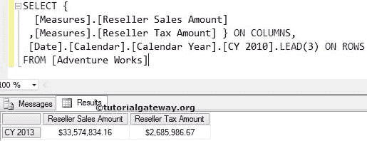

# MDX `LEAD`函数

> 原文：<https://www.tutorialgateway.org/mdx-lead-function/>

MDX `LEAD`函数用于在相同级别的成员之间导航，并返回指定位置的成员。例如，如果你想导航到一个特定的成员，那么我们可以使用这个 MDX `LEAD`函数。

## MDX 潜在客户函数语法

多维表达式中 `LEAD`函数的基本语法如下所示:

```
Member_Expression.LEAD (Member_Position)
```

成员表达式:返回有效成员的任何多维表达式。

成员 _ 位置:请指定要导航的成员的位置。

*   如果我们使用零作为成员位置，MDX `LEAD`函数将编写与我们在 `LEAD`函数之前提到的相同的成员表达式。
*   如果我们使用正值，前导函数将向前移动到指定值，并在该位置返回 Member_Expression。
*   如果我们使用负值，前导函数将向后移动到指定值，并在该位置返回成员表达式。

用于在相同成员级别之间导航的 MDX 主管功能。例如，如果我们将城市成员称为成员表达式，则 `LEAD`函数将在其余城市之间导航。它不会升级(州-省)或降级(邮政编码)。

如何编写一个 MDX `LEAD`函数，用例子来向前和向后导航？。为此，我们将使用下面显示的数据。


## 零引线函数

在这个例子中，我们将向您展示，当我们使用零值作为前导函数时会发生什么。以下查询将返回 2013 日历年本身的经销商销售额和税额。

提示:在 MDX 中，负值的[`LAG`函数](https://www.tutorialgateway.org/mdx-lag-function/)等于正值的超前函数。

```
SELECT {
  [Measures].[Reseller Sales Amount]
 ,[Measures].[Reseller Tax Amount] } ON COLUMNS,
  [Date].[Calendar].[Calendar Year].[CY 2013].LEAD(0) ON ROWS
FROM [Adventure Works]
```


## 具有正值的 MDX 导联函数

在这个例子中，我们将向您展示，当我们在 `LEAD`函数中使用正整数值时会发生什么。以下查询将显示 2013 日历年的经销商销售额和税额，因为正值(3)的销售线索函数将从给定年份(2010 + 3 = 2013)向前推进 3 年

```
SELECT {
  [Measures].[Reseller Sales Amount]
 ,[Measures].[Reseller Tax Amount] } ON COLUMNS,
  [Date].[Calendar].[Calendar Year].[CY 2010].LEAD(3) ON ROWS
FROM [Adventure Works]
```



## 负值的引线函数

当我们对 MDX 引线函数使用负整数值时会发生什么？。以下查询将返回 2010 日历年的经销商销售额和税额，因为负值(-3)的销售线索函数将从给定年份(2013–3 = 2010)向后移动 3 年

```
SELECT {
  [Measures].[Reseller Sales Amount]
 ,[Measures].[Reseller Tax Amount] } ON COLUMNS,
  [Date].[Calendar].[Calendar Year].[CY 2013].LEAD(-3) ON ROWS
FROM [Adventure Works]
```


## 使用 MDX 引线函数查找范围

此示例向您展示了如何使用 `LEAD`函数查找范围。以下查询将返回 2010 至 2013 日历年的经销商销售额和税额，因为我们使用了[CY 2010]和[CY 2010]之间的范围符号(:)。铅(3)。

```
SELECT {
  [Measures].[Reseller Sales Amount]
 ,[Measures].[Reseller Tax Amount] } ON COLUMNS,
 [Date].[Calendar].[Calendar Year].[CY 2010]:
 [Date].[Calendar].[Calendar Year].[CY 2010].LEAD(3) ON ROWS
FROM [Adventure Works]
```


如果您想通过向后移动来查找范围，那么请使用下面的 MDX 查询

```
SELECT {
  [Measures].[Reseller Sales Amount]
 ,[Measures].[Reseller Tax Amount] } ON COLUMNS,
  [Date].[Calendar].[Calendar Year].[CY 2013]:
  [Date].[Calendar].[Calendar Year].[CY 2013].LEAD(-3) ON ROWS
FROM [Adventure Works]
```