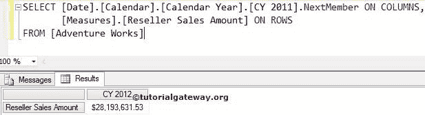
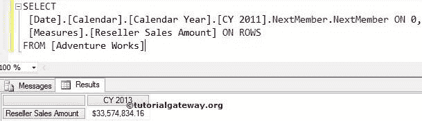
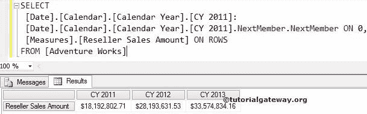
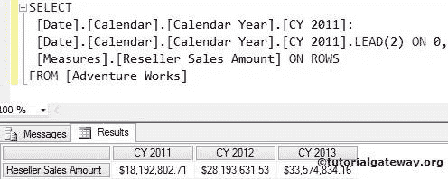
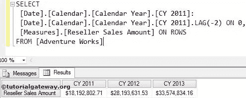

# MDX 下一个成员函数

> 原文：<https://www.tutorialgateway.org/mdx-nextmember-function/>

MDX 下一个成员函数将在下一个位置返回相同级别的成员。

## MDX 下一个成员函数语法

多维表达式中 Nextmember 函数的基本语法如下所示:

```
Member_Expression.NEXTMEMBER
```

成员表达式:返回有效成员的任何多维表达式。

Nextmember 函数用于在同一级别的成员之间向前移动。例如，如果我们提到城市成员为 Member_Expression，则 Nextmember 函数将在其余城市之间向前移动。它不会升级(州-省)或降级(邮政编码)。

对于这个 Nextmember 函数示例，我们将使用下面显示的数据。


## MDX 下一个成员函数示例

在这个例子中，我们将向您展示，如何在多维表达式查询中编写下一个成员函数。以下查询将返回 2012 日历年的经销商销售额，因为[CY 2011]。NEXTMEMBER 将寻找 2011 年之后的一年，也就是 2012 年。

```
SELECT [Date].[Calendar].[Calendar Year].[CY 2011].NextMember ON COLUMNS,
       [Measures].[Reseller Sales Amount] ON ROWS
FROM [Adventure Works]
```



## MDX 下一个成员函数示例 2

在本例中，我们将展示如何在单个多维表达式查询中编写多个 NextMember 函数。以下 [MDX](https://www.tutorialgateway.org/mdx/) 查询将返回 2013 日历年的经销商销售额。

```
SELECT [Date].[Calendar].[Calendar Year].[CY 2011].NEXTMEMBER.NEXTMEMBER ON 0
      ,[Measures].[Reseller Sales Amount] ON ROWS
FROM [Adventure Works]
```



首先，[CY 2011]。NEXTMEMBER 将寻找 2011 年之后的一年，也就是 2012 年

```
[Date].[Calendar].[Calendar Year].[CY 2011].NextMember
```

第二，[CY 2011].Nextmember.Nextmember 将寻找 2012 年之后的一年，也就是 2013 年

```
[Date].[Calendar].[Calendar Year].[CY 2011].NextMember.NextMember
```

## 使用 MDX 下一个成员函数查找范围

如何使用 Nextmember 函数找到 Range？。以下查询将返回 2011 至 2013 日历年的经销商销售额，因为我们使用了[CY 2011]和[CY 2011]之间的范围符号(:)

```
SELECT 
  [Date].[Calendar].[Calendar Year].[CY 2011]:
  [Date].[Calendar].[Calendar Year].[CY 2011].NextMember.NextMember ON 0
 ,[Measures].[Reseller Sales Amount] ON ROWS
FROM [Adventure Works]
```



## MDX 下一成员函数替代 1

在本例中，我们将使用正整数值的 Lead 函数来实现上述结果。请参考 [MDX 引线功能](https://www.tutorialgateway.org/mdx-lead-function/)一文了解功能

```
SELECT 
  [Date].[Calendar].[Calendar Year].[CY 2011]:
  [Date].[Calendar].[Calendar Year].[CY 2011].LEAD(2) ON 0
 ,[Measures].[Reseller Sales Amount] ON ROWS
FROM [Adventure Works]
```



## MDX 下一成员函数替代 2

在这个例子中，我们将使用负整数值的滞后函数。请参考 [MDX 滞后功能](https://www.tutorialgateway.org/mdx-lag-function/)文章了解功能

```
SELECT 
  [Date].[Calendar].[Calendar Year].[CY 2011]:
  [Date].[Calendar].[Calendar Year].[CY 2011].LAG(-2) ON 0
 ,[Measures].[Reseller Sales Amount] ON ROWS
FROM [Adventure Works]
```

