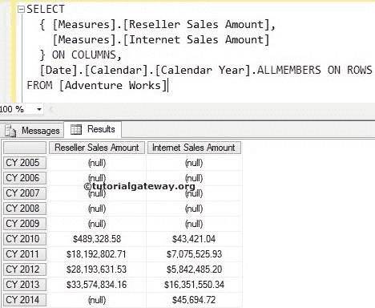
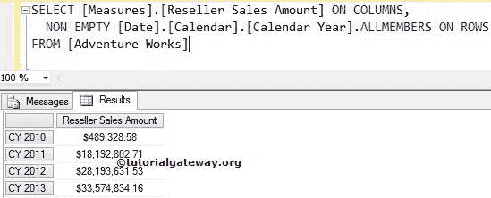
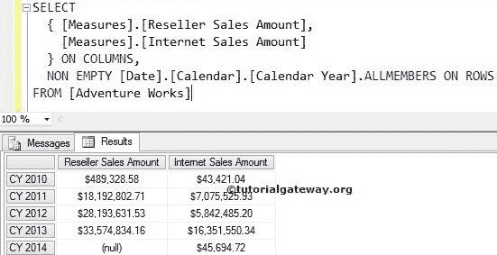

# MDX 非空

> 原文：<https://www.tutorialgateway.org/mdx-non-empty/>

MDX 非空关键字将写入所有值不为空的指定成员。例如，当我们显示不良产品时，您可能会发现一些产品带有空值。要删除空值，我们可以使用这个 MDX 非空关键字。请参考下表了解 MDX 非空输出。

| 测量 1 值 | 测量 2 值 | 非空结果 |
| 空 | 空 | 非空关键字不会显示此记录 |
| 空 | 不为空 | 非空将显示记录 |
| 不为空 | 空 | 非空将显示记录 |
| 不为空 | 不为空 | 非空将显示记录 |

在本文中，我们将通过示例向您展示如何在多维表达式或 MDX 查询中使用非空关键字。为此，我们将使用下面显示的数据



## MDX 非空示例

在本例中，我们将使用非空值来查找销售值不为空的每个日历年的经销商销售金额

```
SELECT 
  [Measures].[Reseller Sales Amount] ON COLUMNS,
  NON EMPTY [Date].[Calendar].[Calendar Year].ALLMEMBERS ON ROWS
FROM [Adventure Works]
```



在上面的 [MDX](https://www.tutorialgateway.org/mdx/) 查询中，我们在列上使用了【经销商销售额】

```
[Measures].[Reseller Sales Amount] ON COLUMNS
```

下面代码行中的 MDX 非空关键字将找到经销商销售金额不为空的日历年，并将它们显示为输出。

```
NON EMPTY [Date].[Calendar].[Calendar Year].ALLMEMBERS ON ROWS
```

众所周知，从 2005 日历年到 2009 日历年以及 2014 日历年都没有销售，这就是 Non Empty 显示 2010、2011、2012 和 2013 日历年经销商销售的原因

## 非空示例 2

在本例中，我们将使用多个度量来更详细地展示非空行为

```
SELECT 
  { [Measures].[Reseller Sales Amount],
    [Measures].[Internet Sales Amount]
  } ON COLUMNS,
  NON EMPTY [Date].[Calendar].[Calendar Year].ALLMEMBERS ON ROWS
FROM [Adventure Works]
```



在上述 MDX 查询中，我们在列中使用了[经销商销售额]和[互联网销售额]

```
{
 [Measures].[Reseller Sales Amount],
 [Measures].[Internet Sales Amount]
} ON COLUMNS
```

下面代码行中的 MDX 非空关键字将查找[经销商销售额]和[互联网销售额]值不为空的日历年。它将显示结果，如上表所述。

```
 NON EMPTY [Date].[Calendar].[Calendar Year].ALLMEMBERS ON ROWS
```

众所周知，从 2005 日历年到 2009 日历年，没有经销商销售和互联网销售。这就是为什么非空显示 2010、2011、2012、2013 和 2014 日历年的经销商销售额。