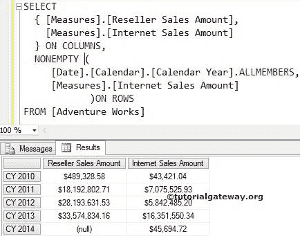
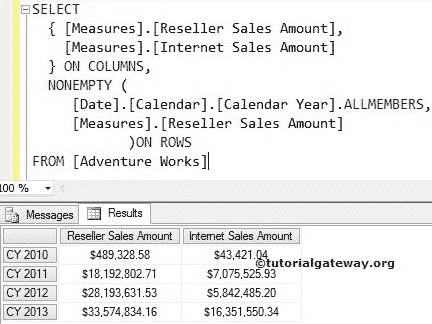

# MDX 非空函数

> 原文：<https://www.tutorialgateway.org/mdx-nonempty/>

用于显示值不为空的记录的 MDX 非空函数。例如，当我们按国家或年份显示最少的销售额时，您可能也会发现空值。在高级数据中看到空值不是很令人愉快。要删除空值，我们可以使用这个 MDX 非空函数，第二个参数为 Sales。

## MDX 非空函数语法

MDX 非空的基本语法是:

```
NONEMPTY( Set_Expression, Measure )
```

*   集合表达式:返回有效集合的任何多维表达式。
*   度量:返回数值的任何多维成员。非空函数将对照该值进行检查，以找到非空或非空记录。

对于这个 MDX NONEMPTY 函数的例子，我们将使用下面显示的数据


## MDX 非空函数示例

在本例中，我们将使用非空函数来查找互联网销售金额不为空的日历年

```
SELECT 
  { [Measures].[Reseller Sales Amount],
    [Measures].[Internet Sales Amount]
  } ON COLUMNS,
  NONEMPTY (
         [Date].[Calendar].[Calendar Year].ALLMEMBERS,
	 [Measures].[Internet Sales Amount]
	   )ON ROWS
FROM [Adventure Works]
```



在下面的 [MDX](https://www.tutorialgateway.org/mdx/) 查询中，我们在列上使用了【经销商销售额】和【互联网销售额】

```
{
 [Measures].[Reseller Sales Amount],
 [Measures].[Internet Sales Amount]
} ON COLUMNS
```

NONEMPTY(第一个参数)后面的第一行代码将返回[日期]中出现的所有成员。[日历]。[日历年]。这意味着第一行代码将带来日期维度中的所有日历年(2005 年到 2014 年)。

```
[Date].[Calendar].[Calendar Year].ALLMEMBERS
```

接下来，我们将[互联网销售额]指定为 MDX 非空函数的第二个参数。这意味着，下面一行代码将检查第一个参数返回的每个日历年的互联网销售额。

*   如果日历年没有互联网销售，则非空函数不会返回相应的行。如果观察第一张图片，从 2005 日历年到 2009 日历年没有互联网销售
*   如果日历年有互联网销售，则非空函数将返回相应的行。

```
NONEMPTY (
         [Date].[Calendar].[Calendar Year].ALLMEMBERS,
	 [Measures].[Internet Sales Amount]
	   )ON ROWS
```

## MDX 非空函数示例 2

在这个例子中，我们将使用上面的例子，但是我们将改变非空函数的第二个参数。将第二个参数赋给 MDX 非空函数时请小心。如果你把错误的度量作为第二个参数，你最终会得到错误的结果

```
SELECT 
  { [Measures].[Reseller Sales Amount],
    [Measures].[Internet Sales Amount]
  } ON COLUMNS,
  NONEMPTY (
         [Date].[Calendar].[Calendar Year].ALLMEMBERS,
	 [Measures].[Reseller Sales Amount]
	   )ON ROWS
FROM [Adventure Works]
```



如果您观察下面的 MDX 非空查询，我们将[经销商销售额]指定为非空函数的第二个参数。这意味着下面一行代码将检查第一个参数返回的每个日历年的经销商销售额。

*   如果日历年没有经销商销售，则非空函数不会返回相应的行。如果您观察第一张图片，则从 2005 日历年到 2009 和 2014 日历年没有经销商销售
*   如果日历年有经销商销售，则非空函数将返回相应的行。

```
NONEMPTY (
         [Date].[Calendar].[Calendar Year].ALLMEMBERS,
	 [Measures].[Reseller Sales Amount]
	   )ON ROWS
```