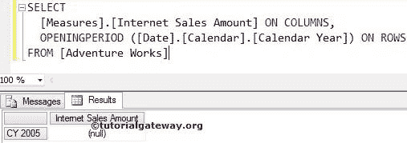
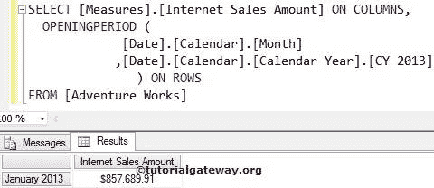
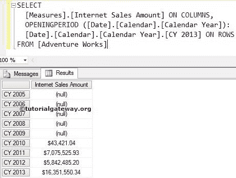
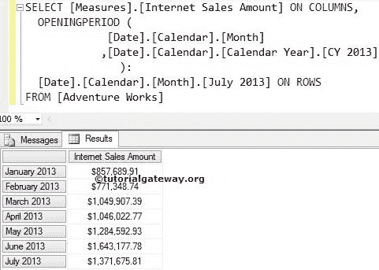

# MDX `OPENINGPERIOD`函数

> 原文：<https://www.tutorialgateway.org/mdx-openingperiod-function/>

MDX `OPENINGPERIOD`函数将返回属于指定成员或指定级别的第一个同级成员。

## MDX `OPENINGPERIOD`函数语法

多维表达式中打开周期的基本语法如下所示:

```
OPENINGPERIOD (Level_Expression, Member_Expression)
```

*   成员表达式:返回有效成员的任何多维表达式。
*   Level_Expression:请指定要导航的级别。

对于 MDX 查询中的这个 OpeningPeriod 函数，我们将使用下面的显示数据。以下截图显示了日期维度


内的日历年列表

## MDX `OPENINGPERIOD`函数示例

在本例中，我们将使用 OpeningPeriod 函数查找日历年中的第一年。

```
SELECT 
  [Measures].[Internet Sales Amount] ON COLUMNS,
  OPENINGPERIOD ([Date].[Calendar].[Calendar Year]) ON ROWS
FROM [Adventure Works]
```



在上面的 [MDX](https://www.tutorialgateway.org/mdx/) 查询中，我们在列上使用了【互联网销售额】

```
[Measures].[Internet Sales Amount] ON COLUMNS
```

下面一行代码将从日期维度返回日历年中出现的第一个同级成员。

```
OPENINGPERIOD ([Date].[Calendar].[Calendar Year])
```

## MDX `OPENINGPERIOD`函数示例 2

在本例中，我们将找到 2013 日历年中的第一个月，并使用 OpeningPeriod 函数计算该月的互联网销售额。

```
SELECT 
  [Measures].[Internet Sales Amount] ON COLUMNS,
  OPENINGPERIOD (
             [Date].[Calendar].[Month] 
            ,[Date].[Calendar].[Calendar Year].[CY 2013]
		) ON ROWS
FROM [Adventure Works]
```



## 使用 MDX 打开周期查找范围示例 1

在本例中，我们将向您展示如何使用 OpeningPeriod 函数查找范围。以下查询将返回 2005 至 2013 日历年的互联网销售额

```
SELECT 
  [Measures].[Internet Sales Amount] ON COLUMNS,
  OPENINGPERIOD ([Date].[Calendar].[Calendar Year]):
  [Date].[Calendar].[Calendar Year].[CY 2013] ON ROWS
FROM [Adventure Works]
```



在上面的 MDX 查询中，我们在列中使用了[互联网销售额]

```
[Measures].[Internet Sales Amount] ON COLUMNS
```

下面一行代码将从日期维度返回日历年中出现的第一个兄弟成员，即 2005 年。

```
OPENINGPERIOD ([Date].[Calendar].[Calendar Year])
```

这意味着我们在 2005 年至 2013 年间使用了范围运算符。因此，输出将显示日期维度中所有日历年的互联网销售额。

```
OPENINGPERIOD ([Date].[Calendar].[Calendar Year]): -- 2005

[Date].[Calendar].[Calendar Year].[CY 2013] -- 2013
```

## 使用 MDX 打开周期查找范围示例 2

在这个例子中，我们向您展示了如何使用 MDX 的 OpeningPeriod 函数来查找范围。以下查询将返回 2013 日历年 1 月至 7 月的互联网销售额

```
SELECT 
  [Measures].[Internet Sales Amount] ON COLUMNS,
  OPENINGPERIOD (
             [Date].[Calendar].[Month] --January 2013 
            ,[Date].[Calendar].[Calendar Year].[CY 2013]
		): 
  [Date].[Calendar].[Month].[July 2013] ON ROWS
FROM [Adventure Works]
```

