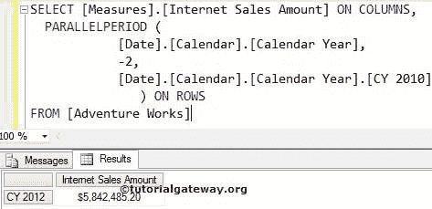

# MDX `PARALLELPERIOD`函数

> 原文：<https://www.tutorialgateway.org/mdx-parallelperiod-function/>

MDX `PARALLELPERIOD`函数，用于返回与指定成员处于相同相对位置的前一个周期的成员。例如，如果您想导航到一个特定的成员，那么我们可以使用这个 MDX `PARALLELPERIOD`函数。

## `PARALLELPERIOD`函数语法

多维表达式中 MDX `PARALLELPERIOD`函数的基本语法如下所示:

```
PARALLELPERIOD( Level_Expression, Member_Position, Member_Expression)
```

成员表达式:返回有效成员的任何多维表达式。

Level_Expression:请指定要导航的级别。成员 _ 位置:请指定要导航的成员的位置。

*   如果我们使用零作为成员位置，那么 MDX `PARALLELPERIOD`函数将编写与我们在`PARALLELPERIOD`函数之前提到的相同的成员表达式。
*   如果我们使用负值作为成员位置，那么`PARALLELPERIOD`函数将向前移动到一个指定的值，并返回该位置的成员表达式。
*   并且，如果我们使用正值作为成员位置，那么`PARALLELPERIOD`函数将向后移动到指定的值，并返回该位置的成员表达式。

在本文中，我们将通过示例向您展示如何编写 MDX `PARALLELPERIOD`函数来向前和向后导航。为此，我们将使用下面显示的数据。


## 零`PARALLELPERIOD`函数

在这个例子中，我们将向您展示，当我们对`PARALLELPERIOD`函数使用零值时会发生什么。以下 [MDX](https://www.tutorialgateway.org/mdx/) 查询将返回 2013 日历年自身 12 月的互联网销售金额。

```
SELECT 
  [Measures].[Internet Sales Amount] ON COLUMNS,
  PARALLELPERIOD (
            [Date].[Calendar].[Month],
            0,
	    [Date].[Calendar].[Month].[December 2013] 
	        ) ON ROWS
FROM [Adventure Works]

```


## 具有正值的`PARALLELPERIOD`函数

在这个例子中，我们向您展示，当我们在 MDX `PARALLELPERIOD`函数中使用正整数值时会发生什么。以下查询将返回 2011 日历年的互联网销售额，因为具有正值(2)的`PARALLELPERIOD`函数将从给定年份(2013–2 = 2011)向后移动两年

```
SELECT 
  [Measures].[Internet Sales Amount] ON COLUMNS,
  PARALLELPERIOD (
            [Date].[Calendar].[Calendar Year],
            2,
	    [Date].[Calendar].[Calendar Year].[CY 2013] 
	        ) ON ROWS
FROM [Adventure Works]

```


## 具有负值的`PARALLELPERIOD`函数

这个例子告诉你，当我们为`PARALLELPERIOD`函数使用负整数值时会发生什么。以下查询将返回 2012 日历年的互联网销售额，因为具有负值(-2)的 MDX `PARALLELPERIOD`函数将从给定年份向前移动 2 年(2010 + 2 = 2012)

```
SELECT 
  [Measures].[Internet Sales Amount] ON COLUMNS,
  PARALLELPERIOD (
            [Date].[Calendar].[Calendar Year],
            -2,
	    [Date].[Calendar].[Calendar Year].[CY 2010] 
	        ) ON ROWS
FROM [Adventure Works]

```



## 使用`PARALLELPERIOD`函数的范围

在这个例子中，我们展示了如何使用 ParallelPeriod 函数找到范围。以下查询将返回 2010 日历年至 2013 日历年的互联网销售额，因为我们使用了[CY 2010]和[CY 2013]之间的范围符号(:)。

```
SELECT 
  [Measures].[Internet Sales Amount] ON COLUMNS,
  [Date].[Calendar].[Calendar Year].[CY 2010]:
  PARALLELPERIOD (
            [Date].[Calendar].[Calendar Year],
            -3,
	    [Date].[Calendar].[Calendar Year].[CY 2010] 
	      ) -- 2013
  ON ROWS 
FROM [Adventure Works]
```

