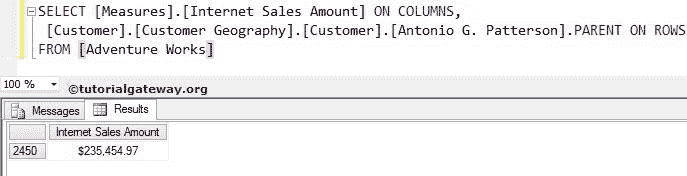

# MDX 父函数

> 原文：<https://www.tutorialgateway.org/mdx-parent-function/>

MDX 父函数将返回指定成员的关联父成员。例如，如果你是亚马逊开发人员，如果你的一个客户正在 Amazon.com 寻找 iPod。作为开发者，你必须在页面底部显示所有的苹果产品，这样用户才能浏览其他产品，有时他可能会购买？在这些情况下，您可以使用 MDX 父函数通过编写类似[产品]的内容来查找 iPod 父项。[苹果]。[iPod]。父母

## MDX 父函数示例

在客户地理层级中，我们有一个客户叫做[安东尼奥·g·帕特森]。在本例中，我们将找到与[安东尼奥·g·帕特森]居住在同一邮政编码的所有客户的[互联网销售额]。

```
SELECT [Measures].[Internet Sales Amount] ON COLUMNS, 

 [Customer].[Customer Geography].[Customer].[Antonio G. Patterson].PARENT ON ROWS 

FROM [Adventure Works]
```



以下语句将[互联网销售额]放在列区域。

```
[Measures].[Internet Sales Amount] ON COLUMNS
```

下面的 MDX 语句将找到[安东尼奥·g·帕特森]的父级(上一级)。根据客户地理位置，层级邮政编码位于客户之上，并且[安东尼奥·g·帕特森]居住在 2450 邮政编码中。

```
[Customer].[Customer Geography].[Customer].[Antonio G. Patterson].PARENT
```

因此，在 [MDX](https://www.tutorialgateway.org/mdx/) 下方的查询将根据邮政编码 2450 计算总的【互联网销售额】。

```
SELECT [Measures].[Internet Sales Amount] ON COLUMNS, 

[Customer].[Customer Geography].[Customer].[Antonio G. Patterson].PARENT ON ROWS 

FROM [Adventure Works]
```