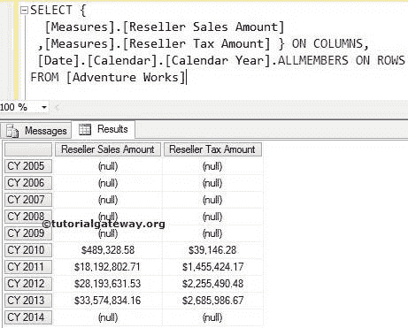
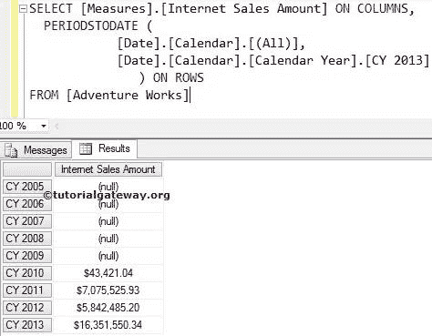

# MDX 周期日期函数

> 原文：<https://www.tutorialgateway.org/mdx-periodstodate-function/>

用于在相同级别成员之间导航的 MDX 周期日期函数。它返回从第一个同级到指定成员的同级成员集。例如，如果您想要列出从一个位置到特定成员的成员，那么我们可以使用这个 MDX PeriodsToDate 函数。

## MDX 周期日期函数语法

多维表达式中 MDX 周期日期的基本语法如下所示:

```
PERIODSTODATE (Level_Expression, Member_Expression)
```

*   成员表达式:返回有效成员的任何多维表达式。
*   成员 _ 位置:请指定要导航的成员的位置。

用于在相同成员级别之间导航的 MDX 周期日期函数。例如，如果我们提到城市成员为成员表达式，那么周期日期函数将在剩余的城市之间导航。它不会升级(州-省)或降级(邮政编码)。对于这个 MDX 周期日期函数示例，我们将使用下面显示的数据。



## MDX 周期日期函数示例 1

在本例中，我们将向您展示，当我们对周期日期函数使用零值时会发生什么。以下查询将返回截至 2013 年 7 月的 2013 日历年的互联网销售月数

```
SELECT 
  [Measures].[Internet Sales Amount] ON COLUMNS,
  PERIODSTODATE (
            [Date].[Calendar].[Calendar Year], 
            [Date].[Calendar].[Month].[July 2013]
                ) ON ROWS
FROM [Adventure Works]

```


在上面的 [MDX](https://www.tutorialgateway.org/mdx/) 查询中，我们在列中使用了【经销商销售额】

```
[Measures].[Reseller Sales Amount] ON COLUMNS
```

下面一行代码将检查

```
PERIODSTODATE (
             [Date].[Calendar].[Calendar Year], 
             [Date].[Calendar].[Month].[July 2013]
                )
```

，然后查找该国家的最后一个子成员。

## MDX 期间截止日期函数示例 2

在这个例子中，我们将向您展示，当我们在周期日期函数中使用正整数值时会发生什么。以下查询将返回 2013、2012 和 2011 日历年的互联网销售额，因为具有正值(3)的 `LASTPERIODS`函数将向后移动 2 年+2013 年。这是因为 PeriodsToDate 函数包含了 2013 年本身。

```
SELECT 
  [Measures].[Internet Sales Amount] ON COLUMNS,
  PERIODSTODATE (
            [Date].[Calendar].[(All)], 
            [Date].[Calendar].[Calendar Year].[CY 2013]
                ) ON ROWS
FROM [Adventure Works]

```

