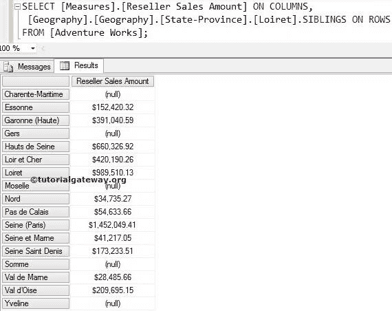
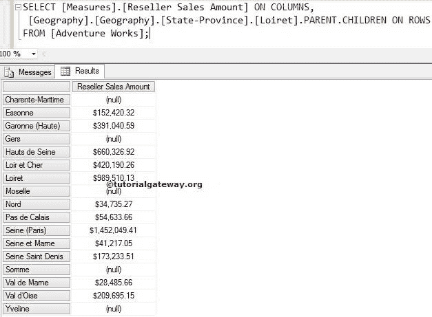

# MDX 兄弟函数

> 原文：<https://www.tutorialgateway.org/mdx-siblings-function/>

MDX 兄弟函数将返回属于指定成员的父成员的所有子成员。或者我们可以说，MDX 兄弟函数将返回指定成员的所有兄弟。例如，如果您知道一个客户名称，并且您想查找该组中所有客户的销售额，那么您可以使用这个兄弟函数。

## MDX 兄弟函数语法

多维表达式中兄弟函数的基本语法如下所示:

```
Member_Expression.SIBLINGS
```

成员表达式:返回有效成员的任何多维表达式。

如何用例子写出 MDX 查询中的姐弟函数？。为此，我们将使用下面显示的数据。以下截图显示了地理


内的国家

下面的截图显示了法国


内部的【州-省】

## MDX 兄弟函数示例

在本例中，我们将使用兄弟函数来查找法国国家的兄弟。

```
SELECT 
  [Measures].[Reseller Sales Amount] ON COLUMNS,
  [Geography].[Geography].[Country].[France].SIBLINGS ON ROWS
FROM [Adventure Works];
```


在上面的 [MDX](https://www.tutorialgateway.org/mdx/) 查询中，我们在列中使用了【经销商销售额】

```
[Measures].[Reseller Sales Amount] ON COLUMNS
```

下面一行代码将检查法国父代(它是所有成员)，然后显示该国家的所有子代成员。

```
[Geography].[Geography].[Country].[France].SIBLINGS
```

## MDX 兄弟函数示例 2

如果我们知道卢瓦尔特是法国的一个州，并且我们打算找到法国的其余州，那么我们可以使用这个 MDX 兄弟函数。在本例中，我们将查找州/省列表中的所有子成员，并计算其经销商销售额。

```
SELECT 
 [Measures].[Reseller Sales Amount] ON COLUMNS,
 [Geography].[Geography].[State-Province].[Loiret].SIBLINGS ON ROWS
FROM [Adventure Works];
```



## 兄弟函数替代

在这个例子中，我们将使用 MDX 兄弟函数来达到同样的结果。请参考 [MDX 父功能](https://www.tutorialgateway.org/mdx-parent-function/)了解父功能，参见 [MDX 子功能](https://www.tutorialgateway.org/mdx-children-function/)了解子功能。

```
SELECT 
 [Measures].[Reseller Sales Amount] ON COLUMNS,
 [Geography].[Geography].[State-Province].[Loiret].PARENT.CHILDREN ON ROWS
FROM [Adventure Works];
```



在上面的 MDX 查询中，我们在列中使用了[经销商销售额]

```
[Measures].[Reseller Sales Amount] ON COLUMNS
```

从下面的代码行，

```
[Geography].[Geography].[State-Province].[Loiret].PARENT.CHILDREN
```

多维表达式将首先实现 Parent 函数来查找[Loiret]的父成员，它是法国。

接下来，它将实现 Children 函数来查找属于法国国家的所有 Child 成员。