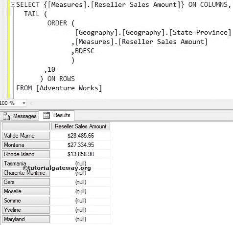

# MDX `TAIL`函数

> 原文：<https://www.tutorialgateway.org/mdx-tail-function/>

MDX `TAIL`函数用于从源数据的底部选择所需数量的记录。例如，如果你想找到表现最差的 10 种产品。或者，找到销售额最低的前 10 个地区，或者要计算最低工资，请将此 MDX `TAIL`函数与订单函数一起使用。

## MDX 尾函数语法

MDX 尾函数只允许两个参数。多维表达式中这个 TAIL 函数的基本语法如下所示:

```
TAIL (Set_Expression, Count)
```

*   Set_Expression:要检查的任何多维表达式或属性。
*   计数:要检索的记录数。

如何用示例编写 MDX TAIL 函数，从经销商销售额低于他人的 Adventure Works 多维数据集中的 Geography 维度提取倒数 7 个州？。对于这个 MDX TAIL 示例，我们将使用下面显示的数据。


## MDX `TAIL`函数示例

在这个例子中，我们将展示如何编写 Tail 函数。以下查询将按照上面出现的顺序返回来自上述来源的最后七条记录。

```
SELECT {[Measures].[Reseller Sales Amount]} ON COLUMNS,
 TAIL (
	 [Geography].[Geography].[State-Province] 
        ,7 
       ) ON ROWS
FROM [Adventure Works]
```

在上面的 [MDX](https://www.tutorialgateway.org/mdx/) 查询中，我们选择了列上的[经销商销售额]度量和行上的地理维度中的[州省]属性。接下来，Tail 函数将选择底部 7 条记录，而不考虑它们的测量值。


没有人会接受上述结果，认为它是世界上表现最差的州。它们只是排名后 7 的记录。

## 使用顺序函数和 MDX 尾函数

在这个例子中，我们向您展示，当我们添加 MDX 订单函数时会发生什么。

```
SELECT {[Measures].[Reseller Sales Amount]} ON COLUMNS,
 ORDER (
    TAIL ([Geography].[Geography].[State-Province], 7)--Already Picked Data 
   ,[Measures].[Reseller Sales Amount], DESC
       ) ON ROWS
FROM [Adventure Works]
```


首先，MDX Tail 函数将使用下面的语句选择源数据中出现的最后 7 条记录

```
 TAIL ([Geography].[Geography].[State-Province], 7)
```

接下来，`TAIL`函数之外的 Order 函数将使用经销商销售额对已经挑选的数据进行降序排序。

```
 ORDER (
    TAIL ([Geography].[Geography].[State-Province], 7) 
   ,[Measures].[Reseller Sales Amount], DESC
       ) ON ROWS
```

这意味着我们从源数据中按降序获得最后七条记录

让我们更改上面的 MDX 代码:

```
SELECT {[Measures].[Reseller Sales Amount]} ON COLUMNS,
  TAIL (
    ORDER (
          [Geography].[Geography].[State-Province]
         ,[Measures].[Reseller Sales Amount]
         ,BDESC
           )
     ,7 
      ) ON ROWS
FROM [Adventure Works]
```



首先，Order 函数将使用经销商销售额按降序对州/省数据进行排序。在对数据进行排序时，我们使用 BDESC 来打破层次结构。

```
ORDER (
        [Geography].[Geography].[State-Province]
       ,[Measures].[Reseller Sales Amount]
       ,BDESC
      )
```

接下来，MDX Tail 函数将从已经排序的数据中挑选最后 7 条记录。

```
TAIL (
    ORDER (
          [Geography].[Geography].[State-Province]
         ,[Measures].[Reseller Sales Amount]
         ,BDESC
           )
     ,7 
      ) ON ROWS

```

现在，我们得到了我们的 7 个最差记录或表现最差的州。

注意:请在 ORDER 函数中使用适当的度量作为第二个参数。否则，你会得到错误的结果。

## 在 MDX 尾函数中使用非空

在本例中，我们将使用`NON EMPTY`关键字来移除空值。

```
SELECT {[Measures].[Reseller Sales Amount]} ON COLUMNS,
 NON EMPTY 
  TAIL (
    ORDER (
          [Geography].[Geography].[State-Province]
         ,[Measures].[Reseller Sales Amount]
         ,BDESC
           )
     ,7 
      ) ON ROWS
FROM [Adventure Works]
```


如果您观察上面的截图，我们在上面的查询中使用的 MDX `NON EMPTY`关键字删除了那些空记录。现在，它看起来又好又容易:)