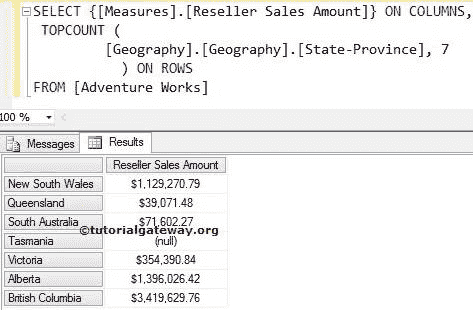
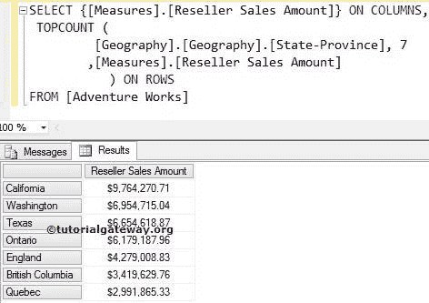
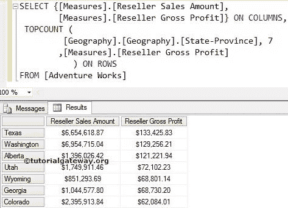

# MDX `TOPCOUNT`函数

> 原文：<https://www.tutorialgateway.org/mdx-topcount-function/>

多维表达式或 MDX `TOPCOUNT`函数将以降序对给定数据进行排序，然后从排序后的数据中选择所需数量的记录。

例如，如果你想找到表现最好的 10 个产品。或者你想找到销售额最高的前 10 个地区，或者计算最高工资。我们可以将这个 MDX `TOPCOUNT`函数与 measure 一起使用。

### MDX TOPCOUNT 与 SQL TOP 子句的相似之处

MDX TOPCOUNT 类似于 [SQL TOP 子句](https://www.tutorialgateway.org/sql-top-clause/)。

*   像 Top 子句一样，MDX Topcount 按照最初存储的顺序提取所需数量的记录。
*   要提取前 10 个性能记录，我们必须使用 SQL 中的 [Order By 子句](https://www.tutorialgateway.org/sql-order-by-clause/)。
*   要提取前 10 个表现良好的记录，我们必须添加第三个参数以及适当的度量值或数值。

## 函数语法

MDX `TOPCOUNT`函数的基本语法如下所示:

```
TOPCOUNT (Set_Expression, Count, Numeric_Expression)
```

*   Set_Expression:要检查的任何多维表达式或属性。
*   计数:请提供要检索的记录数。
*   数值表达式:任何多维表达式或度量。这是一个纯粹可选的论点。如果我们使用这个参数，MDX TOPCOUNT 将使用这个 Numeric_Expression 按降序对数据进行排序。然后选择您要求的记录数量；否则，TOPCOUNT 将选择所需数量的记录，而不进行排序。

在本文中，我们将通过示例向您展示如何编写 MDX `TOPCOUNT`函数，从地理表(位于 Adventure Works 多维数据集中)中提取前 7 个州，这些州的经销商销售额高于其他州。为此，我们将使用下面显示的数据。


## 带两个参数的 MDX 顶部计数

在这个例子中，我们将向您展示，当我们错过 `TOPCOUNT`函数中的第三个参数时会发生什么。下面的查询将按照上面出现的顺序返回来自上述来源的前七条记录。

```
SELECT {[Measures].[Reseller Sales Amount]} ON COLUMNS,
 TOPCOUNT (
	    [Geography].[Geography].[State-Province] 
           ,7 
      	  ) ON ROWS
FROM [Adventure Works]
```

在上面的 [MDX](https://www.tutorialgateway.org/mdx/) 查询中，我们选择了列上的【经销商销售额】度量和行上的地理表中的【州/省】列。接下来，顶部计数功能将选择前 7 条记录，而不管它们的测量值如何。



没有人会接受上述结果，成为全球表现最好的 7 个州。

## MDX `TOPCOUNT`函数示例

在这个例子中，我们将向您展示，当我们在 MDX `TOPCOUNT`函数中添加第三个参数时会发生什么。以下查询将使用[度量]按降序对记录进行排序。[经销商销售额]然后返回排序数据中的前七条记录。简而言之，我们将获得全球表现最好的 7 个州。

```
SELECT {[Measures].[Reseller Sales Amount]} ON COLUMNS,
 TOPCOUNT (
	    [Geography].[Geography].[State-Province] 
           ,7 
	   ,[Measures].[Reseller Sales Amount]
	  ) ON ROWS
FROM [Adventure Works]
```



## MDX `TOPCOUNT`函数中的多种度量

当我们在 `TOPCOUNT`函数中添加错误的度量作为第三个参数时会发生什么？。我们将使用两个衡量标准([衡量标准]。[经销商销售金额]，[衡量标准]。[经销商毛利])，我们分配[措施]。[经销商毛利]作为排序参数。以下 topcount 查询将使用[度量]按降序对记录进行排序。[经销商毛利]然后返回排序数据中的前七条记录。

```
SELECT {[Measures].[Reseller Sales Amount],
        [Measures].[Reseller Gross Profit]} ON COLUMNS,
 TOPCOUNT (
	    [Geography].[Geography].[State-Province]
           ,7 
	   ,[Measures].[Reseller Gross Profit]
	   ) ON ROWS
FROM [Adventure Works]
```



虽然我们预期的是前 7 名销售额，但上面的查询检索的是毛利最高的前 7 个州。

注意:请在 `TOPCOUNT`函数中使用适当的度量作为第三个参数。否则，你最终会得到错误的结果。