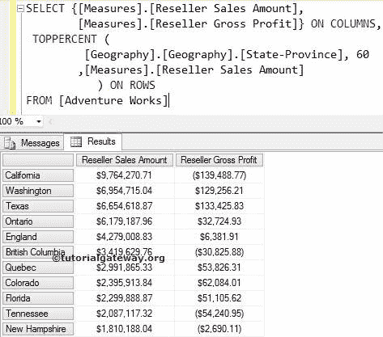

# MDX 顶级函数

> 原文：<https://www.tutorialgateway.org/mdx-toppercent-function/>

MDX TopPercent 函数将以降序对给定的数据进行排序。然后从已排序的数据中选择所需数量的记录，这些记录的总数大于或等于指定的百分比。

## MDX 顶级函数语法

多维表达式中 MDX TopPercent 的基本语法如下所示:

```
TOPPERCENT (Set_Expression, Percentage, Numeric_Expression)
```

*   Set_Expression:要检查的任何多维表达式或属性。
*   百分比:请提供要检索的百分比。
*   数值表达式:任何多维表达式或度量。MDX TopPercent 函数将使用该数值表达式按降序对数据进行排序。然后，选择匹配百分比所需的记录数。

让我们看看如何编写 MDX TopPercent 函数来从地理维度(位于冒险工作多维数据集中)中提取状态，该维度在经销商销售额中占总销售额的 60%。为此，我们将使用下面显示的数据。


## MDX 顶级函数示例

以下 MDX toppercent 查询将返回地理维度中占经销商总销售额 60%的所有州。

```
SELECT {[Measures].[Reseller Sales Amount]} ON COLUMNS,
 TOPPERCENT (
	    [Geography].[Geography].[State-Province], 60
            ,[Measures].[Reseller Sales Amount]
	    ) ON ROWS
FROM [Adventure Works]
```

在上面的 [MDX](https://www.tutorialgateway.org/mdx/) 查询中，我们选择了列上的【经销商销售额】度量和行上的地理维度中的【州省】列。接下来，TopPercent 函数将使用 Measures 按降序对数据进行排序。[经销商销售额]然后计算销售额占总销售额的百分比。


如果您观察上面的顶部百分比屏幕截图，它们不是总计记录的 60%行。如果您合计上述屏幕截图中显示的经销商销售金额，它将大于或等于经销商销售总额的 60%。简而言之，上述各州贡献了总销售额的 60%。

## MDX 顶级函数示例 2

在本例中，我们将使用两个度量标准([度量标准]。[经销商销售金额][衡量标准]。[经销商毛利])。

```
SELECT {[Measures].[Reseller Sales Amount], 
        [Measures].[Reseller Gross Profit]} ON COLUMNS,
 TOPPERCENT (
             [Geography].[Geography].[State-Province], 60
            ,[Measures].[Reseller Sales Amount]
	   ) ON ROWS
FROM [Adventure Works]
```



如果您观察上面的截图，我们会发现[经销商毛利]的结果并不均衡。这是因为数据是根据[经销商销售额]排序的

注意:请在 TOPPERCENT 函数中使用适当的度量作为第三个参数。否则，你最终会得到错误的结果。