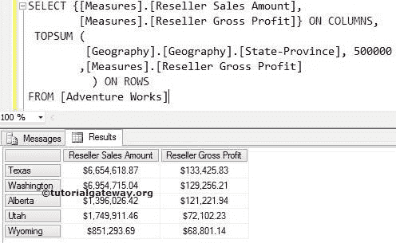

# MDX TOPSUM 函数

> 原文：<https://www.tutorialgateway.org/mdx-topsum-function/>

MDX TopSum 函数将以降序对给定的数据进行排序。然后从已排序的数据中选择所需数量的记录，这些记录的总数至少等于指定的值。

## 函数语法

多维表达式中 MDX TopSum 的基本语法如下所示:

```
TOPSUM (Set_Expression, Value, Numeric_Expression)
```

*   Set_Expression:要检查的任何多维表达式或属性。
*   值:请提供值。MDX TOPSUM 函数将检索总计至少等于此值的记录。
*   数值表达式:任何多维表达式或度量。TopSum 函数将使用这个 Numeric_Expression 按降序对数据进行排序，然后选择与值匹配所需的记录数。

编写 MDX TopSum 函数，从地理维度(存在于冒险工作多维数据集中)中提取状态，其总和至少等于用户给定的值。为此，我们将使用下面显示的数据。


## MDX TopSum 函数示例

以下 MDX TOPSUM 查询返回地理维度中的所有州，这些州贡献了总经销商销售额的 40000000。

```
SELECT {[Measures].[Reseller Sales Amount]} ON COLUMNS,
 TOPSUM (
	 [Geography].[Geography].[State-Province], 40000000
	,[Measures].[Reseller Sales Amount]
	) ON ROWS
FROM [Adventure Works]
```

在上面的 [MDX](https://www.tutorialgateway.org/mdx/) 查询中，我们选择了列上的【经销商销售额】度量和行上的地理维度中的【州省】列。接下来，TopSum 函数将使用 Measures 按降序对数据进行排序。[经销商销售金额]然后将每个州的销售金额相加，直到达到 40000000。


如果您观察上面的截图，如果您将上面显示的状态的销售额相加，它们大约等于 40243296.5。这比我们要求的更重要。

## MDX TopSum 函数示例 2

在本例中，我们将使用两个度量标准([度量标准]。[经销商销售金额][衡量标准]。[经销商毛利])。

```
SELECT {[Measures].[Reseller Sales Amount], 
        [Measures].[Reseller Gross Profit]} ON COLUMNS,
 TOPSUM (
	 [Geography].[Geography].[State-Province], 500000
	,[Measures].[Reseller Gross Profit]
       ) ON ROWS
FROM [Adventure Works]
```

在上面的 MDX TOP SUM 查询中，我们在列上选择了两个度量标准([经销商销售额]，[经销商毛利])，在行上选择了地理维度中的[州/省]属性。接下来，TopSum 函数将使用 Measures 按降序对数据进行排序。[经销商毛利]然后加上每个州的销售额，直到达到 500000。



如果您观察上面的 TOPSUM 截图，我们将获得[经销商毛利]总额为 500000 的顶级州。

注意:请在 MDX TOPSUM 函数中使用适当的度量作为第三个参数。否则，你会得到错误的结果。