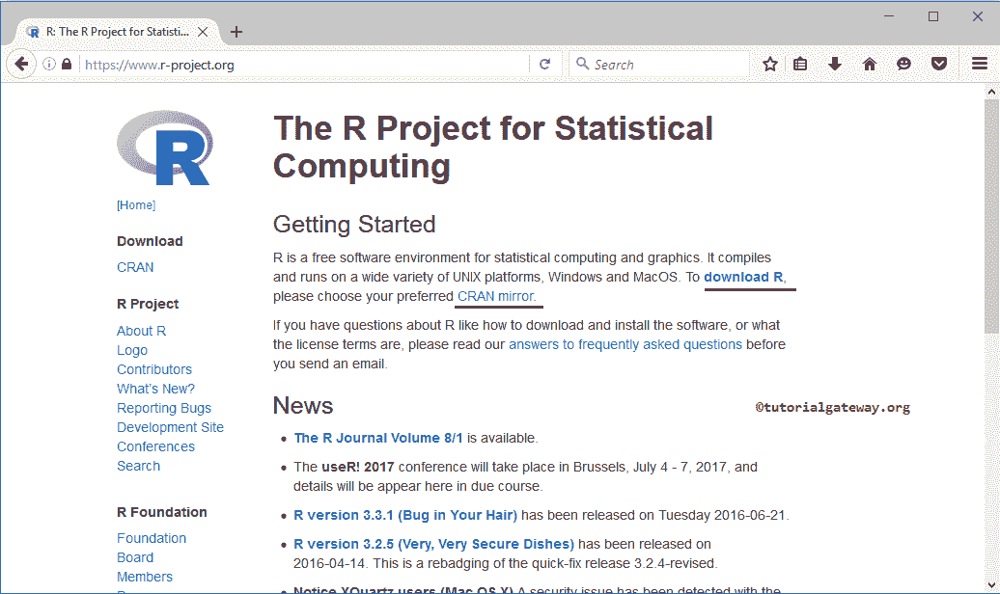
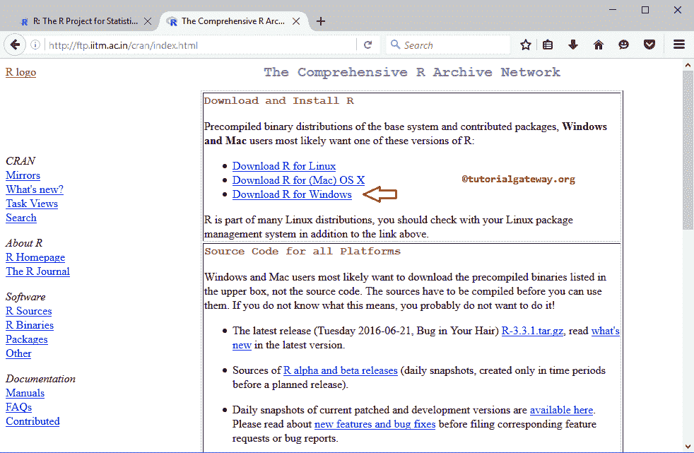
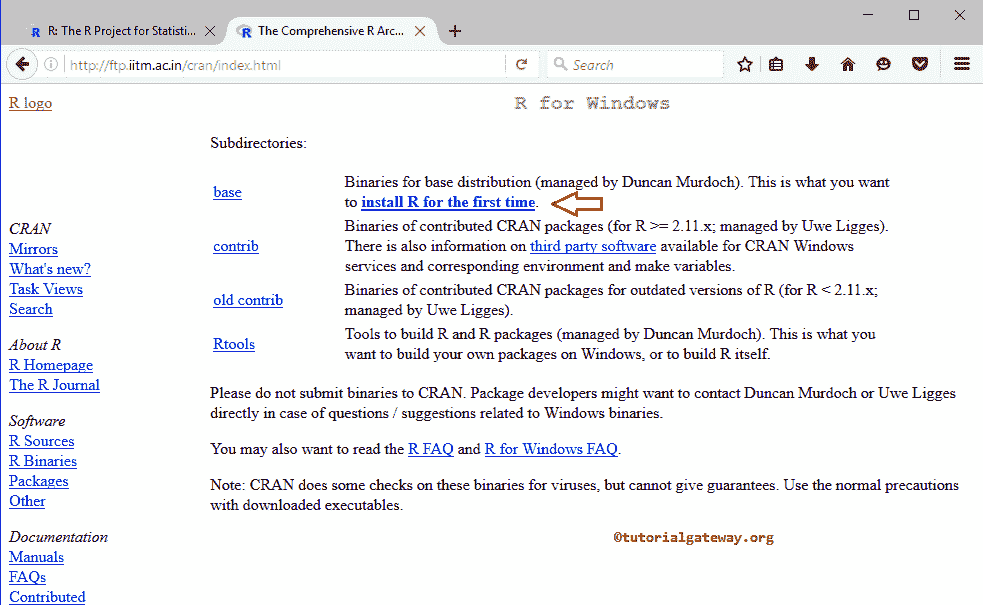
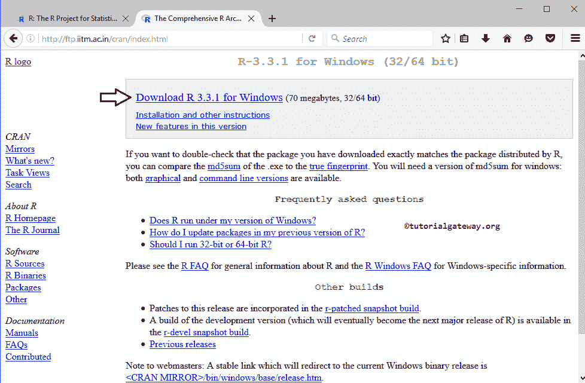
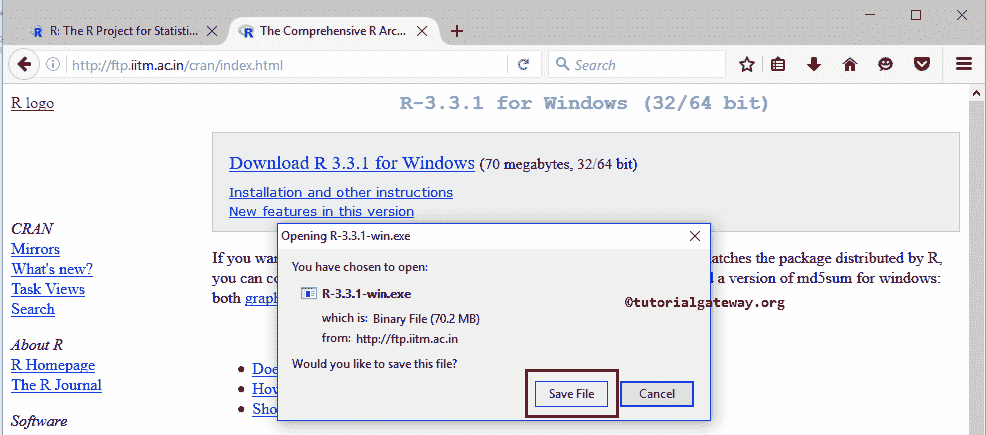

# R 软件下载

> 原文：<https://www.tutorialgateway.org/r-software-download/>

r 是一个用于图形和统计计算的开源或自由软件环境。它可以在各种平台上使用，如苹果操作系统、UNIX 和视窗。在这篇文章中，我们展示了从哪里或者如何用截图下载 R 软件。以下是 [R](https://www.tutorialgateway.org/r-programming/) 软件下载涉及的步骤。

## 软件下载的统计方法

第一步:下载 R 软件，首先点击此链接[进入官网下载](https://www.r-project.org/)。下面的截图显示了官方网站的主页。接下来，点击下载 R 或 CRAN 镜像开始下载过程。

第二步:一旦你点击了上面指定的超链接，下面的标签或窗口就会打开。请选择离您最近的镜像进行软件下载。由于我居住在印度，我选择印度理工学院马德拉斯镜。

一旦您选择了最近的镜子，下面的窗口就会打开。请点击超链接选择您的平台。本教程在 Windows 平台上。所以，我们正在为 Windows 下载 R 软件。

选择平台后，将显示下面的截图。在这里，如果您是第一次安装，请选择第一次安装选项。

在这里，点击 Windows 下载 R 3.3.1 超链接开始下载软件

一旦你点击下载 R 3.3.1 窗口超链接，一个弹出窗口打开保存这个文件。请选择保存文件选项。

提示:请参考[安装软件](https://www.tutorialgateway.org/install-r-software/)文章，了解安装软件涉及的步骤。