# 安装软件

> 原文：<https://www.tutorialgateway.org/install-r-software/>

如何用截图安装 R 软件(不考虑版本)？。安装 R 编程软件包括以下步骤。因此，请遵循我们下面提到的安装软件步骤。

## 安装软件的逐步过程

请将您的文件系统导航到以前下载的 R 软件，然后单击 3.3.1-win.exeapplication，或者如果您使用 Firefox 下载了该文件，请按照以下所示操作。记住，版本号对你来说可能不一样

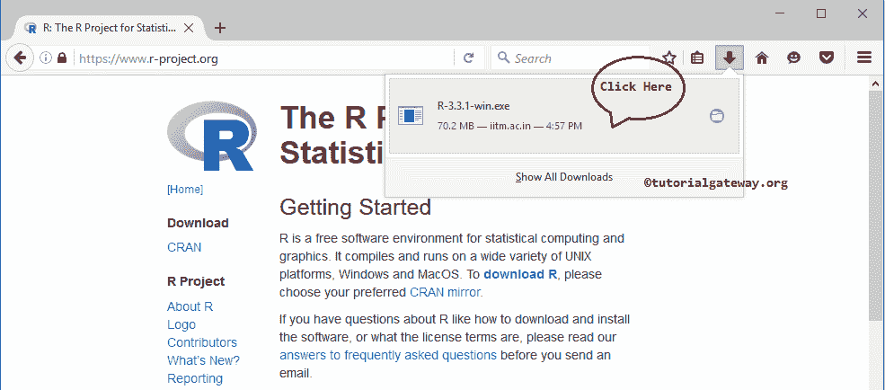

提示:请参考[软件下载](https://www.tutorialgateway.org/r-software-download/)文章，了解下载[编程](https://www.tutorialgateway.org/r-programming/)软件涉及的步骤。

一旦你点击安装应用程序，下面显示的窗口打开。这是一个安全警告，只有当你有任何安全措施时，它才会上诉；否则，跳到下一步。

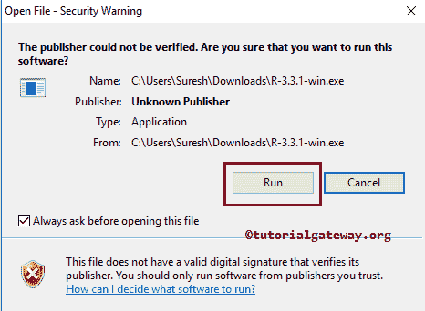

请从下拉列表中选择语言，然后单击确定按钮。

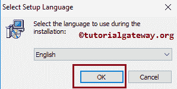

单击“确定”按钮后，欢迎使用 Windows 3.3.1 安装向导窗口打开。请选择“下一步”按钮。

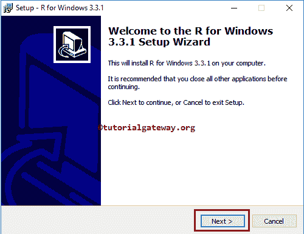

接下来，请阅读软件条款，点击【下一步】按钮

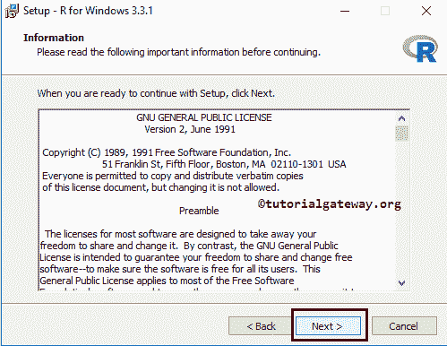

在这里，您还可以更改默认的 R 安装目录。为此，我们必须单击文本框旁边的浏览…按钮。它打开我们的文件系统来导航和选择目录。从下面的截图中，观察到我们保持默认。

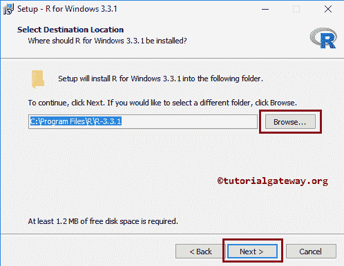

接下来，我们必须选择我们想要安装的 R 组件。如果您知道您的操作系统是 64 位的，那么请选择文件。如果您不知道版本，请从下面显示的窗口中选择所有选项。

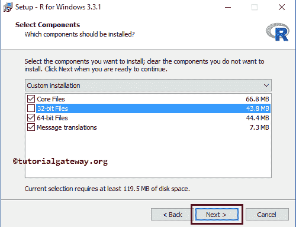

在启动选项中，通过选择否(接受默认值)选项接受所有默认值，然后单击下一步按钮。

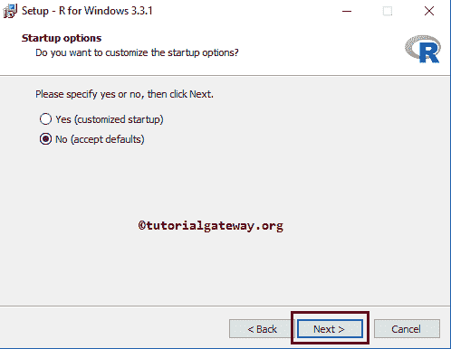

在这里，您可以更改 R 程序的快捷方式默认目录。为此，我们必须单击文本框旁边的浏览…按钮。它打开文件系统来选择目录。从下面的截图中，观察到我们保持默认。

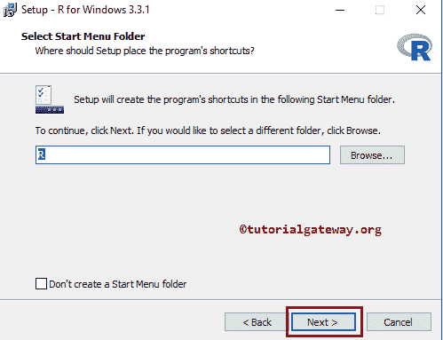

保留默认选项，点击【下一步】按钮

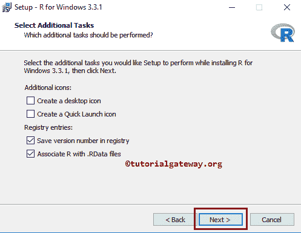

等到 R 安装完成。

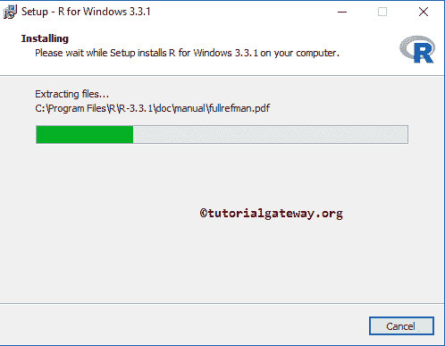

点击完成按钮，完成

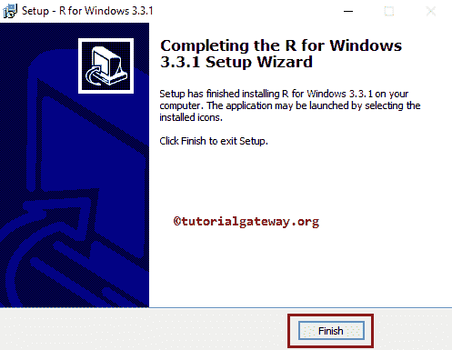

R 软件的安装