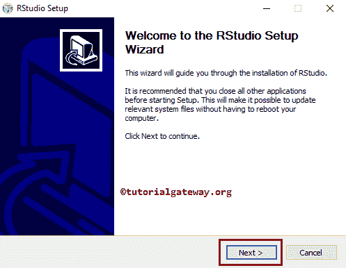

# 下载 R Studio 并安装

> 原文：<https://www.tutorialgateway.org/download-r-studio-and-install/>

R Studio 是一个面向 R 语言的开源企业级专业软件环境。它有桌面版(免费和专业版)和服务器版(免费和专业版)两种版本。在这里，我们用截图展示了从哪里或者如何下载和安装 R Studio 软件(桌面版)。以下是 R Studio 下载中涉及的步骤。

## 一步一步下载 R Studio 的方法

第一步:为 windows 下载 R，首先点击此链接[下载](https://www.rstudio.com/)前往 RStudio 官方网站。下面的截图显示了官网主页。接下来，点击下载 RStudio 桌面按钮开始下载过程。

注:在安装 RStudio 之前，我们必须安装[编程](https://www.tutorialgateway.org/r-programming/)软件。如果您还没有安装 R，那么请参考[软件下载](https://www.tutorialgateway.org/r-software-download/)一文，了解& [安装软件](https://www.tutorialgateway.org/install-r-software/)一文的安装步骤。

第二步:一旦你点击指定的下载 RStudio 按钮，下面的标签或窗口打开。请选择桌面(免费许可)并点击下载按钮。

步骤 3:或者向下滚动页面，选择适合您的操作系统的软件。从下面的截图中，可以看到我们选择的是 RStudio 0 . 99 . 903–Windows Vista/7/8/10

单击 RStudio 超链接后，会打开一个弹出窗口来保存该文件。请选择保存或下载音频文件选项。

## 安装 R Studio 的分步过程

步骤 1:要安装 RStudio，请将您的文件系统导航到先前下载的，并单击 RStudio-0.99.903.exe 应用。或者，如果您使用 Firefox 下载了该文件，请按照以下所示操作。请记住，您的版本号可能会有所不同。

点击安装 R Studio 应用后，欢迎使用打开的 RStudio 安装向导窗口。请选择“下一步”按钮。

步骤 3:在这里，您可以更改默认的 RStudio 安装目录。为此，我们必须单击文本框旁边的浏览…按钮。它打开我们的文件系统来导航位置和选择目录。

请注意，我们使用默认目录作为安装 R studio 的目标文件夹。

在这里，您可以更改程序的快捷方式默认目录。为此，我们必须从列表中选择目录名。从下面的截图中，可以看到我们选择了 Rstudio 文件夹(默认)。

第五步:请等待 R studio 的解压安装完成。接下来，点击【完成】按钮，完成 rstu 迪奥

的安装

让我们打开 R Studio ide，看看支持直接代码执行的 R 软件环境。

