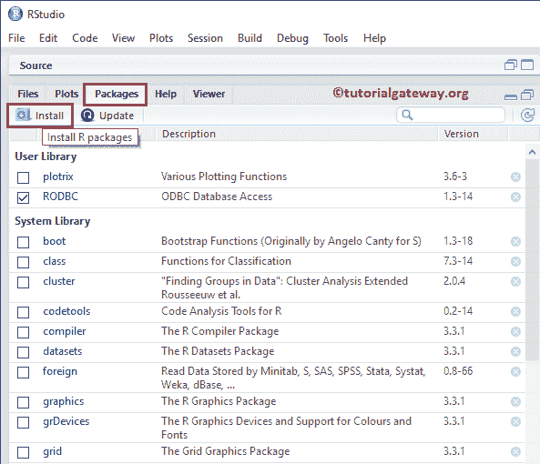
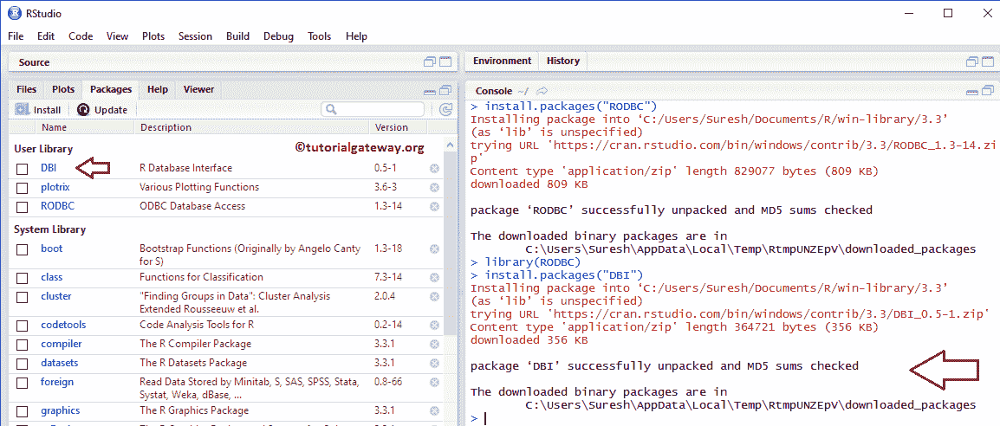

# 安装 R 包

> 原文：<https://www.tutorialgateway.org/install-r-packages/>

包是 R 编程中代码可重用性的基本概念。R 中的包是函数、示例数据和描述如何使用它们的文档的集合。安装 R 软件包有多种方法。在本文中，我们将重点介绍在 r

## 安装 R 包

在 R 中安装软件包的一个快速简单的方法是使用 install.packages 函数。如果你知道这个名字，那么这个方法就派上用场了。该函数背后的语法是:

```
install.packages("packageName")
```

第一步:请在 R 编程中用您想要的包名替换该名称。在这里，我们想要安装 RODBC，它对于从数据库管理系统(如 SQL Server)加载数据非常有用

提示:打字？PackageName，或帮助(PackageName)来获取有关它的信息。


步骤 2:您可能会得到稍微不同的输出，但是，不要担心输出，除非您看到错误消息。从下面的截图中，你可以观察到 R Studio 安装了‘RODBC’。


步骤 3:类型库(RODBC)来加载包，您可以看到它显示了一个可用包的列表以及我们的 RODBC。这个库()还可以帮助我们检查安装是否成功。


第四步:下面的截图显示我们没有收到任何错误消息。如果有问题，它会抛出一个错误，说不存在名为 RODBC 的问题。


## 安装安装包的第二种方法

如果你不知道名字或者你想查看 [R 编程](https://www.tutorialgateway.org/r-programming/)中所有可用的名字，那么这种安装软件包的方法是有益的。为此，我们必须使用文件、绘图、包、帮助、查看器部分。

在“软件包”选项卡下，请单击“安装”选项卡安装新的源软件包。



单击选项卡后，将打开以下弹出窗口。


安装来源:这里我们有两个选项:

*   存储库(CRAN，CRANextra):该选项有助于安装 CRAN 镜像中可用的包。我们现在选择这个选项。
*   包存档文件(。zip，. tar.gz):如果您想加载下载的 zip 文件或第三方网站，请选择此选项。


一旦你输入了一个字符或字母，它就会在 CRAN 中显示可用字符的列表，从那个字母开始。


在这个例子中，我们想加载 DBI，这就是为什么我们选择 DBI。请随意选择您需要的。


单击安装按钮开始安装过程。


一旦你点击按钮，R studio 开始安装选定的库包，这里是 DBI。正如您在控制台中看到的，它表明安装成功。您可能会得到稍微不同的输出，但是，不要惊慌，除非您看到错误消息。

从下面的截图中，您可以观察到我们的“DBI”pkg 位于用户库路径下。



## 安装软件包的传统方法

虽然我们没有实时使用这种方法，但是这些步骤(步骤 1 到步骤 5)中的大多数都有助于找到 R 编程语言中可用的包列表。这种方法(步骤 5 到步骤 8)有助于从第三方网站下载和安装 R 包。

第一步:要找到可用的，首先去官方的 R 编程网站。下面截图是官网主页。接下来，点击 CRAN 开始 R 包下载过程。


第二步:一旦你点击了上面指定的超链接，下面的窗口或标签就会打开。请选择距离您最近的镜像进行下载。由于我居住在印度，我们选择印度理工学院马德拉斯镜。


第三步:选择最近的镜像后，将打开以下窗口。请点击软件下的软件包超链接。


第四步:点击超链接后，显示如下截图。这里，它显示了两个选项:

*   可用软件包表，按发布日期排序
*   可用列表，按名称排序

请选择任一选项


第五步:一旦你点击了这个选项，它就会打开一个包含可用选项列表的页面。请选择要在安装到您的工作环境时下载的软件包。从下面的截图中，观察到我们正在选择 Plot3D。


第六步:点击 plot 3d 1.1.tar.gz 超链接开始下载 zip 文件。单击链接后，会弹出一个窗口来保存该文件。请选择保存文件选项。


第七步:要安装我们下载的那个，打开 R Studio，在“软件包”选项卡下，请单击“安装”选项卡。一旦你点击标签，就会弹出一个窗口。请选择存档文件()。zip，. tar.gz)选项。接下来，单击“浏览”按钮浏览 zip 文件。


第八步:选择好需要的模块后，点击安装按钮，开始将所选模块导入 R 的过程，这里是 plot3D。

你可能想知道为什么我选择了三维绘图。因为除非你安装了 misc3d，否则 plot3D 不会工作，这意味着当你点击安装按钮时；它会抛出一个错误，指出您缺少依赖包 misc3d。这是您在安装软件包时面临的常见错误之一。要解决此错误，请中止该过程，并使用这三种方法中的任何一种安装 misc3d，然后加载该 plot3D。