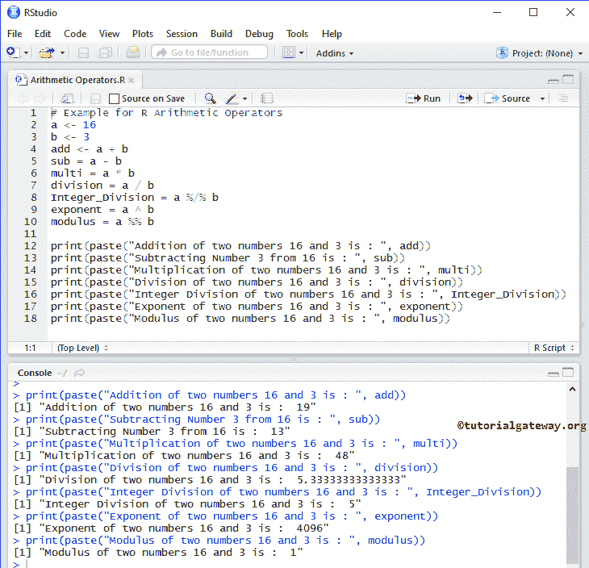

# R 算术运算符

> 原文：<https://www.tutorialgateway.org/r-arithmetic-operators/>

算术运算符包括算术加法、减法、除法、乘法、指数、整数除法和模数等运算符。所有这些 R 算术运算符都是二进制运算符，这意味着它们对两个操作数进行运算。下表用例子展示了 R 语言中的所有算术运算符。

| 算术运算符 | 操作 | 例子 |
| + | 添加 | 15 + 5 = 20 |
| – | 减法 | 15 – 5 = 10 |
| * | 增加 | 15 * 5 = 75 |
| / | 分开 | 15 / 5 = 3 |
| %/% | 整数除法–与除法相同。但是它通过计算额外的小数来返回整数值 | 16 %/% 3 = 5.如果用 3 除 16，得到 5.333，但是整数除法运算符修剪十进制值并输出整数 |
| ^ | 指数–它返回一个变量对另一个变量的幂 | 15 ^ 3 = 3375(表示 15 次方 3 或 10 <sup>3</sup> )。 |
| %% | 模数–它返回除法后的余数 | 15 %% 5 = 0(此处余数为零)。如果是 17 %% 4，那么结果= 1。 |

## 算术运算符示例

在这个 R 语言示例中，我们使用了两个变量 a 和 b，它们的值分别是 16 和 3。在这里，我们将使用这两个变量来执行 R 语言中存在的各种算术运算

```
# Example for R Arithmetic Operators
a <- 16
b <- 3
add <- a + b
sub = a - b
multi = a * b
division = a / b
Integer_Division = a %/% b
exponent = a ^ b
modulus = a %% b

print(paste("Addition of two numbers 16 and 3 is : ", add))
print(paste("Subtracting Number 3 from 16 is : ", sub))
print(paste("Multiplication of two numbers 16 and 3 is : ", multi))
print(paste("Division of two numbers 16 and 3 is : ", division))
print(paste("Integer Division of two numbers 16 and 3 is : ", Integer_Division))
print(paste("Exponent of two numbers 16 and 3 is : ", exponent))
print(paste("Modulus of two numbers 16 and 3 is : ", modulus))
```



当我们使用除法(/)运算符时，结果是浮点或十进制值。如果要通过取整该值将输出显示为整数值，则使用 R 整数除法(%/%)运算符。以下 [R 语言](https://www.tutorialgateway.org/r-programming/)语句求指数。意思是 16 次方 3 = 16 * 16 * 16 = 4096。

```
exponent = a ^ b
```