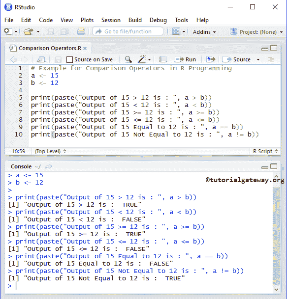
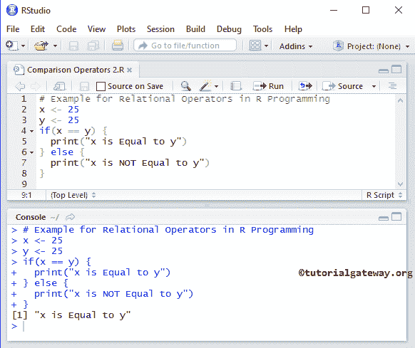

# R 中的比较运算符

> 原文：<https://www.tutorialgateway.org/comparison-operators-in-r/>

R 程序设计中的比较运算符主要用于 If 条件或循环中。关系运算符通常用于检查两个变量之间的关系。

*   如果关系为真，则返回布尔真
*   如果关系为假，则返回布尔假。

下表用例子展示了 R 编程中的所有关系运算符。

| R 中的比较运算符 | 使用 | 描述 | 例子 |
| > | i > j | I 大于 j | 25 > 14 返回真 |
| < | i < j | 我比 j 小 | 25 < 14 返回假 |
| >= | i >= j | I 大于或等于 j | 25 >= 14 返回真 |
| <= | i <= j | I 小于或等于 j | 25 <= 14 返回假 |
| == | i == j | I 等于 j | 25 == 14 返回 False |
| ！= | 我！= j | 我不等于 j | 25 != 14 返回真 |

## R 程序设计示例中的比较运算符

这个例子帮助你实际理解 R 编程语言中的比较运算符。在这个例子中，我们使用了两个变量 a 和 b，它们各自的值是 15 和 12。我们将使用这两个变量来执行 R 编程中存在的各种关系操作

```
# Example for Comparison Operators in R Programming
a <- 15
b <- 12

print(paste("Output of 15 > 12 is : ", a > b))
print(paste("Output of 15 < 12 is : ", a < b))
print(paste("Output of 15 >= 12 is : ", a >= b))
print(paste("Output of 15 <= 12 is : ", a <= b))
print(paste("Output of 15 Equal to 12 is : ", a == b))
print(paste("Output of 15 Not Equal to 12 is : ", a != b))
```



我们分配了两个整数值 a 和 b，并使用下面的语句分配了值 15 和 12。

```
a <- 15
b <- 12
```

在接下来的几行中，我们对照 R 编程语言中的每个比较运算符(关系运算符)检查了这些值。

## IF 语句中的 r 比较运算符

此示例帮助您理解如何在 If 语句中使用比较运算符。在这个例子中，我们使用了两个变量 x 和 y，它们的值分别是 25 和 25。我们将在 If 条件中使用这两个变量，以及 [R 编程](https://www.tutorialgateway.org/r-programming/)中的一个比较运算符来检查条件。

```
# Example for Relational Operators in R Programming
x <- 25
y <- 25
if(x == y) {
  print("x is Equal to y")
} else {
  print("x is NOT Equal to y")
}
```



在这个 R 关系运算符示例中，我们分配了两个整数值 x，y，并使用下面的语句分配了值 25 和 25。

```
x <- 25
y <- 25
```

在 [If 条件](https://www.tutorialgateway.org/r-if-else-statement/)内

如果 x 等于 y，则执行第一个打印语句

```
print("x is Equal to y")
```

如果第一个条件失败，则执行第二个打印语句。

```
print("x is NOT Equal to y")
```

这里 25 等于 25，所以打印第一个打印语句。