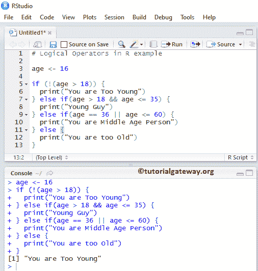
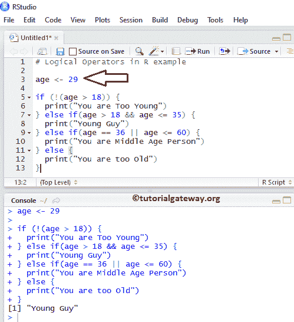
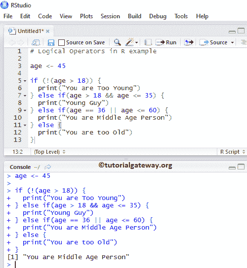
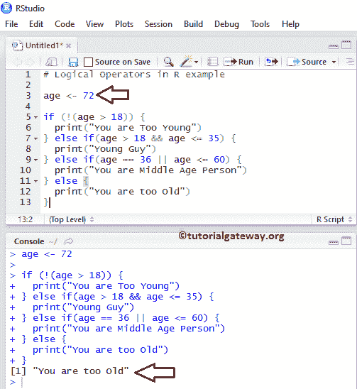
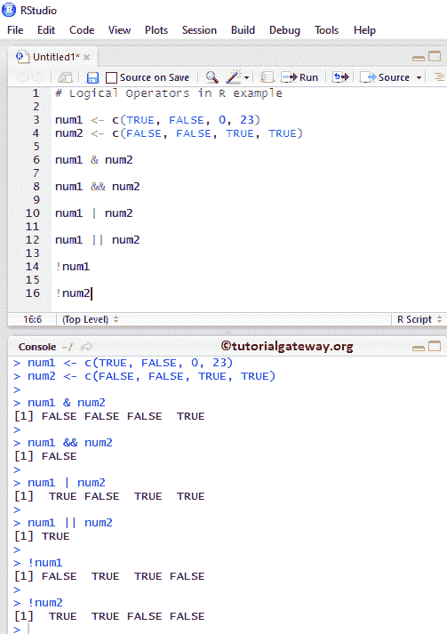

# R 中的逻辑运算符

> 原文：<https://www.tutorialgateway.org/logical-operators-in-r/>

R 编程中的逻辑运算符用于组合两个或多个条件，并使用&(逻辑与)、|(逻辑或)和执行逻辑运算！(逻辑非)。

比较运算符用于比较两个变量，如果我们想要比较多个条件怎么办？很简单，R 逻辑运算符为您完成了这个技巧。

下表描述了逻辑运算符。

| 经营者 | 名字 | 描述 | 例子 |
| & | 和 | 当两个条件都为真时，它返回真 | c(20，30)和 c(30，10) |
| && | 和 | 与上面相同，但是它适用于单个元素 | 如果(年龄> 18 &&年龄< = 25) |
| &#124; | 运筹学 | 当至少一个条件为真时，它返回真 | c(20，30) &#124; c(30，10) |
| &#124;&#124; | 运筹学 | 与逻辑或相同，但它适用于单个元素 | If(年龄== 35 &#124;&#124;年龄< 60) |
| ！ | 不 | 如果条件为真，逻辑非运算符返回假 | 如果年龄= 18 岁那么！(年龄= 18)返回 false。 |

让我们看看 R 编程中逻辑运算符背后的真值表，以便更好地理解

逻辑与真值表

逻辑“与”运算符后面的真值表如下所示:

| 条件 1 | 条件 2 | 条件 1 和条件 2 |
| 真实的 | 真实的 | 真实的 |
| 真实的 | 错误的 | 错误的 |
| 错误的 | 真实的 | 错误的 |
| 错误的 | 错误的 | 错误的 |

逻辑或真值表

[R 编程](https://www.tutorialgateway.org/r-programming/)逻辑或运算符后面的真值表如下所示:

| 条件 1 | 条件 2 | 条件 1 &#124;&#124;条件 2 |
| 真实的 | 真实的 | 真实的 |
| 真实的 | 错误的 | 真实的 |
| 错误的 | 真实的 | 真实的 |
| 错误的 | 错误的 | 错误的 |

## R 示例中的基本逻辑运算符

这个例子帮助你理解 R 编程中的逻辑运算符是如何在 If 语句中使用的。

对于这个逻辑运算符示例，我们分配了一个整数变量。然后，在 If 语句中，我们使用基本的逻辑运算符，如&&，||，和！。请参考 R 文章中的[比较运算符。](https://www.tutorialgateway.org/comparison-operators-in-r/)

```
# Logical Operators in R example

age <- 16
if (!(age > 18)) {
  print("You are Too Young")
} else if(age > 18 && age <= 35) {
  print("Young Guy")
} else if(age == 36 || age <= 60) {
  print("You are Middle Age Person")
} else {
  print("You are too Old")
}
```

从下面的截图可以观察到，我们输入的年龄= 16 岁。表示年龄不大于 18 岁，所以打印 First 语句。



让我们看看当我们改变价值观时会发生什么。从下面的截图中，看到我们已经输入了 age = 29。意思是年龄在 18 到 35 岁之间，所以打印第二份声明



从下面的截图，观察我们已经进入年龄= 45。意思是年龄在 36 岁到 60 岁之间，所以打印第三个声明



从下面的截图，看到我们已经进入了年龄= 72。



## 逻辑运算符示例

这个例子帮助你理解每个 R 逻辑运算符是如何工作的。请记住，任何大于零的正整数值都被视为布尔真，0 被视为布尔假。

```
# Logical Operators in R example

num1 <- c(TRUE, FALSE, 0, 23)
num2 <- c(FALSE, FALSE, TRUE, TRUE)

# Performs AND operation on each element in both num1, num2 
num1 & num2

# Performs AND operation on first element in both num1, num2 
num1 && num2

# Performs OR operation on each element in both num1, num2 
num1 | num2

# Performs OR operation on first element in both num1, num2 
num1 || num2

This will convert all the num1 TRUE values to FALSE, and FALSE values to TRUE
!num1 

# From num2 Vector - This will convert all the TRUE values to FALSE, and FALSE to TRUE
!num2
```



在 r 示例中的这些逻辑运算符中，首先，我们声明了两个向量

```
num1 <- c(TRUE, FALSE, 0, 23)
num2 <- c(FALSE, FALSE, TRUE, TRUE)
```

下面的语句比较每个向量元素并找到逻辑关系。

```
num1 & num2
```

以下语句比较 num1 向量的第一个元素和 num2 向量的第一个元素。意思是，真&&假=假。

```
num1 && num2
```