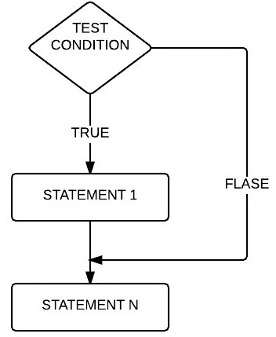
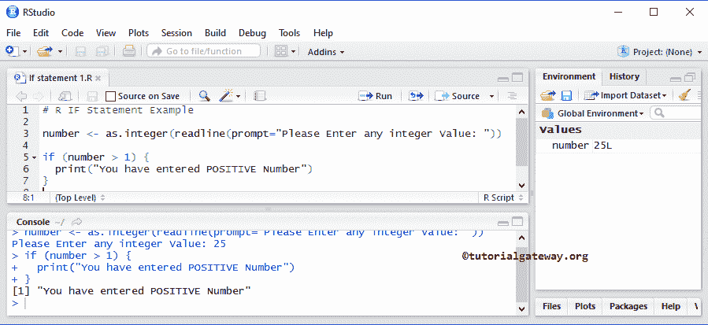
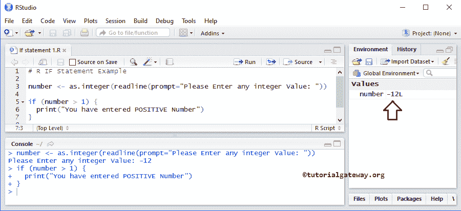
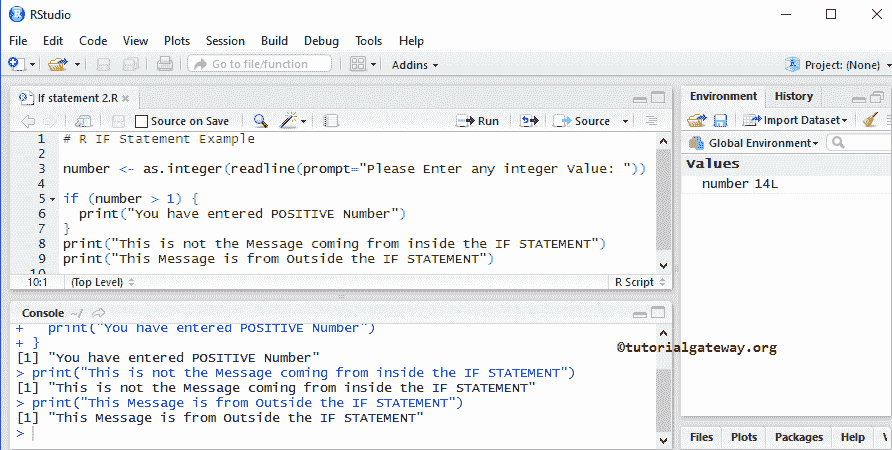
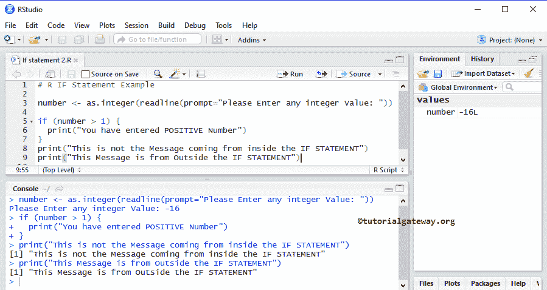

# `if`语句

> 原文：<https://www.tutorialgateway.org/r-if-statement/>

在真实的编程世界中，R `if`语句是主要的决策语句。`if`语句首先测试条件，然后根据结果执行语句。如果测试条件为真，则只执行 `if`块中的代码。

## `if`语句语法

R 语言中 `if`语句的语法结构简单

```
if (Boolean_Expression)  {

    Statement 1;
    Statement 2;
    ………….
    ………….
    Statement n;
}
```

从上面的代码片段中，如果 `if`语句中的布尔表达式/测试条件为真，那么 Statement1、Statement2、……。，StatementN 已执行。否则，跳过所有这些语句。

## 如果报表流程图

下图显示了 `if`语句背后的流程图。



*   如果测试条件为真，则执行 STATEMENT1，然后执行 STATEMENTN。
*   如果条件为 False，STATEMENTN 将被执行，因为它位于 If 条件块之外，并且与条件结果无关。让我们看一个例子来更好地理解。

## `if`语句示例

R `if`语句程序允许用户输入任何正整数，并检查用户指定的数字是否为正。

```
number <- as.integer(readline(prompt="Please Enter any integer Value: "))

if (number > 1) {
  print("You have entered POSITIVE Number")
}
```

注: [R 语言](https://www.tutorialgateway.org/r-programming/)中的 `if`语句不要求花括号保持一行。但是，使用花括号总是好的做法。

如你所见，我们输入了 25 作为一个数字。这个 R `if`语句程序检查 25 是否大于 1。我们都知道这是真的；这就是程序在 print()中打印文本的原因。



让我们更改数值来检查如果布尔表达式失败会发生什么？(编号< 1).



它不打印任何内容，因为-12 小于 1，并且我们在 `if`语句块之后没有任何内容可打印。希望你困惑，让我们再看一个例子。

## `if`语句示例 2

这个 R `if`语句的程序允许用户输入任意正整数，并检查该数是否为正整数。

```
number <- as.integer(readline(prompt="Please Enter any integer Value: "))

if (number > 1) {
  print("You have entered POSITIVE Number")
} 
print("This is not the Message coming from inside the IF STATEMENT")
print("This Message is from Outside the IF STATEMENT")
```

您可以观察下面的输出。它打印了所有的打印行，因为 14 大于 1。



让我们尝试使用负值来故意忽略 `if`语句中的条件。



这里，`if`语句中的布尔表达式失败(数字> 1)。这就是为什么它不打印 `if`块中的任何内容。但是，它打印了 `if`块之外的代码。